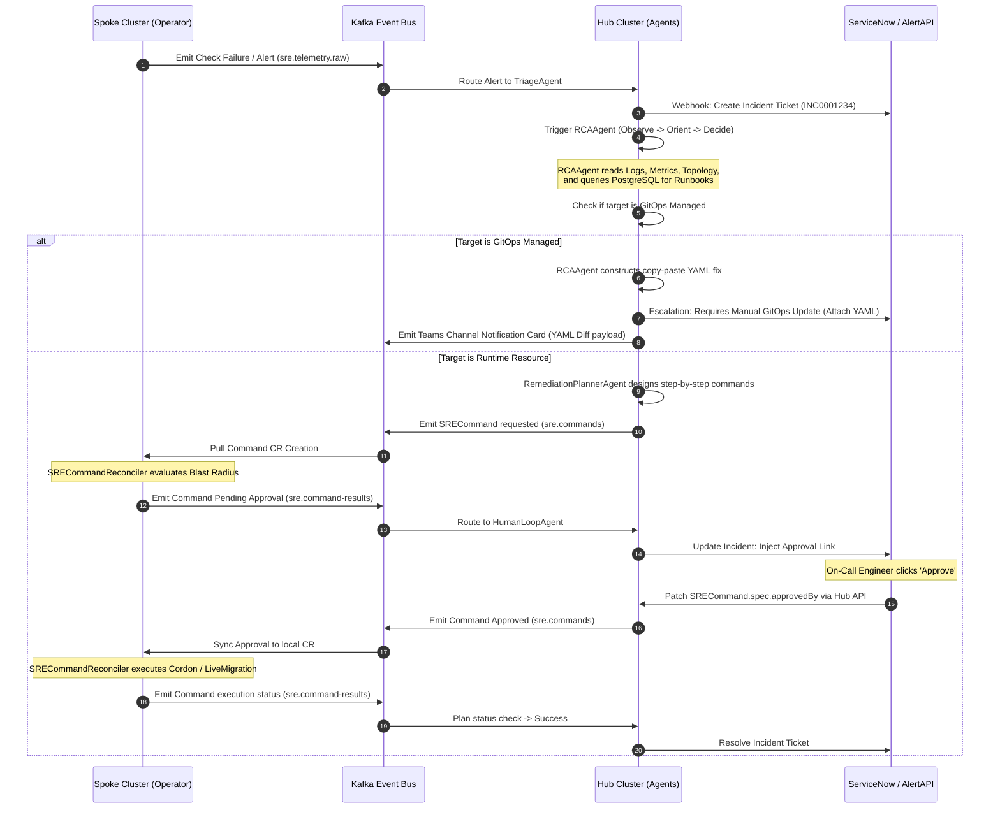

# File: plan.md
```
# Cortex SRE Platform — Architecture Plan (v2)
## Hub-and-Spoke, Kafka-Native, Tiered-Intelligence SRE Automation for OpenShift Virtualization

> Supersedes: sre_operator_whitepaper.md, unified_sre_platform_architecture.md,
> spoke_operator_architecture.md, central_agents_architecture.md,
> agent_lifecycle_and_context_windows.md, rag_domain_knowledge_sourcing.md

---

## CHANGELOG — What Changed From v1 And Why

| # | Change | Reason |
|---|---|---|
| 1 | Added **Tiered Decision Architecture** (Level 0/1/2) | v1 sent every signal through the full Hub→LLM round trip. Bottleneck at scale, wasteful even at 3 regions. |
| 2 | Added **Capability Model** (`SREClusterRegistration.status.capabilities`) | v1 had a single `storageProvider` string. Agents had no reliable way to know if an action was even executable on a given cluster. |
| 3 | Added **Validation phase** to `SRECommand` state machine | v1's `Succeeded` meant "API call didn't error," not "the fix actually worked." |
| 4 | Fixed **maintenance-window / SRERelease interaction bug** | v1 suppressed incidents from Kafka entirely during maintenance windows, which silently broke `SRERelease` well-being checks running concurrently. |
| 5 | Fixed **approval-flow topic inconsistency** | v1's sequence diagram had ServiceNow/Teams producing onto `sre.command-results`, conflating human decisions with operator execution results. |
| 6 | Added **`approvedByVerified`** distinct from spoofable `spec.approvedBy` | Anyone with patch RBAC could previously write any string into the approval field. |
| 7 | Added **FleetCorrelationAgent** | v1 had no cross-cluster pattern detection — N clusters hitting the same bug looked like N independent incidents. |
| 8 | Added **agent-platform observability metrics** | v1 only measured operator health (reconcile latency, Kafka lag), never LLM cost, confidence calibration, or override rate. |
| 9 | Documented **DAG execution as Argo Workflows/Tekton delegation**, not a hand-rolled engine | `SRERemediationPlan`'s sequential/parallel model doesn't need to become a bespoke DAG engine. |
| 10 | Added **Workflow Catalog / Intent layer** as a roadmap item | Reduces LLM free-form action synthesis to catalog selection over time. |
| 11 | Added **Stateful-system DR/backup requirement** as an explicit gate before GA | Neo4j, Postgres, Redis, BoltDB, Kafka all currently undocumented for backup/restore. |
| 12 | Added new `SignalSource` types: `PacketDropSignal`, `MachineConfigInspection`, `RegistryProbe`, `SimulatorQuery`, `PodStatusInspection` | Closed real diagnostic gaps (packet drops, NTP false positives, Nexus tag-typo vs. registry-down, NetworkPolicy denial, app-vs-platform CrashLoop). |
| 13 | Added `MarkAsExpected` / `MarkAsDuplicate` outcomes to `SRECorrelationRule` | v1 could only escalate. No way to encode "this is expected, suppress" (e.g. NTP jitter during live migration). |

Everything else below is the full plan, not a diff — read it standalone.

---

## 1. Philosophy: "Smart Brain, Dumb Hands" — With A Local Reflex Arc

The Spoke Operator executes. The Hub reasons. That principle is unchanged. What's new in v2 is a third layer underneath both:

```
Level 0 — Reflex (Spoke, no Kafka, no LLM, sub-second)
Level 1 — Template Match (Hub, Kafka round-trip, no fresh LLM call)
Level 2 — Full Reasoning (Hub, Kafka round-trip, full OODA + LLM)
```

Most real-world alert volume is Level 0 or Level 1. Reserve Level 2 — the expensive, slow, token-consuming path — for genuinely novel or ambiguous failures. This isn't a scale optimization bolted on later; it's core to the design because it changes what the Spoke Operator is allowed to decide on its own.

### 1.1 Level 0 — Local Reflex (Spoke-only, zero Hub involvement)

Defined per-policy, evaluated entirely inside `SREPolicyReconciler`/`SRECorrelationRuleReconciler` on the spoke. No Kafka `sre.commands` round trip. The action executes, then a result is emitted to Kafka **for visibility only**.

```yaml
# SREPolicy.spec.localAutonomy
localAutonomy:
  enabled: true
  rules:
    - triggerCheck: "PVCCapacityWarning"       # existing check/signal name
      maxRiskLevel: "Low"
      allowedActions: ["ExpandPVC"]
      conditions:
        - "resource.utilizationPct < 90"        # still bounded — never blind expansion
    - triggerCheck: "SingleNodeNotReadyNoImpact"
      maxRiskLevel: "Low"
      allowedActions: ["CordonNode"]
      conditions:
        - "affectedVMCount == 0"
```

### 1.2 Level 1 — Template Match (Hub, no fresh LLM call)

When an incident's signature (triggering alerts + affected resource type + cluster capability fingerprint) cosine-matches an existing `historical_incidents` record at similarity > 0.95 **and** that record has a human rating ≥ 4, `RemediationPlannerAgent` fills the template directly and skips a fresh `RCAAgent` LLM invocation entirely. This is the single largest cost/latency lever in the platform — a cluster that has seen the same NTP-drift-after-migration pattern 40 times this month should not burn an LLM call on the 41st.

### 1.3 Level 2 — Full OODA (unchanged from v1, described in full in §10)

---

## 2. Capability Model (NEW)

Every spoke publishes a structured capability object on each heartbeat cycle — read from the informer cache, zero extra API load, same pattern as the existing heartbeat.

```yaml
# SREClusterRegistration.status.capabilities
status:
  capabilities:
    storage:
      provider: "portworx"          # portworx | dell-csm | ocs | mixed
      liveExpansion: true
      snapshotSupport: true
      replicationFactor: 3
    network:
      cni: "ovn-kubernetes"
      sriov: true
      multus: true
      loadBalancerType: "metallb"
    hypervisor:
      liveMigration: true
      gpuPassthrough: false
      dedicatedCPUSupport: true
    versions:
      ocp: "4.16.8"
      kubevirt: "1.2.1"
      acm: "2.11.2"
      cnv: "4.16.2"
    installedOperators: ["cnv", "portworx-operator", "vault-secrets-operator", "openshift-gitops"]
    gitopsEnabled: true
    lastCapabilityRefresh: "2026-07-18T10:00:00Z"
```

**Enforcement points:**
- `SRECommand` admission webhook rejects any action whose required capability isn't present on the target cluster (e.g. `MigrateVolume` on a cluster reporting `storage.provider: ocs`).
- `SRECorrelationRule.requiresCapability` gates rule evaluation — a Portworx-specific correlation rule never even evaluates on a Dell CSM cluster.
- `RemediationPlannerAgent` filters its candidate action list by capability before invoking the LLM, reducing hallucinated-but-inexecutable proposals.

---

## 3. Hub-Spoke Topology & HA

```
                  ┌──────────────────────────────────────────────┐
                  │          Kubernetes API Server (Spoke)        │
                  └──────┬────────────────────────────────┬──────┘
                         │                                │
                 Leader Election                   Webhook Traffic
                         │                                │
                         ▼                                ▼
            ┌────────────────────────┐       ┌────────────────────────┐
            │     Replica 01         │       │     Replica 02          │
            │   (Active Leader)      │       │   (Standby Member)      │
            │ - Spoke Reconcilers    │       │ - Webhook Server ONLY   │
            │ - Kafka Consumers      │       │ - No Informers / Cache  │
            │ - BoltDB PVC Mounted   │       │ - No PVC dependency     │
            └────────────────────────┘       └────────────────────────┘
```

**Note on BoltDB + replica count:** BoltDB's `ReadWriteOnce` PVC can only be mounted by one pod. Do **not** collapse the whole Deployment to `replicas: 1` to satisfy this (that was a real regression risk raised in review — it kills webhook HA). Keep two Deployments:
- `sre-operator-reconciler` — `replicas: 1`, mounts BoltDB PVC, runs all reconcilers + Kafka consumers.
- `sre-operator-webhook` — `replicas: 2+`, stateless, no PVC, no leader election needed, serves ValidatingWebhookConfiguration/MutatingWebhookConfiguration only.

Hub runs the equivalent split for its own reconcilers vs. any hub-side admission surface.

---

## 4. CRD Catalog — Spoke

```
SREGlobalConfig ─────── Kafka/Vault/Splunk bootstrap config
        │
        ▼
    SREPolicy ─────────── Health checks + all SignalSources + localAutonomy rules
        │
        ▼
 SRECorrelationRule ─────── Temporal multi-signal grouping (BoltDB-backed buffer)
        │
        ▼
    SREIncident ────────── Lifecycle state machine (§7)
        │
        ▼
 SRERemediationPlan ────── Sequential/parallel step orchestration (delegates DAG-heavy
        │                   cases to Argo Workflows — see §9)
        ▼
    SRECommand ────────── Discrete action execution + Validation phase (§7)

    SRERelease ─────────── ArgoCD sync tracking + post-release well-being window
```

### 4.1 SREGlobalConfig
Bootstraps Kafka bootstrap servers, Vault role, Splunk HEC, proxy config. Watches its own updates to rotate TLS/Kafka connections in memory without restart.

### 4.2 SREPolicy
Defines `checks[]`, `prometheus.alertTriggers[]`, `signalSources[]` (full taxonomy in §14), `storageChecks`, `vaultChecks`, `errataChecks`, `gitOpsAwareness` (observation only — **never** creates a PR from the operator), `diagnosticCollection`, `remediation` (approval thresholds, maintenance windows), `sloDefinitions[]`, and the new `localAutonomy` block (§1.1).

### 4.3 SRECorrelationRule
Full grammar in §14. Evaluated against the BoltDB-backed `SignalStore` (persistent, crash-resilient, PVC-mounted — see §12.1) via an inverted-index engine (`signalToRules` map) so evaluation is O(signals-matching-this-rule), not O(all-rules) per signal.

### 4.4 SREIncident
Single source of truth for incident lifecycle. State machine in §7. Auto-harvests diagnostics on `Active` transition — **diagnostics collection is independent of notification suppression** (fix #4 — see §7.1).

### 4.4 SREIncident (addendum — diagnostics storage & deduplication)

Diagnostics are never stored inline in `status.diagnostics`. On harvest, the full
bundle is written to a ConfigMap (`incident-diag-<name>`, owned via
`controllerutil.SetControllerReference` for automatic GC), and only
`status.diagnosticsRef` (the ConfigMap name) is stored on the CR. A size-capped
summary (not the full bundle) is embedded directly in the `sre.incidents.lifecycle`
Kafka payload so RCAAgent's Observe phase needs no extra round trip for the common
case; the ConfigMap is the on-demand escalation path for full-detail forensics.

`status.auditTrail` and `status.remediationLog` are bounded ring buffers (last 20
entries) updated via `retry.RetryOnConflict` + re-fetch + `Status().Patch()` — never
a blind `MergeFrom()` against a stale snapshot, since JSON Merge Patch replaces
arrays wholesale rather than appending, and concurrent writers (correlation engine,
SRECommandReconciler, SREIncidentReconciler) can silently clobber each other's
entries otherwise. The durable, unbounded history is Kafka `sre.audit` (90d) —
status fields are a recent-activity cache for `kubectl get`/`describe`, not the
system of record.

**Deduplication Sorting:** To prevent race conditions and non-deterministic behavior during parallel reconciles, the deduplication logic in `SREIncidentReconciler` must explicitly sort matching incidents by `metadata.creationTimestamp` before picking the oldest instance (`existing[0]`) as the merge survivor.

### 4.8 SREJob (addendum — results capacity & routing)

To prevent unbounded status growth on recurring cron schedules, `status.results` is managed as a bounded ring buffer capped at the value of `spec.historyLimit` (updated via `retry.RetryOnConflict` + re-fetch + `Status().Patch()`). The full details of each run are emitted to the `sre.job-results` Kafka topic. Additionally, to route execution feedback without collision risks, jobs are referenced and routed by their unique `namespace/name` rather than the non-unique text `job_label`.

### 4.5 SRERemediationPlan
Orchestrates `SRECommand` steps. For genuinely complex multi-branch/fan-out workflows, this CRD should create an Argo `Workflow` object rather than reimplement DAG semantics — see §9.

### 4.6 SRECommand
Executes one discrete action. Full state machine with the new **Validation** phase in §7.2.

### 4.7 SRERelease
Watches ArgoCD `Application` sync completion. Cross-references `SREErrataCache` for newly-introduced vulnerable versions. Runs a 30-minute post-release well-being window — **now correctly queries incident *existence*, not incident *notification state*** (fix #4).

---

## 5. CRD Catalog — Hub

```
SREClusterRegistration ── One per ACM ManagedCluster. Now includes status.capabilities (§2).
SRECrossClusterRead ────── Read-only fleet inspection (ConfigMaps/RBAC/CRDs). Secret kind hard-blocked.
SREErrataCache ─────────── Daily Red Hat/NVD sync, broadcast to spokes via Kafka.
SREGlobalPolicy ────────── Fleet-wide policy pushed to spokes via ACM ManifestWork.
```

---

## 6. State Machines

### 6.1 SREIncident (with suppression fix)

```
Detecting ──(correlation window elapses)──> Active
                                                │
                          ┌─────────────────────┤
                          │                     │
              [in maintenance window]     [not in window]
                          │                     │
                          ▼                     │
                    Suppressed                  │
              (spec.suppressUntil set)          │
                          │                     │
              ★ FIX: diagnostics STILL          │
              collected here. Only the          │
              paging/notification path is       │
              suppressed — SREIncident.status    │
              still populates fully so           │
              SRERelease well-being checks        │
              and the RCAAgent (once window       │
              ends) have complete data.           │
                          │                     │
              [window ends, still failing]      │
                          └────────────►────────┘
                                                │
                                                ▼
                                          Remediating
                                                │
                          ┌─────────────────────┤
                          ▼                     ▼
                      Resolved            FalsePositive
```

### 6.2 SRECommand (with Validation phase added)

```
Pending → PendingApproval → Approved → Executing
                                            │
                                            ▼
                                       (API call returns)
                                            │
                              ┌─────────────┴─────────────┐
                              ▼                            ▼
                          Succeeded*                     Failed
                              │
                              ▼
                    ★ NEW: Validating
              Poll target resource health for
              spec.validationWindowSeconds
              (default 60s, action-specific override)
                              │
                  ┌───────────┴───────────┐
                  ▼                       ▼
              Healthy                StillDegraded
                  │                       │
                  ▼                       ▼
       Incident may Resolve      Auto-trigger rollback
                                  OR escalate — incident
                                  stays Remediating

*"Succeeded" now means "API call accepted." It is no longer
 sufficient on its own to resolve the parent SREIncident.
 Only Validating→Healthy resolves it.
```

Example: `LiveMigrateVM` returns `Succeeded` the instant the migration API call is accepted. `Validating` then polls `VirtualMachineInstance.status.phase == Running` **and** guest-agent heartbeat for 60s before the incident is allowed to close. This closes the "API succeeded but guest is still hung" gap.

### 6.3 Approval Flow (fixed — no longer conflicts with sre.command-results semantics)

```
SRECommand.status.phase = PendingApproval
        │
        ▼
Human clicks "Approve" in Teams / ServiceNow
        │
        ▼
Admission webhook intercepts the resulting PATCH request directly against
the SRECommand object (via kubectl, Hub API, or a thin approval-service proxy)
        │
        ▼
Webhook captures request.userInfo from the AUTHENTICATED API request itself
        │
        ▼
Sets status.approvedByVerified = request.userInfo.username   (server-derived, non-spoofable)
spec.approvedBy remains a free-text field for display only — NEVER trusted for authorization
        │
        ▼
SRECommandReconciler checks status.approvedByVerified != "", not spec.approvedBy
```

`sre.command-results` remains exclusively operator-produced, representing execution outcomes only. Human decisions never appear on that topic.

---

## 7. GitOps Exclusion Protocol (unchanged from v1 — this part was already correct)

```
Is the action in the runtime-operations allowlist?
  (CordonNode, DrainNode, LiveMigrateVM, ExpandPVC*, transient pod deletion)
    YES → execute directly. GitOps never manages these.
    NO  → is the target resource GitOps-tracked (ArgoCD label / in an Application's
          managed resource list)?
            YES → operator BLOCKS the command (status = Failed, reason = GitOpsManagedExclusion)
                  → RCAAgent generates the exact YAML diff
                  → posted as a copy-pasteable block to ServiceNow + Teams Adaptive Card
                  → SRE merges manually, ArgoCD auto-syncs, well-being window confirms fix
            NO  → execute directly

* ExpandPVC only if storage class supports online expansion without a manifest change.
```

The operator **never** creates a Git commit, branch, or PR. This is a hard boundary, not a policy toggle.

---

## 8. Kafka Topic Registry

| Topic | Key | Producer(s) | Consumer(s) | Retention |
|---|---|---|---|---|
| `sre.telemetry.raw` | `{cluster-id}` | Spoke `SREPolicyReconciler` | `TriageAgent`, `TopologyAgent`, Splunk Connect | 24h |
| `sre.signals.buffer` | `{cluster-id}:{ns}:{signal}` | Spoke (dual-write with BoltDB) | Spoke only (startup replay) | 20m |
| `sre.incidents.lifecycle` | `{fingerprint}` | Spoke `SREIncidentReconciler`, Hub (synthetic `ClusterUnreachable` on heartbeat loss) | `TriageAgent`, `RCAAgent`, `FleetCorrelationAgent` (NEW), `SREClusterRegistrationReconciler`, `PolicyLearnerAgent`, Splunk Connect | 7d, compacted |
| `sre.commands` | `{cluster-id}:{cmd}` | `RemediationPlannerAgent`, `CapacityAgent`, `ErrataCorrelatorAgent`, `PolicyLearnerAgent` | Hub `SREClusterRegistrationReconciler` → creates CR on spoke | 24h |
| `sre.command-results` | `{cmd-name}` | Spoke `SRECommandReconciler` **only** — never ServiceNow/Teams (fix #5) | `RemediationPlannerAgent`, `HumanLoopAgent`, Splunk Connect | 7d |
| `sre.errata.cache` | `{cve-id}` | Hub `SREErrataCacheReconciler` | Spoke consumer, `ErrataCorrelatorAgent`, Splunk Connect | 30d, compacted |
| `sre.crosscluster.reads` | `{cluster}:{kind}:{name}` | Hub `SRECrossClusterReadReconciler` | RAG ingestion pipeline, `TopologyAgent`, Splunk Connect | 1h |
| `sre.audit` | `{cluster-id}` | Spoke reconcilers (all mutations, approvals, bypasses) | `PolicyLearnerAgent`, Splunk Connect (90d compliance) | 90d |
| `sre.dead-letter` | `{topic}:{key}` | Any producer on retry exhaustion | Manual review, DLQ alert | 7d |

### 8.1 Multi-Region Kafka Federation

To support global deployments (e.g., US, EU, APAC) without experiencing WAN latency bottlenecks:
- Regional Kafka clusters are deployed in each geographic region.
- High-frequency, latency-sensitive traffic (like heartbeats and raw telemetry logs) stays entirely local to the region's Kafka cluster.
- Low-frequency orchestration traffic (`sre.commands`, `sre.command-results`, and `sre.incidents.lifecycle`) is federated globally to the central primary Kafka cluster via **Strimzi / Apache Kafka MirrorMaker 2 (MM2)**.
- Hub agents connect directly to the global primary Kafka cluster, allowing centralized control without regional latency overhead.

---

## 9. Execution Model — Sequential Steps vs. True DAGs

Keep `SRERemediationPlan` for the common case (2-5 sequential or parallel steps with simple `dependsOnStep`). For genuinely complex multi-branch recovery workflows (e.g. "Recover OVN": cordon → drain in parallel across 3 nodes → wait-for-quorum → conditionally reboot → validate → close), **do not build a bespoke DAG engine inside the reconciler.** Delegate to Argo Workflows:

```
SRERemediationPlanReconciler:
  if plan.spec.complexity == "simple":
    → orchestrate directly (existing sequential/parallel logic)
  if plan.spec.complexity == "dag":
    → translate plan.spec.steps into an Argo Workflow object
    → create it on the spoke (Argo Workflows already installed alongside ArgoCD in most
      OpenShift GitOps deployments — reuse, don't duplicate)
    → watch Workflow.status, mirror back into SRERemediationPlan.status
```

This keeps your differentiator (correlation + RCA intelligence) as the thing you build, and borrows a battle-tested execution engine for the part that isn't your differentiator.

---

## 10. Agent Registry — Hub

```
                  ┌──────────────────────────────────────────────┐
                  │                 TriageAgent                  │
                  │   Consumes incidents.lifecycle, routes        │
                  └──────────────────────┬───────────────────────┘
                                         │
                    ┌────────────────────┼────────────────────┐
                    ▼                    ▼                     ▼
            ┌───────────────┐   ┌────────────────┐   ┌──────────────────┐
            │  Level 1       │   │    RCAAgent    │   │ FleetCorrelation  │
            │  Template      │   │  (Level 2 OODA)│   │      Agent (NEW)  │
            │  Match (NEW)   │   └────────┬───────┘   └──────────────────┘
            └───────┬────────┘            │
                    │                     ▼
                    │           RemediationPlannerAgent
                    │           (capability-filtered actions)
                    └──────────┬──────────┘
                               ▼
                    SRECommand → Validation phase → Resolved
```

### 10.1 TriageAgent
Routes incidents. Checks Level 1 template match (§1.2) before dispatching to `RCAAgent`. Creates baseline ServiceNow ticket for P1.

### 10.2 RCAAgent (Level 2, OODA loop — unchanged core logic)
Observe (Splunk query window `[triggerTime - 15m, now()]` + diagnostics bundle + topology) → Orient (RAG retrieval, pgvector) → Decide (schema-enforced LLM call, **now filtered by capability model**) → Act (emit `SRECommand`, or halt on `insufficient_data`).

### 10.3 RemediationPlannerAgent
Translates RCA conclusion into ordered `SRECommand` steps. **Now filters candidate actions against `SREClusterRegistration.status.capabilities` before proposing them.**

### 10.4 CapacityAgent
Linear-regression forecasting on Prometheus range queries. Proactively issues `ExpandPVC`/scale commands 7 days ahead of exhaustion.

### 10.5 ErrataCorrelatorAgent
Daily RHSA/CVE audit against running kernel/package versions. Schedules patching within maintenance windows.

### 10.6 PolicyLearnerAgent
Mines resolved incidents for MTTR trends and false-positive patterns. Proposes new `SRECorrelationRule`s **including `MarkAsExpected` suppression rules**, always `approvalRequired: true`.

### 10.7 HumanLoopAgent
Manages approval timeouts. On timeout: `SafeAbort` + escalate to P1, never leaves state ambiguous.

### 10.8 FleetCorrelationAgent (NEW)
```python
def detect_fleet_pattern(self):
    # Every 5 minutes, group Active mirrored incidents by
    # (triggering_alerts signature, ocp_version, kubevirt_version, storage_provider)
    groups = group_active_incidents_by_signature()
    for signature, affected in groups.items():
        if len(affected) >= 3:
            primary = affected[0]
            for dup in affected[1:]:
                mark_as_duplicate(dup, primary_ref=primary)   # suppresses N-1 redundant RCA runs
            create_fleet_incident(
                title=f"Fleet pattern: {signature} across {len(affected)} clusters",
                severity="P1Critical" if len(affected) > 10 else "P2High"
            )
```
Directly reduces LLM cost (fewer duplicate `RCAAgent` runs) and gives humans immediate "this is a platform bug, not my cluster" signal.

### 10.9 LangGraph Orchestration State Machine (StateGraph Skeleton)

To prevent lost context on Hub restarts and enable first-class interrupts for human loops, the Central Agent Platform avoids procedural python function-chaining. Instead, it relies on a typed `IncidentState` managed by a LangGraph `StateGraph` with a supervisor node and durable PostgreSQL checkpoints:

```python
from typing import TypedDict, Literal, Optional
from langgraph.graph import StateGraph, END
from langgraph.checkpoint.postgres import PostgresSaver

class IncidentState(TypedDict):
    incident_id: str
    cluster_id: str
    incident_data: dict
    diagnostics: Optional[dict]          # from operator's ConfigMap/Kafka summary
    rag_context: Optional[dict]          # runbooks + historical_incidents + errata
    topology_context: Optional[dict]     # Neo4j blast radius
    rca_decision: Optional[dict]         # enforced schema output
    remediation_plan: Optional[dict]
    command_results: list
    route: Optional[str]                 # supervisor's routing decision
    human_feedback: Optional[dict]

def supervisor_node(state: IncidentState) -> IncidentState:
    """The central router node. Determines the next node based on current state."""
    if state.get("rca_decision") is None:
        state["route"] = "rca_agent"
    elif state["rca_decision"].get("action") == "ESCALATE":
        state["route"] = "human_loop_agent"
    elif state.get("remediation_plan") is None:
        state["route"] = "remediation_planner_agent"
    elif not all(c["phase"] in ("Succeeded", "Failed") for c in state.get("command_results", [])):
        state["route"] = "wait_for_commands"
    else:
        state["route"] = END
    return state

def route_decision(state: IncidentState) -> str:
    return state["route"]

def rca_node(state: IncidentState) -> IncidentState:
    # Observe -> Orient -> Decide. Interacts with Postgres / Neo4j via ToolRegistry
    obs = ToolRegistry.invoke("splunk_tool.query", incident_id=state["incident_id"])
    context = ToolRegistry.invoke("vector_db.search", query=state["incident_data"]["title"])
    state["diagnostics"] = obs
    state["rag_context"] = context
    state["rca_decision"] = decide_cause(obs, context)
    return state

def remediation_planner_node(state: IncidentState) -> IncidentState:
    state["remediation_plan"] = build_plan(state["rca_decision"], state["cluster_id"])
    emit_commands_to_kafka(state["remediation_plan"])
    return state

def human_loop_node(state: IncidentState) -> IncidentState:
    # StateGraph interrupt point. Graph state is persisted to Postgres;
    # Execution halts until Teams/ServiceNow callback triggers resume.
    state["human_feedback"] = None
    return state

# Graph assembly
graph = StateGraph(IncidentState)
graph.add_node("supervisor", supervisor_node)
graph.add_node("rca_agent", rca_node)
graph.add_node("remediation_planner_agent", remediation_planner_node)
graph.add_node("human_loop_agent", human_loop_node)
graph.set_entry_point("supervisor")

graph.add_conditional_edges("supervisor", route_decision, {
    "rca_agent": "rca_agent",
    "remediation_planner_agent": "remediation_planner_agent",
    "human_loop_agent": "human_loop_agent",
    "wait_for_commands": END, # wait for external Kafka trigger to resume
    END: END
})
graph.add_edge("rca_agent", "supervisor")
graph.add_edge("remediation_planner_agent", "supervisor")
graph.add_edge("human_loop_agent", "supervisor")

compiled = graph.compile(checkpointer=PostgresSaver(conn_pool))
```

---

## 11. RAG / Knowledge Architecture (unchanged core, unchanged and correct)

PostgreSQL + pgvector, three tables (`runbooks`, `platform_configs`, `historical_incidents`), HNSW indexes, relational pre-filter + vector similarity. Sources: Red Hat KCS/errata, `openshift/runbooks`, KubeVirt closed-issue mining, internal runbooks, and — highest long-term value — your own `historical_incidents` corpus once populated. Ingestion via `SRECrossClusterRead` events (real-time config) and weekly cron (static docs). No changes recommended here; this section of v1 was already well-designed.

**One addition:** feed `SREClusterRegistration.status.capabilities` into `platform_configs` retrieval filters so the RCAAgent's runbook search is capability-scoped (`WHERE storage_provider = cluster.capabilities.storage.provider`), not just version-scoped as in v1.

---

## 12. Security Model

### 12.1 Signal Buffer Persistence
BoltDB (`go.etcd.io/bbolt`), pure Go, FIPS-compatible, mounted via 1Gi `ReadWriteOnce` PVC on the reconciler-only Deployment (see §3 HA correction). `sync.RWMutex`-protected. Falls back to in-memory no-op with a degraded heartbeat if the PVC fails to mount.

### 12.2 Emergency Bypass (JWT, not boolean)
Short-lived RS256 JWT issued by Hub, validated by a spoke admission webhook. Claims checked: `iss`, `exp` (<5min), `target_cluster`, `action`. Hub public key loaded **once at operator startup** via a watched Secret and cached — never fetched inline inside the webhook handler (that was a real anti-pattern risk flagged in review: don't reintroduce an external call inside an O(1)-budget webhook). Include a `jti` claim plus a 5-minute in-memory used-token set to prevent replay.

### 12.3 Approval Non-Spoofability
`status.approvedByVerified` derived from `request.userInfo` at admission time (§6.3), never trusted from the free-text `spec.approvedBy` field alone.

### 12.4 Allow-Listed Actions Only
No raw shell/kubectl passthrough from any agent. Every action maps to a compiled Go handler behind the `AllowedSREActions` enum, validated at admission.

### 12.5 Cross-Cluster Read Boundaries
`Secret` and `ServiceAccount` kinds hard-blocked at both the webhook and the reconciler (defense in depth). All other read results sanitized for `password`/`token`/`credential` substrings before storage.

### 12.6 local LLM vLLM Sizing Requirement

For air-gapped security compliance, serving `Llama-3-70B-Instruct` locally in FP16 format requires a minimum of **140GB of VRAM**. This necessitates multi-GPU tensor parallelism (typically 2× A100-80GB or equivalent GPU footprint) on the Hub cluster's GPU node pool, which must be factored in during the initial platform infrastructure sizing.

### 12.7 Microsoft Teams Callback Gateway

To enable interactive buttons (`Approve`, `Reject`, `Escalate`) on Microsoft Teams Adaptive Cards, the platform cannot rely on one-way Incoming Webhooks. SRE Teams operations require one of the following interactive callback routes back into the Hub API approval endpoint:
1. **Azure Bot Service + Teams App Manifest:** Registering a Bot Framework messaging endpoint.
2. **Power Automate Gateway:** A flow triggered by card execution ("When a Teams adaptive card action is performed") that parses the callback payload and updates the Hub SRE API.

### 12.8 Tool Registry & MCP Readiness

To future-proof the platform for Model Context Protocol (MCP) server integration, all specialist agent tools (e.g. `prom_tool`, `splunk_tool`, etc.) are wrapped within a unified `ToolRegistry` abstraction layer. Agents never import tools as direct in-process Python modules. Swapping to stdio or HTTP+SSE-based MCP transports later is completed purely by modifying the `ToolRegistry.invoke()` handler.

New query-level tools are introduced to the registry:
* `servicenow_tool.get_ticket_status(ticket_id)` -> Queries active status and assignment groups.
* `maintenance_tool.check_active_window(cluster_id, resource_ref)` -> Checks if the resource is currently in a scheduled maintenance window.
* `suppression_tool.check_suppression(fingerprint)` -> Checks for active local or fleet-wide suppressions.

---

## 13. Observability

### 13.1 Operator Self-Monitoring (already correct in v1)
`sre_check_result`, `sre_incident_total`, `sre_command_duration_seconds`, `sre_kafka_producer_lag`, reconcile latency, webhook latency (p99 budget: 2s, hard timeout 3s).

### 13.2 Agent Platform Observability (NEW — was entirely missing in v1)
```
sre_agent_llm_tokens_total{agent, incident_type}
sre_agent_llm_cost_usd_total{agent}
sre_agent_confidence_vs_outcome{confidence_bucket}     # calibration check — is a stated
                                                        # 90% confidence actually right 90% of the time?
sre_agent_human_override_rate{incident_type}
sre_agent_rollback_frequency{action}
sre_agent_reasoning_latency_seconds{agent, phase}
sre_agent_level0_reflex_rate                            # % of signals resolved without Kafka/LLM
sre_agent_level1_template_match_rate                    # % resolved without a fresh LLM call
sre_fleet_duplicate_suppression_rate                     # FleetCorrelationAgent effectiveness
```

---

## 14. Correlation & Policy Rule Grammar (reference)

### SRECorrelationRule dimensions

| Dimension | Field | Values |
|---|---|---|
| Signal type | `signals[].type` | `Alert`, `Event`, `MetricThreshold`, `LogPattern`, `ClusterOperator`, `NodeCondition`, `NTPCheck`, `DNSCheck`, `NexusPullCheck`, `RBACEvent`, `HardwareEvent`, `VaultCondition`, `PortworxCondition`, `DellCSMCondition`, `ArgoCDSyncEvent`, `ReleaseEvent`, `ErrataMatchSignal`, `PacketDropSignal`, `CapabilityGate` |
| Requirement | `signals[].required` | `true` / `false` |
| Comparison | `signals[].valueExpr` | `>`, `<`, `>=`, `<=`, `==`, `!=`, regex |
| Match count | `minSignalCount` | int |
| Window | `correlationWindow` | duration, capped at buffer TTL (20m) |
| Scope | `scopeConstraint` | `same-node`, `same-namespace`, `same-cluster`, `cross-cluster`, `fleet-wide` |
| Priority | `priority` | int ascending |
| Outcome | `remediationAction` | action name, or `MarkAsExpected` (suppress), or `MarkAsDuplicate` (fleet dedupe) |
| Capability gate | `requiresCapability` | e.g. `storage.provider == portworx` |
| Provenance | `autoGenerated` | `true` forces `approvalRequired: true` |

### SREPolicy.signalSources catalog

```
Existing:      Alert, HealthCheck, KubernetesEvent, PodLog, ClusterOperator,
               NodeCondition, MetricQuery, NTPCheck, DNSCheck, NexusPullCheck,
               RBACEvent, HardwareEvent, VaultCondition, PortworxCondition,
               DellCSMCondition, ArgoCDSyncEvent, ReleaseEvent

New this pass: MachineConfigInspection  — reads rendered chrony.conf etc., not live drift only
               RegistryProbe            — GET /v2/{repo}/manifests/{tag}, distinguishes
                                           typo-vs-registry-down for Nexus pull failures
               SimulatorQuery           — calls NetworkPolicySimulator tool for policy denial
               PodStatusInspection      — classifies CrashLoop as Platform/App/Ambiguous from
                                           exitCode + terminated.reason
```

---

## 15. Operational Maturity Gate Before GA

Do not go to production without backup/restore runbooks for:
- **Neo4j** (topology graph — rebuildable from `sre.crosscluster.reads` replay, but document the procedure)
- **PostgreSQL/pgvector** (runbooks + historical_incidents — this is learned data, not rebuildable, needs real backups)
- **Redis** (working memory — ephemeral by design, but document what breaks if it's lost mid-incident)
- **BoltDB per spoke** (already has a documented degraded fallback — lowest risk of the five)
- **Kafka** (AMQ Streams — standard Strimzi backup patterns, but confirm retention + replication factor covers your actual RPO)

---

## 16. Roadmap Priority

```
1. Fix suppression/well-being interaction (§6.1)              — correctness bug, ship first
2. Fix approval-flow topic inconsistency (§6.3)                 — doc + small code fix
3. Capability Model (§2)                                        — unlocks correct action gating
4. Tiered decision architecture, Level 0 first (§1.1)            — biggest cost/latency win
5. FleetCorrelationAgent (§10.8)                                 — pays for itself in LLM savings
6. Validation phase on SRECommand (§6.2)                         — closes "succeeded but not healthy" gap
7. Agent-platform observability (§13.2)                          — you can't tune what you can't measure
8. Level 1 template-match path (§1.2)                            — depends on historical_incidents volume
9. Argo Workflows delegation for complex plans (§9)               — do when first DAG-shaped need appears
10. Workflow catalog / intent layer                              — lower urgency, do after capability model
11. DR runbooks for stateful systems (§15)                        — required gate before GA, not before dev
```

```

# File: sre_rule_grammar.md
```
# SRE Rule Catalog: SRECorrelationRule & SREPolicy

This document outlines the grammar and structural coverage for `SRECorrelationRule` and `SREPolicy`, serving as a reference for authoring correlation and remediation logic on the Cortex SRE platform.

## SRECorrelationRule — Rule Grammar

| Dimension | Field | Allowed Values / Operators |
|---|---|---|
| Signal type | `signals[].type` | `Alert`, `Event`, `MetricThreshold`, `LogPattern`, `ClusterOperator`, `NodeCondition`, `NTPCheck`, `DNSCheck`, `NexusPullCheck`, `RBACEvent`, `HardwareEvent`, `VaultCondition`, `PortworxCondition`, `DellCSMCondition`, `ArgoCDSyncEvent`, `ReleaseEvent`, `ErrataMatchSignal`, **`PacketDropSignal`**, **`CapabilityGate`** |
| Requirement | `signals[].required` | `true` (must be present) / `false` (contributes to `minSignalCount` but not mandatory) |
| Value comparison | `signals[].valueExpr` | `>`, `<`, `>=`, `<=`, `==`, `!=`, plus regex on log/event message text |
| Match count | `minSignalCount` | integer — how many of the listed signals (required + optional) must be present |
| Time window | `correlationWindow` | duration string (`"2m"`–`"15m"` typical; capped by buffer TTL) |
| Scope | `scopeConstraint` | `same-node`, `same-namespace`, `same-cluster`, `cross-cluster`, **`fleet-wide`** (feeds FleetCorrelationAgent) |
| Priority | `priority` | int, ascending = higher priority; only the top match fires |
| Outcome — escalate | `remediationAction` + `autoCreateIncident: true` | standard path: create/enrich `SREIncident` |
| Outcome — suppress | **`remediationAction: MarkAsExpected`** + `autoCreateIncident: false` | matched signals are logged but explicitly do NOT create/escalate an incident — e.g. `NTPDriftSignal + LiveMigrationSucceeded(within=-2m)` |
| Outcome — dedupe | **`remediationAction: MarkAsDuplicate`** (fleet-scope only) | used by FleetCorrelationAgent to fold N cluster incidents into 1 |
| Severity shaping | `severity` | base severity assigned on match; can escalate an existing lower-severity incident |
| Runbook binding | `runbookUrl`, `runbookSummary` | injected directly into LLM prompt context on match |
| Learning provenance | `autoGenerated` | `true` if PolicyLearnerAgent proposed it (always `approvalRequired: true` at creation) |
| Capability gate | **`requiresCapability`** | e.g. `storage.provider == portworx` — rule only evaluates on clusters reporting that capability; prevents proposing Portworx-specific correlation on an ODF cluster |

### Extended Signal Sources (for SREPolicy.signalSources)

```yaml
- name: "VMNetworkDropDetection"       # type: MetricQuery — kubevirt_vmi_network_receive_packets_dropped_total
- name: "NodeNICDropDetection"          # type: MetricQuery — node_network_receive/transmit_drop_total
- name: "OVNFlowErrors"                 # type: KubernetesEvent — ErrorAddingLogicalPort, FailedCreatePodSandBox
- name: "SoftIRQSaturation"             # type: MetricQuery — NET_RX softirq vs cpu_seconds ratio
- name: "NTPSourceConfigCheck"          # type: MachineConfigInspection — reads rendered chrony.conf
- name: "NTPReachabilityCheck"          # type: MetricQuery — chrony_reachability == 0, distinct from drift
- name: "NetworkPolicyDenyCheck"        # type: SimulatorQuery — calls NetworkPolicySimulator tool
- name: "NexusManifestCheck"            # type: RegistryProbe — GET /v2/{repo}/manifests/{tag}, distinguishes typo vs. registry-down
- name: "CrashLoopClassification"       # type: PodStatusInspection — exitCode + terminated.reason → Platform/App/Ambiguous
```

## SREPolicy — Full Structural Coverage

| Section | Purpose | Key toggles |
|---|---|---|
| `checks[]` | Scheduled health checks (VM/Node/Storage/Network/Cluster) | `category`, `intervalSeconds`, `severity`, `remediation` |
| `prometheus.alertTriggers[]` | Single-alert-driven detection | `alertName`, `remediation`, `collectLogs` |
| `signalSources[]` | Everything feeding the correlation buffer | see table above — this is where all net-new signal types register |
| `storageChecks` | Portworx/Dell CSM specific | `capacityThresholdPercent`, `latencyThresholdMs`, `replicationCheck` — **should now also read `requiresCapability`** |
| `vaultChecks` | Cert expiry, lease renewal, seal status | `certExpiryWarningDays`, `leaseRenewalBufferHours` |
| `errataChecks` | CVE/kernel version matching | `severityThreshold`, `autoCreateIncident` |
| `gitOpsAwareness` | ArgoCD drift detection (observation only, no PR) | `driftCheckIntervalSeconds`, `createIncidentOnDrift` |
| `diagnosticCollection` | What auto-harvests on incident creation | `eventLookbackMins`, `logTailLines`, `containersToLog[]` |
| `remediation` | Approval policy | `autoApproveRiskLevels[]`, `requireApprovalFor[]`, `maintenanceWindows[]`, `blackoutPeriods[]` |
| `sloDefinitions[]` | Error budget tracking | `targetPercent`, `windowDays`, `errorBudgetAction` |
| **`localAutonomy`** | Which check→action pairs skip the Hub entirely | `allowLocalExecution: true`, `maxLocalRiskLevel: Low` |

```

# File: spoke_operator_architecture.md
```
# Spoke Operator Architecture: State, Validation & Execution

The **Spoke Operator** is deployed to every managed Kubernetes / OpenShift Virtualization cluster in the fleet. It acts as the "Dumb Hands" of the architecture, executing commands, collecting telemetry, and grouping alerts locally while remaining stateless and independent of direct central controller REST dependencies.

---

## 1. Technological Stack

* **Core Framework**: Go 1.21+ with `controller-runtime` (v0.16+) and Kubebuilder scaffolding.
* **Local Buffer Database**: BoltDB (`go.etcd.io/bbolt`) — a pure Go, transactional, single-file key-value store (CGO-free and FIPS compliant).
* **Admission Webhooks**: `controller-runtime` webhook server using `cert-manager` for TLS certificate injection.
* **Kafka Consumer Engine**: `segmentio/kafka-go` (pure Go implementation).

---

## 2. Cluster Deployment Topology

The operator split-deployment architecture ensures high availability for validation webhooks while avoiding BoltDB lock contention on the single-mount PVC:

```
                  ┌──────────────────────────────────────────────┐
                  │          Kubernetes API Server (Spoke)        │
                  └──────┬────────────────────────────────┬──────┘
                         │                                │
                 Leader Election                   Webhook Traffic
                         │                                │
                         ▼                                ▼
            ┌────────────────────────┐       ┌────────────────────────┐
            │     Replica 01         │       │     Replica 02          │
            │   (Active Leader)      │       │   (Standby Member)      │
            │ - Spoke Reconcilers    │       │ - Webhook Server ONLY   │
            │ - Kafka Consumers      │       │ - No Informers / Cache  │
            │ - BoltDB PVC Mounted   │       │ - No PVC dependency     │
            └────────────────────────┘       └────────────────────────┘
```

**Note on BoltDB + replica count:** BoltDB's `ReadWriteOnce` PVC can only be mounted by one pod. Do **not** collapse the whole Deployment to `replicas: 1` to satisfy this (as it kills webhook HA). Keep two Deployments:
- `sre-operator-reconciler` — `replicas: 1`, mounts BoltDB PVC, runs all reconcilers + Kafka consumers.
- `sre-operator-webhook` — `replicas: 2+`, stateless, no PVC, no leader election needed, serves ValidatingWebhookConfiguration/MutatingWebhookConfiguration only.

---

## 3. CRD Definition & Reconciler Details

The Spoke Operator registers and manages 6 namespaced Custom Resources:

```
            SREGlobalConfig ─────── (Configures credentials / Kafka)
                  │
                  ▼
              SREPolicy ─────────── (Configures health checks / limits)
                  │
                  ▼
         SRECorrelationRule ─────── (Defines temporal grouping of alerts)
                  │
                  ▼
             SREIncident ────────── (Tracks active operational failure state)
                  │
                  ▼
          SRERemediationPlan ────── (Orchestrates a sequence of commands)
                  │
                  ▼
              SRECommand ────────── (Executes discrete actions on the API)
```

### 3.1 `SREGlobalConfig`
* **Scope**: Cluster-scoped or Single Namespace (`openshift-cnv`).
* **Purpose**: Bootstraps the platform. Configures Kafka bootstrap servers, Vault connection roles, Splunk HEC index details, and proxy parameters.
* **Paradigms**: Listens to update events to dynamically rotate TLS certificates and Kafka connection pools in memory without restarting the operator.

### 3.2 `SREPolicy`
* **Scope**: Namespaced.
* **Purpose**: Coordinates all active checks and defines the **Signal Sources** (e.g., Prometheus metrics, Kubernetes events, Pod log regex patterns, OpenShift ClusterOperators, NTP drifts, CoreDNS error rates, Nexus pull failures) that stream into the BoltDB signal buffer.
* **Reconciler Flow**: 
  - Tracks configured `SignalSources` in parallel.
  - Tail logs, filters cluster events, and queries metric endpoints.
  - Converts matched conditions (e.g., matching a "failed to retrieve secret" environment plugin pattern) into structured `Signal` objects.
  - Writes signals to the BoltDB buffer and publishes them to `sre.telemetry.raw`.
  - **Capability Matrix**: On every heartbeat cycle, the operator publishes a `status.capabilities` object (detailing local CNI, Storage Providers, Hypervisor versions) to `sre.telemetry.raw`, ensuring the Hub LLMs have accurate, up-to-date execution boundaries.

### 3.3 `SRECorrelationRule`
* **Scope**: Namespaced.
* **Purpose**: Instructs the local engine on how to correlate transient alerts within a sliding temporal window, and determines if the incident requires Hub escalation or local execution.
* **Reconciler Flow**: Evaluates incoming alerts stored in BoltDB. If the required signals match the rule schema within the specified `timeWindow`, it evaluates execution tiers before emitting to Kafka:
  - **Level 0 (Local Execution)**: If the rule specifies a deterministic, allow-listed action (e.g., `ExpandPVC`) with `autoApprove: true`, the operator triggers `SRECommand` locally and emits only the result to Kafka. The LLM is bypassed entirely.
  - **Level 1 (Historical Match)**: If the alert closely matches a known historical template, it fills the runbook parameters and executes locally.
  - **Level 2 (Hub Escalation)**: For novel or ambiguous events, it transitions to creating an `SREIncident` object and escalates to the Hub.

### 3.4 `SREIncident`
* **Scope**: Namespaced.
* **Purpose**: Represents the single source of truth for an operational incident's lifecycle on the spoke.
* **Reconciler Flow**: 
  - Deduplicates matching incident fingerprints to avoid ticket storms.
  - **Diagnostic Auto-Collection**: When the incident transitions to `Active`, the `SREIncidentReconciler` automatically harvests a diagnostic bundle. Diagnostics are never stored inline in `status.diagnostics` to prevent etcd size limits from being breached. Instead, the full bundle is written to a ConfigMap (`incident-diag-<name>`, owned via `controllerutil.SetControllerReference` for automatic GC), and only `status.diagnosticsRef` (the ConfigMap name) is stored on the CR. The auto-harvest collects:
    1. **Live State**: Crawls VM/Node statuses, pod phases, and controller conditions.
    2. **Events**: Collects active Kubernetes Events in the bounded window `[creationTimestamp - 10m, now()]`.
    3. **Log Excerpts**: Fetches the last 100 stdout/stderr log lines of launcher and agent containers, filtering for matched regex patterns.
    4. **Metrics Snapshot**: Captures current Prometheus/Thanos metric coordinates (e.g., `px_volume_replication_status`, CPU utilization).
    5. **Release Context**: Cross-references against `SRERelease` to identify if the incident occurred within the 30-minute well-being window of a recent ArgoCD application sync.
  - Emits the incident lifecycle event (with a size-capped summary embedded directly inline and the `diagnosticsRef` referencing the ConfigMap) to `sre.incidents.lifecycle` to kick off agent reasoning.
  - SRECommands are reserved strictly for extended/on-demand diagnostics (e.g., broad Splunk log queries).

### 3.5 `SRERemediationPlan`
* **Scope**: Namespaced.
* **Purpose**: Translates the remediation workflow proposed by the central planner into a series of steps.
* **Reconciler Flow**: Orchestrates execution steps sequentially or in parallel. If a step fails, it halts execution and runs the specified rollback commands.

### 3.6 `SRECommand`
* **Scope**: Namespaced.
* **Purpose**: Validates, reviews, executes raw API operations, and verifies post-execution health.
* **Reconciler Flow**: Computes the blast-radius score. If the action exceeds the auto-approval threshold defined in `SREPolicy`, it halts and requests human validation. Upon execution, it enters a **Validating** state, polling the target resource health for `validationWindowSeconds`. It only marks the command as `Resolved` once health is confirmed; otherwise, it triggers rollback or escalation.

### 3.7 `SRERelease`
* **Scope**: Namespaced.
* **Purpose**: Tracks ArgoCD Sync deployment events (manual GitOps integrations) and runs post-deployment health check loops.
* **Reconciler Flow**:
  - Watches ArgoCD `Application` resources for sync completion.
  - On sync completion, creates a `SRERelease` CR, capturing the Helm charts, Git tag, commit SHA, and target namespaces.
  - Automatically queries the `SREErrataCache` to check if any newly introduced package versions contain active critical/warning CVEs.
  - Begins a 30-minute post-release well-being check. The reconciler queries for the *existence* of any `SREIncident` (including `Suppressed` ones) in the affected namespaces during this window. If found, it tags the incident with the release context and updates `status.phase = Degraded`.
  - Publishes a `ReleaseEvent` signal to `sre.signals.buffer`.

---

## 4. Local Persistence & Cache Hygiene

To prevent data loss during pod restarts, the local correlator does not rely on transient in-memory maps.

### 4.1 BoltDB SignalStore
* **Hygiene**: The leader reconciler mounts a `1Gi` persistent volume. All incoming alerts (from local checks or the Kafka alert consumer) are dual-written to `sre.signals.buffer` and the local BoltDB bucket.
* **Pruning**: A background goroutine runs every 5 minutes (`EvictExpired`), deleting signals older than 20 minutes to keep the BoltDB database under `50MB` and prevent filesystem bloat.
* **Fault Tolerance**: If the PVC fails to mount, the operator falls back to an in-memory no-op structure and writes a `SignalStoreFailed` alert to the central telemetry.

### 4.2 Cache-First Reads
* The operator forbids direct API calls for reads (`client.Get` or `client.List` only read from Informer caches).
* Custom indexes (e.g., matching parent incidents to active `SRECommands`) are registered via the Field Indexer during manager startup to ensure `O(1)` query efficiency and protect the Kubernetes API server from performance degradation.

---

## 5. Webhook Validation & Emergency Bypass

To maintain safety constraints without slowing down critical mitigations, the operator runs admission webhooks:

### 5.1 Validating Webhook (JWT Authorization)
* When the central planner triggers an emergency bypass (e.g., to quickly cordon a node during an active P1 incident without waiting for GitOps sync or human approval), it bakes an `emergencyBypassToken` into the `SRECommand` spec.
* The spoke validation webhook intercepts this:
  1. It reads the local cryptographic secret containing the Hub's public key (synchronized via ACM policies).
  2. It validates the RS256 signature of the JWT.
  3. It verifies claims: `iss == "sre-hub-authority"`, `target_cluster == local_cluster`, `action == command_spec.action`, and checks that the expiration timestamp has not passed (typically <5 minutes).
* If validation succeeds, the bypass is allowed, and a high-priority audit log is emitted to `sre.audit`.

### 5.2 Mutating Webhook (Defaulting & Idempotency)
* Ensures all created resources have default values automatically injected (e.g., default timeout constraints, retry budgets, and tracing tags).
* Enforces strict idempotency on modifications to avoid append loops on finalizers or labels during duplicate admission reviews.

---

## 6. Maintenance Windows & Alert Suppression

* **Definition**: Spoke clusters reference maintenance window intervals in their local configuration or the ACM cluster registration metadata.
* **Evaluation**: In the `Detecting` phase of `SREIncidentReconciler`, the operator checks the current time against `spec.maintenanceWindows`.
* **Behavior**: If the timestamp falls within a window:
  - The incident is successfully created, and diagnostic auto-collection proceeds normally.
  - The incident phase is immediately set to `Suppressed`.
  - `spec.suppressUntil` is set to the end of the window.
  - The incident IS sent to Kafka (so it is visible for release well-being checks and Hub reporting), but the `Suppressed` phase explicitly prevents downstream ServiceNow incident creation and paging alerts.
  - A background loop transitions the incident back to `Active` (enabling paging) if the failure persists after the window expires.

```

# File: central_agents_architecture.md
```
# Central Agent Platform: Intelligence, Reasoning & RAG

The **Central Agent Platform** represents the "Smart Brain" of the architecture. Deployed centrally on the Hub, it is responsible for analyzing telemetry, executing root cause analysis (RCA) loops, scheduling proactive maintenance, and coordinating remediation strategies across all spoke clusters.

---

## 1. Technological Stack

* **Agent Orchestration**: **LangGraph (Python)** — a stateful, cyclical graph-based framework for constructing multi-agent architectures with human-in-the-loop validation checkpoints. Uses a **PostgresSaver checkpointer** to persist execution graphs across hub pod restarts.
* **Tool Abstraction Layer**: **ToolRegistry** — a thin Python wrapper that maps agent actions to dynamic methods, abstracting in-process imports from transport layers. This ensures stdio/HTTP+SSE-based Model Context Protocol (MCP) servers can be swapped in without modifying agent logic.
* **Vector Database**: **PostgreSQL (with pgvector)** — standard relational engine with pgvector extension supporting cosine similarity vector lookup, relational SQL filters, and HNSW indexing.
* **Graph Database**: **Neo4j** — hosts cluster topology relationships and executes Cypher queries to compute blast-radius scopes.
* **Short-Term Storage & Cache**: **Redis** — maintains agent working memory, session locks, and temporary log buffers.
* **LLM Serving Engine**: **vLLM** — running open-source models (Llama-3-70B-Instruct or Mistral Large) locally on Hub cluster GPU pools for air-gapped security compliance.
* **Embedding Model**: `text-embedding-3-small` or `nomic-embed-text`.

---

## 2. Specialized Agent Roles

The Hub runs eight specialized agents, each managing a specific domain of operations:

```
                  ┌──────────────────────────────────────────────┐
                  │                 TriageAgent                  │
                  │         - Consumes Incident Lifecycle        │
                  │         - Routes to Specialist Agents        │
                  └──────────────────────┬───────────────────────┘
                                         │
                                         ▼
                  ┌──────────────────────────────────────────────┐
                  │                  RCAAgent                    │
                  │         - Runs OODA Loop                     │
                  │         - Evaluates Logs & Metrics           │
                  └──────────────────────┬───────────────────────┘
                                         │
                                         ▼
                  ┌──────────────────────────────────────────────┐
                  │           RemediationPlannerAgent            │
                  │         - Synthesizes Command Steps          │
                  │         - Checks Risk & Blast Radius         │
                  └──────────────────────┬───────────────────────┘
```

### 2.1 TriageAgent (The Router)
* **Ingestion**: Consumes `sre.incidents.lifecycle` messages.
* **Function**: Registers the incident in Redis, determines initial routing to specialist agents, and creates the baseline ServiceNow incident (via AlertManager webhook mappings) for P1 Critical failures.

### 2.2 RCAAgent (The Investigator)
* **Function**: Runs a strict **OODA** (Observe-Orient-Decide-Act) troubleshooting loop.
* **Process**: 
  - **Observe Phase**: 
    1. Reads the size-capped diagnostic summary directly from the incoming `sre.incidents.lifecycle` event. If a deeper forensic analysis is required, it dynamically fetches the full, un-truncated diagnostic logs/events from the ConfigMap referenced in `status.diagnosticsRef` via `ToolRegistry`.
    2. Inspects `status.diagnostics.releaseContext` to check if the failure is correlated with a recent manual GitOps sync (`SRERelease`).
    3. Runs an extended log range query via the **Splunk REST API** using a query window bounded to `[triggerTime - 15m, now()]` (ending at `now()` to prevent querying log events that have not occurred yet) targeting the VM launcher node.
  - **Orient Phase**: Pulls topology graphs (Neo4j), queries runbooks and historical case studies (PostgreSQL), formulates a root-cause hypothesis, and passes the output to the planner.

### 2.3 RemediationPlannerAgent (The Architect)
* **Function**: Receives the root-cause hypothesis and designs an orchestration plan via intent-based indirection.
* **Process**: Instead of directly synthesizing raw YAML actions, the LLM selects intents from a versioned **`WorkflowCatalog`** (e.g., "intent: recover kubevirt-handler"). A deterministic policy table then maps the intent and cluster capabilities to the correct underlying `SRECommand` CRD instructions and writes the plan to `sre.commands`. This reduces hallucination risk and standardizes blast-radius scoring.

### 2.4 CapacityAgent (Proactive Forecaster)
* **Function**: Proactively checks cluster capacity constraints using Prometheus range queries.
* **Process**: Runs linear regression models on node memory, CPU, and storage. If utilization is projected to exceed thresholds (95% Critical / 85% Warning) within **7 days**, it automatically issues a PVC expansion command.

### 2.5 ErrataCorrelatorAgent (Compliance Audit)
* **Function**: Periodically audit node and VM configurations against Red Hat security errata.
* **Process**: Scrapes new advisories, maps kernel version dependencies against live virtualization nodes, and proactively schedules rolling package updates during maintenance windows.

### 2.6 PolicyLearnerAgent (Optimizing Engine)
* **Function**: Analyzes historical operational efficiency.
* **Process**: Calculates MTTR metrics from closed incidents. If a correlation rule generates high numbers of false alerts, it automatically increases trigger thresholds to prevent paging fatigue.

### 2.7 HumanLoopAgent (Escalator)
* **Function**: Manages human-in-the-loop approvals.
* **Process**: Watches commands pending manual confirmation. If an approval times out (based on severity thresholds), it cancels the action, triggers a `SafeAbort` rollback command, and escalates the ServiceNow incident to page on-call SREs.

### 2.8 FleetCorrelationAgent (Pattern Detector)
* **Function**: Detects platform-level bugs by identifying correlated incidents across multiple clusters.
* **Process**: Groups active mirror incidents by signature (e.g., matching triggering alerts, OCP version, storage provider). Marks redundant incidents as duplicates (suppressing redundant RCAAgent LLM invocations) and creates unified fleet-level incident tickets.

---

## 3. Agent Toolset Integration

Agents cannot modify resources directly. They reason and interact with Kubernetes and telemetry stacks using a defined list of Python-based tools:

| Tool Name | Scope | Primary Function |
| :--- | :--- | :--- |
| `prom_tool.query` | Telemetry | Queries Prometheus metrics on spoke clusters via federated Thanos. |
| `splunk_tool.query` | Logs | Gathers guest OS, CNI, and virtual machine logs during RCA. |
| `topology_tool.query`| Graph | Runs Cypher queries on Neo4j to build blast-radius dependencies. |
| `vector_db.search` | Vector DB | Searches PostgreSQL using pgvector for semantic runbook matches and errata workarounds. |
| `k8s_tool.create_cr` | Kubernetes| Creates SRECrossClusterRead or mirror incident CRDs on the Hub. |

---

## 4. LangGraph Stateful Orchestration Graph

To prevent lost context on Hub restarts and enable first-class interrupts for human loops, the Central Agent Platform avoids procedural python function-chaining. Instead, it relies on a typed `IncidentState` managed by a LangGraph `StateGraph` with a supervisor node and durable PostgreSQL checkpoints:

```python
from typing import TypedDict, Literal, Optional
from langgraph.graph import StateGraph, END
from langgraph.checkpoint.postgres import PostgresSaver

class IncidentState(TypedDict):
    incident_id: str
    cluster_id: str
    incident_data: dict
    diagnostics: Optional[dict]          # from operator's ConfigMap/Kafka summary
    rag_context: Optional[dict]          # runbooks + historical_incidents + errata
    topology_context: Optional[dict]     # Neo4j blast radius
    rca_decision: Optional[dict]         # enforced schema output
    remediation_plan: Optional[dict]
    command_results: list
    route: Optional[str]                 # supervisor's routing decision
    human_feedback: Optional[dict]

def supervisor_node(state: IncidentState) -> IncidentState:
    """The central router node. Determines the next node based on current state."""
    if state.get("rca_decision") is None:
        state["route"] = "rca_agent"
    elif state["rca_decision"].get("action") == "ESCALATE":
        state["route"] = "human_loop_agent"
    elif state.get("remediation_plan") is None:
        state["route"] = "remediation_planner_agent"
    elif not all(c["phase"] in ("Succeeded", "Failed") for c in state.get("command_results", [])):
        state["route"] = "wait_for_commands"
    else:
        state["route"] = END
    return state

def route_decision(state: IncidentState) -> str:
    return state["route"]

def rca_node(state: IncidentState) -> IncidentState:
    # Observe -> Orient -> Decide. Interacts with Postgres / Neo4j via ToolRegistry
    obs = ToolRegistry.invoke("splunk_tool.query", incident_id=state["incident_id"])
    context = ToolRegistry.invoke("vector_db.search", query=state["incident_data"]["title"])
    state["diagnostics"] = obs
    state["rag_context"] = context
    state["rca_decision"] = decide_cause(obs, context)
    return state

def remediation_planner_node(state: IncidentState) -> IncidentState:
    state["remediation_plan"] = build_plan(state["rca_decision"], state["cluster_id"])
    emit_commands_to_kafka(state["remediation_plan"])
    return state

def human_loop_node(state: IncidentState) -> IncidentState:
    # StateGraph interrupt point. Graph state is persisted to Postgres;
    # Execution halts until Teams/ServiceNow callback triggers resume.
    state["human_feedback"] = None
    return state

# Graph assembly
graph = StateGraph(IncidentState)
graph.add_node("supervisor", supervisor_node)
graph.add_node("rca_agent", rca_node)
graph.add_node("remediation_planner_agent", remediation_planner_node)
graph.add_node("human_loop_agent", human_loop_node)
graph.set_entry_point("supervisor")

graph.add_conditional_edges("supervisor", route_decision, {
    "rca_agent": "rca_agent",
    "remediation_planner_agent": "remediation_planner_agent",
    "human_loop_agent": "human_loop_agent",
    "wait_for_commands": END, # wait for external Kafka trigger to resume
    END: END
})
graph.add_edge("rca_agent", "supervisor")
graph.add_edge("remediation_planner_agent", "supervisor")
graph.add_edge("human_loop_agent", "supervisor")

compiled = graph.compile(checkpointer=PostgresSaver(conn_pool))
```

### 4.1 Schema Enforcement (Structured Output)
Every LLM call within the agent graph is validated against a strict JSON schema:
- **`hypotheses`**: Array of ranked potential causes with confidence scores, source citations, and evidence lines.
- **`proposed_action`**: Action name, target resource coordinates (kind/name/namespace), and parameter block.
- **`rollback`**: Action and parameters to revert the mitigation if post-execution health checks fail.
- **`insufficient_data`**: Boolean flag. If `true`, the LLM explains the data gap and halts remediation to prevent unguided mutations.

### 4.2 Proactive vs. Reactive Execution
- **Reactive Workflow**: Triggered by a Kafka event -> TriageAgent -> RCAAgent -> Execution Plan -> Operator acting on cluster.
- **Proactive Workflow**: Triggered by Cron -> CapacityAgent -> Linear Regression -> Kafka `sre.commands` -> Operator expanding storage or scaling nodes.

---

## 5. Agent Long-Term Memory & Human Feedback Loop

To learn over time, the Central Agent Platform leverages a **Long-Term Memory** database (the `historical_incidents` PostgreSQL table) and a structured **Human Feedback Loop**.

### 5.1 The Feedback Loop Lifecycle

```
[Incident Resolved] ──> [SRE inputs rating (1-5) & feedback] ──> [RCA summary embedded] ──> [Stored in Long-Term Memory]
                                                                                                      │
[New Incident Fired] <── [Agent queries Memory (Few-Shot Prompt)] <───────────────────────────────────┘
```

1. **Inputting Feedback**:
   - When an `SREIncident` is resolved, engineers can write feedback notes and rate the automated resolution (1 to 5 stars) directly via their ServiceNow ticket or within the `SREIncident.spec.humanFeedback` fields on the Hub cluster.
2. **Memory Ingestion**:
   - The `PolicyLearnerAgent` captures this feedback. It generates an embedding of the incident context (`title + alert_names + rca_conclusion`) and stores the record in the `historical_incidents` table.
3. **Retrieval during Triage**:
   - When a new active incident is processed, the `RCAAgent` performs a cosine-similarity query on the `historical_incidents` vector database to retrieve similar past failures.

### 5.2 Dynamic Few-Shot Prompt Injection

The retrieved historical data is injected directly into the LLM context window using two distinct categories:

#### A. Positive Few-Shot Examples (Rating >= 4)
If past similar incidents were resolved successfully, the agent incorporates them as recommended templates:
> *"Here is how a similar failure was successfully resolved on cluster prod-west-02: [RCA: Node Worker-02 had stale Portworx replicas. Fix: Cordon Node followed by VM LiveMigration]."*

#### B. Negative Few-Shot Examples (Rating <= 2)
If past incident actions were flagged as bad or dangerous by human engineers, the agent injects them as warnings:
> *"WARNING: On 2026-06-01, an agent attempted to restart CNI pods for a similar alert on prod-east-01. The human rated this 1 star, commenting: 'Do NOT restart CNI during active VM live migrations—it causes virtual networks to disconnect'. Do NOT propose restarting CNI."*

This feedback mechanism guarantees that the central planner learns from mistakes and respects specific environment constraints.

---

## 6. User Interfaces & Integration

The platform provides dedicated interfaces tailored for SRE engineers and platform maintainers:

### 6.1 SRE ChatOps (Microsoft Teams Integration)
Teams Adaptive Cards serve as the operational hub during incidents, providing interactive buttons mapping to API operations:
- **`Approve`**: Sends an approval event to `sre.command-results`, authorizing the Spoke Operator to execute high-risk commands.
- **`Reject`**: Cancels the command step and instructs `RemediationPlannerAgent` to execute rollback commands.
- **`Escalate`**: Places the plan in manual mode, halts automated agent actions, and pages primary SRE on-call.
- **`Re-evaluate`**: Clears the current diagnostic cache and triggers `RCAAgent` to run a fresh OODA loop.

### 6.2 Agent Maintainer UI (Hub Admin Panel)
Designed for developers tuning the agent platform:
- **LangGraph Observability**: Utilizes LangSmith or LangFuse to log node latency, trace agent token costs, and track LLM inputs/outputs.
- **Prompt Registry Manager**: Dynamically manages LLM system prompts without rebuilding Python container images.
- **pgvector Runbook Portal**: Web portal to upload markdown runbooks, trigger semantic embeddings, and check retrieval accuracy scores.

### 6.3 Agent Platform Observability
The Hub exports specific Prometheus metrics to track the LLM platform's cost, performance, and calibration:
- `sre_agent_llm_tokens_total{agent, incident_type}`: Tracks token consumption.
- `sre_agent_llm_cost_usd_total{agent}`: Tracks financial spend per agent.
- `sre_agent_confidence_vs_outcome{bucket}`: Calibrates the agent's self-reported confidence against actual resolution success.
- `sre_agent_human_override_rate{incident_type}`: Tracks how often engineers reject the plan.
- `sre_agent_rollback_frequency{action}`: Tracks validation check failures.
- `sre_agent_reasoning_latency_seconds{agent, phase}`: Tracks time spent in Observe vs Orient vs Decide phases.

---

## 7. Structured Context Processing (Prompt Engineering)

To make correct decisions, the agent prompt is built dynamically using retrieved context. The agent is provided with:
1. **The Telemetry Payload**: The raw Prometheus alert and the exact guest OS error message.
2. **The Runbook Excerpt**: The matching step-by-step resolution from the vector DB.
3. **The Topology Chain**: The Neo4j dependency chain showing what else runs on the same physical node.

This structure allows the agent to reason securely:
> *"The VM has disk I/O errors. Topology shows worker-02 has a degraded Portworx storage pool. The runbook instructs to migrate the VM to worker-03. I will issue a LiveMigrateVM command targeting worker-03."*

---

## 8. LLM Gateway: Dynamic Token Authentication

For air-gapped security compliance, the central agents connect to the local models via an **Internal LLM Gateway**. Rather than utilizing static API keys, the gateway enforces a short-lived token rotation schema:

### 8.1 Authentication Protocol
1. **Dynamic Token Ingestion**: The agent is configured with gateway client credentials (`LLM_CLIENT_ID` and `LLM_CLIENT_SECRET`) mounted via Kubernetes secrets.
2. **Token Fetching**: Before sending any completion request, the Python agent queries the internal authentication endpoint `/auth/token`.
3. **30-Second Lifetime**: The returned Bearer token has a strict **30-second expiry**.
4. **Auto-Refreshing Middleware**: The HTTP client implements a dynamic wrapper to handle caching and refresh requests.

### 8.2 Client Implementation Pattern (Python)
```python
import time
import requests
from datetime import datetime, timedelta

class GatewayTokenRefresher:
    def __init__(self, token_url, client_id, client_secret):
        self.token_url = token_url
        self.client_id = client_id
        self.client_secret = client_secret
        self.cached_token = None
        self.expiry_time = datetime.min

    def get_token(self) -> str:
        # Refresh if token is close to expiring (within 5 seconds of the 30-second window)
        if not self.cached_token or datetime.utcnow() >= self.expiry_time - timedelta(seconds=5):
            self._refresh_token()
        return self.cached_token

    def _refresh_token(self):
        response = requests.post(
            self.token_url,
            auth=(self.client_id, self.client_secret),
            data={"grant_type": "client_credentials"},
            timeout=5
        )
        response.raise_for_status()
        data = response.json()
        self.cached_token = data["access_token"]
        # Set expiry (30 seconds from now)
        expires_in = int(data.get("expires_in", 30))
        self.expiry_time = datetime.utcnow() + timedelta(seconds=expires_in)
```
This refresher is registered as a custom authentication middleware in the agent's LangGraph model client context.

---

## 9. Stateful Systems & Disaster Recovery

The central Hub relies on several stateful databases that require strict backup, DR runbooks, and HA configurations to prevent the SRE platform from becoming a single point of failure during a critical outage:
- **PostgreSQL / pgvector**: Stores `historical_incidents` and runbook embeddings. Requires continuous WAL archiving and daily snapshots.
- **Neo4j**: Stores the cluster topology graph. Requires regular backups, although the graph can be rebuilt by re-ingesting ACM hub data if lost.
- **Redis**: Caches LLM context windows and session states. Should be configured with persistence (AOF/RDB) or treated as volatile with the understanding that active RCA loops will restart on failure.
- **Kafka**: The central event backbone (and regional federated clusters) requires strict replication (min. ISR) and topic retention policies.

```

# File: unified_sre_platform_architecture.md
```
# Unified SRE Platform: Decoupled Agent-Operator Architecture

The **Cortex SRE Platform** is built on a split-plane architectural design: **"Smart Brain, Dumb Hands."** The Spoke Operator is stateless and handles strict cluster execution, while the Central Agent Platform runs on the Hub, managing intelligence, reasoning, and multi-cluster correlation. 

The two planes are decoupled using **Apache Kafka** as the event-driven backbone.

---

## 1. Architectural Philosophy: "Smart Brain, Dumb Hands"

By separating decision-making from execution, we protect Kubernetes control planes and establish strict security boundaries:
- **Stateless Execution (Spoke)**: Spoke clusters do not run resource-heavy LLMs or hold large topology graphs. The Spoke Operator consumes commands, checks local constraints (blast radius, approvals), and runs the execution.
- **Centralized Reasoning (Hub)**: All LLM reasoning, semantic search RAG loops, and Neo4j dependency mapping happen in the Hub, reducing spoke CPU/Memory usage.
- **Asynchronous Communication**: Spoke clusters have **no inbound network connection** from the Hub. All communication is routed asynchronously through a federated Kafka event stream, creating a zero-trust perimeter.

---

## 2. Dynamic OODA Loop Integration

The sequence diagram below shows how an alert moves from detection to diagnosis, approval, and execution across the planes:



---

## 3. Kafka Event Backbone (Topic Registry)

Kafka serves as the central nervous system. The table below outlines how topics route data between the spoke operator and central agents:

| Topic Name | Key Format | Producer(s) | Consumer(s) | Payload Context & Usage |
| :--- | :--- | :--- | :--- | :--- |
| **`sre.telemetry.raw`** | `{cluster-id}` | `SREPolicyReconciler` (spoke) | `TriageAgent` (agent), Splunk Kafka Connect | Raw diagnostic check metrics, CNI/NTP offsets, heartbeat logs, and `status.capabilities` matrix. |
| **`sre.signals.buffer`** | `{cluster-id}:{ns}:{name}` | Spoke Operator | Spoke Operator (Replay Cache) | Local BoltDB alert buffer for rule playback (20-min window). |
| **`sre.incidents.lifecycle`** | `{incident-fingerprint}` | `SREIncidentReconciler` (spoke) | `TriageAgent` (agent), `RCAAgent` (agent), `SREClusterRegistrationReconciler` (hub), `PolicyLearnerAgent` (agent), Splunk Kafka Connect | Broadcasts incident phase transitions (Detecting -> Active -> Resolved). |
| **`sre.commands`** | `{cluster-id}:{cmd-name}` | `RemediationPlannerAgent` (agent), `PolicyLearnerAgent` (agent for rules), `ClusterHealthScorerAgent` (agent), `ErrataCorrelatorAgent` (agent) | `SREClusterRegistrationReconciler` (hub) | Triggers creation of the local `SRECommand` CR on the target spoke cluster. |
| **`sre.command-results`** | `{command-name}` | `SRECommandReconciler` (spoke) | `RemediationPlannerAgent`, `HumanLoopAgent`, Splunk Kafka Connect | Execution feedback (Success, Failure, Execution logs). |
| **`sre.errata.cache`** | `{cve-id}` | `SREErrataCacheReconciler` (hub) | `SREPolicyReconciler` (spoke) consumer, `ErrataCorrelatorAgent` (agent), Splunk Kafka Connect | OS packages advisories and kernel vuln patches mirror. |
| **`sre.crosscluster.reads`** | `{cluster-id}:{kind}:{name}` | `SRECrossClusterReadReconciler` (hub) | Central Agent tools layer, Splunk Kafka Connect | Sanitized spoke Kubernetes resource state queries for RAG prompts. |
| **`sre.audit`** | `{cluster-id}` | `SRECommandReconciler` (spoke), `SREIncidentReconciler` (spoke), Hub operator (ManifestWork events) | `PolicyLearnerAgent` (agent), Splunk Kafka Connect | 90-day compliance logs auditing all mutations, bypasses, and approvals. |
| **`sre.dead-letter`** | `{partition}:{offset}` | Any producer on retry exhaustion | Manual SRE review, Dead-letter monitor alert | DLQ for broker unreachable failures or parsing crashes. |

---

## 4. Heartbeat & Dead Man's Switch Protocol

To proactively detect network partitions or cluster failures, the platform implements a **Dead Man's Switch** heartbeat protocol:

```
┌────────────────────────┐                   ┌────────────────────────┐
│     Spoke Cluster      │                   │      Hub Cluster       │
│  (SREPolicyReconciler) │                   │  (ClusterRegReconciler)│
└───────────┬────────────┘                   └───────────┬────────────┘
            │                                            │
            │   Emit Heartbeat Event                     │
            │───(Every 30s via sre.telemetry.raw)───────>│
            │                                            │  Updates status.lastSeen
            │                                            │  (Resets offline timer)
            │                                            │
            │   *Heartbeat Missed (90s)*                 │
            │                                            │  Fires synthetic
            │                                            │  ClusterUnreachable incident
            │                                            │──(sre.incidents.lifecycle)──┐
            │                                            │                             │
            │                                            │<────────────────────────────┘
            │                                            │
            │                                            ▼
                                             ┌────────────────────────┐
                                             │      TriageAgent       │
                                             │  - Creates SNOW P2     │
                                             │  - Routes to RCA       │
                                             └────────────────────────┘
```

1. **Heartbeat Emission**: The `SREPolicyReconciler` on the spoke emits a `io.sre.kubevirt.telemetry.heartbeat` event to `sre.telemetry.raw` every **30 seconds**.
2. **Central Tracking**: The `SREClusterRegistrationReconciler` on the Hub processes this heartbeat and updates `status.lastSeen` and `status.capabilities` on the corresponding `SREClusterRegistration` CR. This capability matrix is used to gate `SRECommand` actions correctly.
3. **Dead Man's Trigger**: If a cluster has not emitted a heartbeat for **90 seconds** (3 consecutive intervals):
   - The Hub controller marks the cluster `status.connected = false`.
   - The Hub operator generates a synthetic `ClusterUnreachable` incident and writes it to `sre.incidents.lifecycle`.
   - The `TriageAgent` consumes this event, creates a ServiceNow P2 incident, and routes it to the `RCAAgent` to determine if a WAN partition or cluster control plane failure has occurred.

---

## 5. Command Execution & GitOps-Exclusion Protocol

To ensure automated remediations never conflict with declarative configurations managed by GitOps controllers, the platform partitions operations:

### 5.1 Direct Kubernetes API Mutations (Volatile / Runtime Resources)
Remediations are focused **exclusively** on runtime cluster state that GitOps does not manage:
* **Node Operations**: CordonNode, UncordonNode, DrainNode.
* **VM Operations**: LiveMigrateVM (moving a VM's runtime launcher pod between physical nodes).
* **Storage Operations**: Dynamic PVC expansion (if storage classes support online expansion without modifying the deployment manifests).
* **Pod Operations**: Restarting transient system pods or clearing temporary local volume directories.
These commands are executed directly on the spoke cluster API by the `SRECommandReconciler`.

### 5.2 GitOps Declarative Block (Escalation & Microsoft Teams Notification)
If the `RCAAgent` or `SRECommandReconciler` detects that the target resource (e.g., a Deployment's replica count or a ConfigMap) is tagged with GitOps tracking labels:
1. The operator **instantly blocks** the command and updates its status to `Failed` with the reason `GitOpsManagedExclusion`.
2. The Central Agent intercepts this status shift via `sre.command-results`.
3. The agent halts automated execution of the remediation plan.
4. **YAML Generation**: The agent leverages the Vector DB runbooks to generate the **suggested YAML patch/diff block** needed to fix the drift or resource parameters.
5. **Incident Escalation**: It updates the ServiceNow incident with the copy-pasteable YAML code block.
6. **Microsoft Teams Card**: The agent calls the `AlertAPI` to post an **Adaptive Card to the SRE Teams Channel**, structured as follows:
   ```json
   {
     "type": "AdaptiveCard",
     "body": [
       { "type": "TextBlock", "text": "GitOps Exclusion Triggered", "weight": "bolder", "color": "attention" },
       { "type": "TextBlock", "text": "Incident: vm-stuck-image-pull | Cluster: prod-east-01" },
       { "type": "TextBlock", "text": "Manual Action Required: Copy-paste the block below into your GitOps repo:" },
       { "type": "CodeBlock", "language": "yaml", "code": "spec:\n  template:\n    spec:\n      containers:\n      - name: main\n        env:\n        - name: HTTPS_PROXY\n          value: squid-proxy-dmz.corp.internal:3128" }
     ]
   }
   ```
7. SRE team members copy this payload directly, merge it to Git, and wait for ArgoCD auto-sync to resolve the incident.

---

## 6. Multi-Region Kafka Federation

To support global deployments (e.g., US, EU, APAC) without experiencing WAN latency bottlenecks:
- Regional Kafka clusters are deployed in each geographic region.
- High-frequency, latency-sensitive traffic (like heartbeats and raw telemetry logs) stays entirely local to the region's Kafka cluster.
- Low-frequency orchestration traffic (`sre.commands`, `sre.command-results`, and `sre.incidents.lifecycle`) is federated globally to the central primary Kafka cluster via **Strimzi / Apache Kafka MirrorMaker 2 (MM2)**.
- Hub agents connect directly to the global primary Kafka cluster, allowing centralized control without regional latency overhead.

```

# File: agent_lifecycle_and_context_windows.md
```
# SRE Agent Platform: End-to-End Lifecycle & Context Windows

This document maps out the precise operational lifecycle of an alert from the moment a correlation rule fires to the resolution phase, detailing the exact context windows, inputs, outputs, tool permissions, and behavior profiles of each central agent.

---

## 1. Step-by-Step Operational Lifecycle

```
[Spoke: Correlation Fires] ──> [SREIncident Created] ──> [State Harvested] ──> [Lifecycle Event to Kafka]
                                                                                      │
[Teams Card & SNOW Ticket] <── [TriageAgent Routes] <── [Hub: Ingested] <─────────────┘
          │
          ▼
   [RCAAgent OODA] ───────────> [High Confidence?]
          │                              │
          │                              ├──> Yes ──> [RemediationPlanner] ──> [Exec Plan]
          │                              │
          └───────────────────────────> No ───> [Escalation to Teams/SNOW]
```

### Step 1: Spoke Correlation Matches
1. The spoke `SRECorrelationRuleReconciler` detects a match in the BoltDB `SignalStore`.
2. It creates an `SREIncident` Custom Resource (CR) with a unique SHA256 fingerprint.

### Step 2: Live Diagnostic State Harvesting
The `SREIncidentReconciler` intercepts the new CR. Before emitting any events, it harvests:
- The last 50 error-filtered stdout/stderr lines of the target Pod: `[triggerTime - 10m, now()]`.
- Active Kubernetes Event logs (warning/critical messages) for the target resource UIDs: `[triggerTime - 10m, now()]`.
- Live Pod statuses and status conditions.

### Step 3: Lifecycle Event Published
The operator publishes a CloudEvent payload to the `sre.incidents.lifecycle` topic.

---

## 2. Inbound Lifecycle Event Payload Schema

This payload is consumed by the Hub, serving as the baseline context for all central operations.

```json
{
  "specversion": "1.0",
  "type": "io.sre.kubevirt.incident.phase-changed",
  "source": "sre-operator/prod-east-01",
  "id": "inc-uuid-9876",
  "time": "2026-07-17T23:00:00Z",
  "data": {
    "incident_id": "sre-incident-storage-deg-20260717",
    "cluster_id": "prod-east-01",
    "region": "us-east-1",
    "finger_print": "sha256:d8b2e3...",
    "previous_phase": "Detecting",
    "current_phase": "Active",
    "severity": "P1Critical",
    "type": "StorageDegradation",
    "title": "KubeVirt VM evicted due to Portworx degradation",
    "affected_resources": [
      { "kind": "VirtualMachine", "name": "db-vm-01", "namespace": "production-vms" },
      { "kind": "Node", "name": "worker-04", "namespace": "" }
    ],
    "triggering_alerts": ["KubeVirtVMEvicted", "PortworxVolumeReplicationDegraded"],
    "correlation_rule_ref": "vm-eviction-plus-portworx-replication",
    "observed_pod_state": {
      "virt-launcher-db-vm-01": "Failed (ContainerEvicted) | Ready=False"
    },
    "log_excerpt_summary": {
      "virt-launcher-db-vm-01": "[WARN] guest agent heartbeat missed\n[ERROR] I/O write error on dev/vda\n[FATAL] launcher process killed: evict signal received"
    },
    "observed_events": [
      "2026-07-17T22:58:10Z: Pod/virt-launcher-db-vm-01 evicted due to Node worker-04 disk pressure"
    ],
    "diagnostics_ref": "incident-diag-sre-incident-storage-deg-20260717",
    "timestamp": "2026-07-17T23:00:00Z"
  }
}
```

---

## 3. Agent Specifications & Context Windows

Below is the execution detail for each agent running in the Hub LangGraph framework:

### 3.1 TriageAgent
* **Primary Role**: Processes incoming raw incidents and routes them.
* **Inbound Context Window**:
  - The raw Kafka CloudEvent payload (Section 2).
* **Outbound Context Window**:
  - Sets the initial state parameters: `incident_id`, `cluster_id`, and `specialist_agent` (e.g., `rca_agent`).
  - Registers the incident session log in Redis.
* **Accessible Tools**:
  - `alert_api.post()`: Triggers the ServiceNow ticket creation and posts the initial triage alert card to Teams.
* **Data Sources Referenced**: None (stateless routing based on `incident_type`).

---

### 3.2 RCAAgent (Diagnostic Engine)
* **Primary Role**: Investigates the failure vector using the OODA loop.
* **Inbound Context Window**:
  - The initial telemetry payload from the operator.
  - Custom system prompts explaining KubeVirt CNI, OVN, and storage paradigms.
* **Observe Phase (Data Gathering)**:
  - Runs a Splunk REST API query for the time range `[triggerTime - 15m, triggerTime + 1h]` targeting the VM launcher node.
  - Queries Neo4j for the topological path: `VM -> Pod -> Node -> Storage Pool`.
* **Orient Phase (RAG Search)**:
  - Queries the PostgreSQL `runbooks` and `historical_incidents` tables using the embedding of `triggering_alerts` (similarity match).
* **Decide Phase (LLM Reasoning)**:
  - Injects the logs, events, topology, runbook text, and past historical cases (few-shot context) into the prompt.
* **Outbound Context Window**:
  - Returns a structured JSON schema:
    ```json
    {
      "rca_conclusion": "Portworx replication pool metadata corrupted on worker-04.",
      "confidence_score": 95,
      "proposed_action": {
        "action": "LiveMigrateVM",
        "target": { "kind": "VirtualMachine", "name": "db-vm-01", "namespace": "production-vms" },
        "parameters": { "target_node": "worker-06" }
      },
      "insufficient_data": false
    }
    ```
* **Accessible Tools**:
  - `splunk_tool.query()`, `topology_tool.query()` (Neo4j), `vector_db.search()` (Postgres pgvector).
* **Data Sources Referenced**: Splunk, Neo4j, PostgreSQL.

---

### 3.3 RemediationPlannerAgent
* **Primary Role**: Designs and schedules execution command steps.
* **Inbound Context Window**:
  - The RCA conclusion, proposed action, and topological blast-radius score.
* **Outbound Context Window**:
  - Outputs a complete step-by-step execution plan containing sequential or parallel commands.
  - Publishes the plan payload to `sre.commands`.
* **Accessible Tools**:
  - `k8s_tool.create_command_cr()` (via Kafka messaging).
* **Data Sources Referenced**: None.

---

### 3.4 CapacityAgent (Proactive Scheduler)
* **Primary Role**: Preemptively checks node/volume exhaustions.
* **Inbound Context Window**:
  - Prometheus metric range queries (utilization patterns over 24 hours).
* **Outbound Context Window**:
  - Outputs a forecast rating. If utilization is projected to exceed 95% within 7 days, it issues a preemptive storage expansion `SRECommand` block.
* **Accessible Tools**:
  - `prom_tool.query_range()`, `k8s_tool.create_command_cr()`.
* **Data Sources Referenced**: Prometheus / Thanos.

---

### 3.5 ErrataCorrelatorAgent
* **Primary Role**: Proactively audits VMs against CVE caches.
* **Inbound Context Window**:
  - Daily lists of new RHSAs/CVEs from the Red Hat Errata API.
  - Active spoke cluster registration software logs.
* **Outbound Context Window**:
  - Outputs targeted compliance patching plans.
* **Accessible Tools**:
  - `k8s_tool.read_spoke_versions()`, `errata_cache.query()`.
* **Data Sources Referenced**: Red Hat Errata API, Spoke Cluster Registry.

---

### 3.6 PolicyLearnerAgent
* **Primary Role**: Evaluates MTTR and tunes rules.
* **Inbound Context Window**:
  - Historical closed incident lists and MTTR metrics.
  - Human rating scores (1-5 stars) and comments.
* **Outbound Context Window**:
  - Outputs updated threshold configurations for `SRECorrelationRule` resources on the spokes.
* **Accessible Tools**:
  - `k8s_tool.update_correlation_rule()`.
* **Data Sources Referenced**: PostgreSQL `historical_incidents` table.

---

### 3.7 HumanLoopAgent
* **Primary Role**: Coordinates manual SRE approvals and timeouts.
* **Inbound Context Window**:
  - `SRECommand` status notifications showing `PendingApproval`.
* **Outbound Context Window**:
  - Updates command status to `TimedOut` or `Approved` based on Teams/ServiceNow user clicks.
* **Accessible Tools**:
  - `alert_api.post_approval_link()`.
* **Data Sources Referenced**: Redis session store.

---

## 4. Agent Behavior Profiles: Sure vs. Unsure

To prevent automated scripts from taking unguided or dangerous actions, the platform implements a dual-path behavior matrix:

### 4.1 Sure Scenario (Confidence >= 80%)
* **Criteria**: The LLM successfully matches the alerts/logs to a known runbook or high-rated historical incident.
* **Path**:
  1. The agent compiles the `SRECommand` plan.
  2. If the blast-radius score is `Low` or `Medium`, the plan is marked `AutoApproved` and immediately written to `sre.commands`.
  3. The Spoke Operator executes the changes automatically.

### 4.2 Unsure / Low Confidence Scenario (Confidence < 80% OR unknown error)
* **Criteria**: The LLM cannot match the logs to a runbook, or the extracted log signatures conflict.
* **Path**:
  1. The LLM sets the schema flag `insufficient_data = true` and details the diagnostic gap (e.g., *"Cannot distinguish if packet drops are caused by CNI config or hardware NIC issues on worker-04"*).
  2. The agent **halts automated execution**. No commands are sent to the cluster.
  3. The `HumanLoopAgent` generates a **Teams Chat Card** and ServiceNow alert containing the diagnosis logs, the low-confidence explanation, and buttons for SREs to select manual diagnostics:
     - `[Run Ping Test]`
     - `[Cordon worker-04]`
     - `[Escalate to Human]`
  4. The issue is frozen until an engineer makes a decision.

---

## 5. Summary of Agent Tool Permissions & Access

The table below defines the strict RBAC / network access boundaries for the agent containers:

| Agent Name | Prometheus | Splunk REST | Neo4j Graph | Postgres Vector | Kafka Produce | ServiceNow API |
| :--- | :---: | :---: | :---: | :---: | :--- | :---: |
| **TriageAgent** | ❌ | ❌ | ❌ | ❌ | ❌ |  (Webhook) |
| **RCAAgent** |  |  |  |  | `sre.commands`¹ | ❌ |
| **PlannerAgent** | ❌ | ❌ | ❌ | ❌ | `sre.commands` | ❌ |
| **CapacityAgent**|  | ❌ |  | ❌ | `sre.commands` | ❌ |
| **ErrataAgent** | ❌ | ❌ | ❌ |  | `sre.commands` | ❌ |
| **LearnerAgent** | ❌ | ❌ | ❌ |  | `sre.commands` | ❌ |
| **HumanLoop** | ❌ | ❌ | ❌ | ❌ | `sre.commands`² |  |

¹ RCAAgent is authorized to produce to `sre.commands` specifically to trigger high-priority diagnostic collection escalation commands (never writes to execution/remediation topics).
² HumanLoopAgent is strictly authorized to produce to `sre.commands` only to trigger the `SafeAbort` cleanup command in timeout events. It is strictly blocked from producing to the spoke-exclusive `sre.command-results` topic.


```

# File: rag_domain_knowledge_sourcing.md
```
# Real-Time Domain RAG & Knowledge Sourcing Architecture
## For OpenShift Virtualization, KubeVirt, and Platform Infrastructure

To enable the Central SRE Agents to make accurate, production-grade decisions on VM, Pod, and Platform failures, they must access a combination of static upstream documentation and real-time environment configurations. This document defines the architecture for a **Real-Time Domain RAG (Retrieval-Augmented Generation)** pipeline.

---

## 1. Architectural Overview

The RAG system decouples static platform manuals (e.g., KubeVirt node evacuation runbooks) from real-time operational context (e.g., current cluster configurations). The Central Agents query this system during their OODA loop's **Orient** phase.

```
                  ┌──────────────────────────────────────────────┐
                  │           Central Platform Agents            │
                  └──────────────────────┬───────────────────────┘
                                         │
                                   Orient Phase
                        (Semantic Vector + Metadata Query)
                                         │
                                         ▼
                  ┌──────────────────────────────────────────────┐
                  │    PostgreSQL Database (with pgvector)       │
                  └──────────────────────┬───────────────────────┘
                                         │
       ┌─────────────────────────────────┼────────────────────────────────┐
       ▼                                 ▼                                ▼
┌──────────────┐                  ┌──────────────┐                 ┌──────────────┐
│  Runbooks    │                  │  Platform    │                 │  Telemetry   │
│  Collection  │                  │  Errata      │                 │  & Topology  │
└──────▲───────┘                  └──────▲───────┘                 └──────▲───────┘
       │                                 │                                │
 (Static Sync)                     (Daily Sync)                    (Real-Time Sync)
       │                                 │                                │
 ┌─────┴──────────┐               ┌──────┴─────────┐               ┌──────┴───────┐
 │ RH Portal, KB, │               │ Red Hat Errata │               │ Kafka:       │
 │ KubeVirt Docs, │               │ API, CVE feeds │               │ telemetry.raw│
 │ Internal Wikis │               │                │               │ crosscluster │
 └────────────────┘               └────────────────┘               └──────────────┘
```

---

## 2. Ingested Data Sources

To support deep diagnosis, the vector database maps three distinct scopes of data:

### 2.1 Upstream & Platform Domain Knowledge (Static / Semi-Static)
- **OpenShift Virtualization / KubeVirt Manuals**: Official documentation for live migrations, storage bindings, guest agent configurations, and network attachments (Multus/SR-IOV).
- **Red Hat KCS (Knowledgebase) Articles**: Known issues, bug descriptions, and workarounds for OpenShift virtualization stacks (e.g., OVN network interface failures under heavy VM loads).
- **Internal Runbooks & Playbooks**: Curated incident response plans mapping out internal registry configurations (Nexus), proxy exceptions, and approved cluster architectures.

### 2.2 Security & Component Errata (Daily Sync)
- **Red Hat Advisories (RHSA/RHBA)**: Critical updates affecting RHEL CoreOS nodes and OCP operators.
- **NVD CVE Feed**: Vulnerabilities mapped directly to active container images and node kernels.

### 2.3 Live Configuration & Topology (Real-Time / Event-Driven)
- **Cross-Cluster Configurations**: Sanitized `MachineConfigs`, `NetworkPolicies`, CNI configurations, and deployment specs scraped continuously by the `SRECrossClusterReadReconciler`.
- **Knowledge Graph Nodes**: VM-to-Node topological mapping managed in real-time by the `TopologyAgent`.

---

## 3. Real-Time Ingestion & Sync Pipeline

To keep the agent's context window current, updates are processed continuously rather than in batches.

```
┌─────────────────────────────────┐
│     RH Portal / CVE Feeds       │─────┐
└─────────────────────────────────┘     │
                                        │  (Daily)
┌─────────────────────────────────┐     ▼      ┌─────────────────────────┐
│   Internal Git / Markdown Docs  │───────────>│   Semantic Embedding    │
└─────────────────────────────────┘            │    Transformer Service  │
                                        ┌─────>│  (text-embedding-3-sm)  │
┌─────────────────────────────────┐     │      └────────────┬────────────┘
│    SRECrossClusterRead CRs      │─────┘                   │
│   (Kafka: sre.crosscluster.reads)     │  (Real-Time)      │  (Upsert)
└─────────────────────────────────┘     │                   ▼
                                        │      ┌─────────────────────────┐
                                        │      │  PostgreSQL DB          │
                                        │      │  (Tables: runbooks,     │
                                        │      │   errata, configs)      │
                                               └─────────────────────────┘
```

### 3.1 Static Runbook & Docs Sync
* **Trigger**: Git commit webhooks on internal runbook repositories, or weekly cron jobs scraping Red Hat customer portals.
* **Process**: A lightweight doc-parser splits documents using markdown section headers (MarkdownHeaderTextSplitter) rather than strict character counts, preserving tabular data and terminal command parameters.

### 3.2 Real-Time Configuration Ingestion (The Ooda Loop Bridge)
* **Trigger**: Spoke changes trigger a Kafka message on the `sre.crosscluster.reads` topic.
* **Process**:
  - The Hub operator serializes the raw YAML resource (e.g., an updated `NetworkPolicy` or `MachineConfig`) and strips private metadata (secrets, system annotations).
  - The resource is embedded as a structured string: `Resource: NetworkPolicy/deny-all | Namespace: production | Rules: ...`
  - Upserted into PostgreSQL with a record containing `source_cluster`, `namespace`, and `resource_version`. Old configurations under the same resource reference are instantly evicted using their unique key constraint on `(cluster_id, namespace, resource_name)`.

## 4. PostgreSQL Database Schema (pgvector)

To keep context windows small and queries fast, the PostgreSQL schema structures the vector data into three dedicated tables, indexing them with HNSW (Hierarchical Navigable Small World) indexes:

### 4.1 Schema Definition
```sql
-- Enable vector extension
CREATE EXTENSION IF NOT EXISTS vector;

-- Table 1: Runbooks
CREATE TABLE runbooks (
    id UUID PRIMARY KEY DEFAULT gen_random_uuid(),
    title TEXT NOT NULL,
    content TEXT NOT NULL,
    category TEXT NOT NULL,
    components TEXT[] NOT NULL,
    min_ocp_version TEXT,
    is_internal BOOLEAN DEFAULT true,
    last_updated TIMESTAMPTZ DEFAULT NOW(),
    embedding vector(1536) -- openai text-embedding-3-small dimension
);

-- Table 2: Platform Configs
CREATE TABLE platform_configs (
    id UUID PRIMARY KEY DEFAULT gen_random_uuid(),
    cluster_id TEXT NOT NULL,
    resource_kind TEXT NOT NULL,
    resource_name TEXT NOT NULL,
    namespace TEXT,
    yaml_content TEXT NOT NULL,
    last_sync_time TIMESTAMPTZ DEFAULT NOW(),
    embedding vector(1536),
    UNIQUE (cluster_id, resource_kind, resource_name, namespace)
);

-- Table 3: Historical Incidents (Agent Long-Term Memory & Feedback)
CREATE TABLE historical_incidents (
    id UUID PRIMARY KEY DEFAULT gen_random_uuid(),
    incident_id TEXT NOT NULL UNIQUE,
    title TEXT NOT NULL,
    incident_type TEXT NOT NULL,
    cluster_id TEXT NOT NULL,
    triggering_alerts TEXT[] NOT NULL,
    rca_conclusion TEXT NOT NULL,
    resolution_actions TEXT[] NOT NULL,
    mttr_minutes INTEGER NOT NULL,
    resolved_at TIMESTAMPTZ NOT NULL,
    human_feedback TEXT,
    human_rating INTEGER CHECK (human_rating BETWEEN 1 AND 5),
    embedding vector(1536) -- embedding of: title + triggering_alerts + rca_conclusion
);

-- Index vector columns for rapid cosine distance search
CREATE INDEX ON runbooks USING hnsw (embedding vector_cosine_ops);
CREATE INDEX ON platform_configs USING hnsw (embedding vector_cosine_ops);
CREATE INDEX ON historical_incidents USING hnsw (embedding vector_cosine_ops);
```

### 4.2 Query Execution Pattern
The Agent performs relational-filtered vector similarity queries directly in SQL:
```sql
SELECT title, content, 1 - (embedding <=> %(query_vector)s) AS similarity
FROM runbooks
WHERE %(ocp_version)s >= min_ocp_version
  AND %(component)s = ANY(components)
ORDER BY embedding <=> %(query_vector)s
LIMIT 3;
```

---

## 5. Retrieval & Synthesis Flow for Agents

When an incident transitions to **Active**, the `RCAAgent` performs the following automated search loop:

```
                  ┌──────────────────────────────────────────────┐
                  │         Active SREIncident Fired             │
                  └──────────────────────┬───────────────────────┘
                                         │
                                         ▼
                  ┌──────────────────────────────────────────────┐
                  │       Keyword extraction from Splunk logs     │
                  │             and triggering alerts            │
                  └──────────────────────┬───────────────────────┘
                                         │
                                         ▼
                  ┌──────────────────────────────────────────────┐
                  │          Query 1: Runbook Match              │
                  │      Filter: target_components in payload    │
                  └──────────────────────┬───────────────────────┘
                                         │
                                         ▼
                  ┌──────────────────────────────────────────────┐
                  │         Query 2: Real-time Config            │
                  │      Filter: cluster_id == local_cluster     │
                  └──────────────────────┬───────────────────────┘
                                         │
                                         ▼
                  ┌──────────────────────────────────────────────┐
                  │      Inject both inputs into Agent Prompt    │
                  │       "Identify drift & propose action"      │
                  └──────────────────────────────────────────────┘
```

### 5.1 Prompt Injections Strategy (Example: Nexus ImagePullBackOff issue)
During retrieval, the agent prompt is dynamically compiled:

```markdown
You are diagnosing an SRE Incident on cluster [prod-east-01].
Triggering Alert: KubeVirtPodStuckInImagePullBackOff (Pod: virt-launcher-db01-xxxx)
Spoke Event Error: "failed to pull image nexus.dmz.corp.internal/kubevirt/virt-launcher: connection refused"

---
RETRIEVED DOMAIN KNOWLEDGE (Semantic Similarity: 0.89):
Document: "Nexus Registry Networking Guidelines (Internal Runbook)"
Content: "Nexus registry is only exposed on the Internal Management Network segment. Pods trying to pull from DMZ namespaces must route requests through the squid-proxy-dmz.corp.internal:3128 egress proxy. Workloads must define the HTTPS_PROXY environment variable."

---
RETRIEVED REAL-TIME CONFIGURATION (Cluster: prod-east-01):
Resource: Deployment/virt-launcher-db01 (Namespace: production-vms)
Active env vars: [NO HTTPS_PROXY env var defined]

---
Task: Suggest the remediation step.
```

The agent resolves this instantly: **Emit SRECommand (GitOps PR) adding the HTTPS_PROXY environment variable to the workload config.**

---

## 6. Actionable Implementation Recommendations

To deploy this in production, implement these three key integrations:

1. **Deploy PostgreSQL on the Central Hub**:
   - Run PostgreSQL as a StatefulSet with a Persistent Volume in the `sre-hub` namespace.
   - Install the `pgvector` extension and configure memory bounds (shared_buffers, work_mem) optimized for vector indexes.
2. **Wire Git Webhooks & Incident Resolution Feed**:
   - Establish a CI pipeline in your GitLab/GitHub runbook repository. Every merge to `main` splits changed markdown files and runs a script to upsert embeddings into the PostgreSQL database.
   - Wire a database trigger or listener on `SREIncident` phase resolution: when an incident goes to `Resolved`, capture its metadata, metrics, and any feedback comments left by the SRE team. Compute the semantic embedding of the resolution summary and upsert it into the `historical_incidents` table. This continually updates the agent's long-term memory.
3. **Configure the `SRECrossClusterRead` Sync Interval**:
   - Set the `SRECrossClusterRead` controller to sync critical config kinds (`MachineConfigs`, `NetworkPolicies`, `IngressConfigs`) every **15 minutes** to keep the `platform_configs` table fresh.

```

# File: sre_operator_whitepaper.md
```
# Cortex SRE Operator: Next-Generation Automated Remediation

## Executive Summary
The **Cortex SRE Operator** is an event-driven, Hub-and-Spoke Kubernetes operator designed to automate incident resolution across hundreds of OpenShift Virtualization clusters. Moving away from traditional synchronous webhook architectures, it leverages Kafka for complete decoupling between the Spoke clusters and Central Platform Agents. 

The core philosophy of the SRE Operator is **"Smart Brain, Dumb Hands."** The Spoke Operator is entirely stateless and declarative, focusing strictly on GitOps safety, blast-radius calculation, and execution. All complex reasoning, policy learning, and RCA generation are offloaded to Central AI-assisted Agents running on the Hub.

## 1. Architectural Philosophy

### 1.1 GitOps-Awareness & Exclusion Protocol
Directly modifying declarative resources managed by GitOps controllers (like ArgoCD) leads to immediate state drift, which GitOps aggressively reverts. To prevent drift fights and configuration corruption, the SRE Operator enforces a strict **GitOps-Exclusion Protocol**:
- The operator never attempts to modify declarative resources (Deployments, replicas, config maps) that are managed by GitOps.
- If a required remediation targets a GitOps-managed resource, the operator blocks the action, flags the command as `RequiresManualIntervention`, and delegates diagnosis to the Central Agents.
- The Central Agents analyze the config error and generate the **exact suggested YAML diff / patch block** needed to correct the issue.
- This copy-pasteable configuration fix is posted directly to **Microsoft Teams** (via webhook integration) and attached to the ServiceNow ticket, allowing SREs to quickly apply the patch to Git.
- The operator focuses automated remediation **strictly** on runtime/infrastructure-level resources that are NOT managed by GitOps (e.g., CordonNode, LiveMigrateVM, deleting transient pods, Portworx storage expansions), ensuring zero conflict with GitOps controllers.

### 1.2 Event-Driven OODA Loop via Kafka
To handle thousands of alerts without overwhelming Kubernetes control planes or creating complex inter-operator REST dependencies, the architecture utilizes Kafka.
- **Observe**: Alerts are ingested into the `sre.telemetry.raw` topic.
- **Orient**: Correlation rules group signals into `SREIncident` CRDs.
- **Decide**: Hub Agents analyze the incident and propose `SRECommand` payloads into `sre.commands`.
- **Act**: The Spoke Operator picks up the command, verifies safety rails, and executes it, emitting results back to `sre.command-results`.

## 2. Core Components (The Spoke Operator)

The Spoke operator is deployed to every managed cluster and executes the following critical reconcilers:

### 2.1 SREIncidentReconciler
Manages the lifecycle of an incident. It handles deduplication, phase transitions (`Active` -> `Remediating` -> `Resolved`), MTTR calculation, and SLA tracking. It listens to command results from Kafka to auto-resolve incidents once all remediation steps succeed.

### 2.2 SRECorrelationRuleReconciler & BoltDB Signal Store
To correlate transient alerts (e.g., CPU spikes followed by Node NotReady events), the operator maintains a persistent temporal buffer using a local **BoltDB** instance mounted via PVC. The correlator continuously evaluates incoming alerts against declarative `SRECorrelationRule` definitions and fires an incident if conditions are met within a rolling time window.

### 2.3 SRECommandReconciler
The workhorse of the operator. It translates high-level commands proposed by the Hub (e.g., `CordonNode`, `ExpandPVC`) into concrete Kubernetes API actions. 
Before execution, it enforces:
- **Blast Radius Computation**: Calculates how many workloads are impacted.
- **Approval Workflows**: Halts execution for High/Critical risk commands until a human approves via the API.
- **Dependency Graphs**: Ensures sequential commands execute in the correct order.
- **Zero-Trust Emergency Bypass**: In P1 Critical scenarios, it validates a short-lived, cryptographically signed JWT (RS256) issued by the Hub to bypass GitOps and approval rails.


## 3. The Central Hub

The Hub acts as the aggregation point and "Smart Brain." It runs various specialized agents:
- **RemediationPlannerAgent**: Breaks down complex incidents into a sequence of safe `SRECommand` steps.
- **HumanLoopAgent**: Monitors commands pending approval and escalates timeouts via PagerDuty/ServiceNow.
- **TopologyAgent**: Maintains a real-time Neo4j graph of all clusters, VMs, and PVCs, cleaning up stale nodes to ensure accurate blast-radius estimates.
- **CapacityAgent**: Analyzes telemetry trends to proactively expand PVCs or propose Node additions before exhaustion occurs.

## 4. User Interfaces

The platform splits user interaction into two interfaces based on user roles:

### 4.1 SRE ChatOps (Microsoft Teams Integration)
The primary operational interface for SRE engineers during an active incident. Teams Adaptive Cards deliver:
- **Incident Summaries**: Aggregated root cause analysis and metric evidence.
- **Interactive Action Buttons**: `Approve`, `Reject`, `Escalate`, or `Trigger Rollback` directly within the chat window.
- **GitOps Diff Cards**: Copy-pasteable YAML blocks when declarative modifications are required.

### 4.2 Agent Maintainer UI (Central Hub Dashboard)
A specialized administrative interface for SRE platform maintainers to monitor and tune the AI engine:
- **LangGraph Tracing (LangSmith/LangFuse)**: Visualizes the execution steps of the agent graphs to debug prompt latencies and tool usage.
- **Neo4j Explorer**: Visual interface to traverse the active cluster topology.
- **PostgreSQL pgvector Configurator**: Allows uploading new runbooks, editing embeddings, and auditing human feedback ratings.

## 5. Security & Compliance

- **Admission Webhooks**: Validating webhooks intercept `SRECommand` creation, ensuring that emergency bypass tokens are cryptographically valid, correctly scoped, and not expired.
- **Audit Logging**: Every command execution, approval, and bypass is immutably written to the `sre.audit` Kafka topic, retained for 90 days for compliance reviews.
- **Maintenance Windows**: Defined at the cluster level; active maintenance windows automatically suppress new incident creation to prevent alert fatigue during scheduled downtime.
- **Multi-Region Federation**: To ensure sub-second Dead Man's Switch heartbeat latency across the globe, Kafka clusters are federated regionally via MirrorMaker2.

## Conclusion
The Cortex SRE Operator bridges the gap between AI-driven Operations and GitOps strictness. By strictly decoupling decision-making from execution and treating Kafka as the central nervous system, it achieves massive scale, absolute auditability, and impenetrable safety rails for autonomous remediation.

```

# File: sre-agent-operator.txt
```
**Historical snapshot, superseded by plan.md and AGENTS.md — do not treat as current design.**
<thinking>
The user wants:
1. No document creation - just a message (easy to copy/paste)
2. Replace PagerDuty/Slack with an "Alert API" service (POST request with severity, description, optional keys, unique key → creates ServiceNow + XMatters to primary on-call)
3. Detailed pseudo-code for each controller and agent
4. Kafka message body/schema for each topic
5. For each topic: who is producer and consumer

This is going to be a very long message. Let me structure it clearly and make it copy-paste friendly.

Let me think about the Alert API:
- POST endpoint
- Payload: severity, description, unique_key, optional fields
- Creates ServiceNow incident + XMatters notification to primary on-call
- So wherever I had Slack/PagerDuty, I replace with AlertAPI call

For Kafka topics, I need to define:
- Topic name
- Producer(s)
- Consumer(s)  
- Message schema (key + value body)

For pseudo-code, I need detailed logic for each controller:
1. SREGlobalConfigReconciler
2. SREPolicyReconciler
3. SREIncidentReconciler
4. SRECommandReconciler
5. SRECorrelationRuleReconciler
6. SREDriftReportReconciler
7. SRERemediationPlanReconciler
8. SREClusterRegistrationReconciler (hub)
9. SRECrossClusterReadReconciler (hub)
10. SREErrataCacheReconciler (hub)

And for agents:
1. TriageAgent
2. RCAAgent
3. RemediationPlannerAgent
4. ErrataCorrelatorAgent
5. PolicyLearnerAgent
6. ClusterHealthScorerAgent
7. HumanLoopAgent

This will be a very long message. Let me write it in a structured way without creating a file.

Let me think about the Alert API integration:

```go
// Alert API Call
type AlertAPIRequest struct {
    UniqueKey   string            `json:"unique_key"`   // incident fingerprint
    Severity    string            `json:"severity"`     // P1/P2/P3/P4
    Description string            `json:"description"`
    Title       string            `json:"title"`
    ClusterID   string            `json:"cluster_id"`
    Region      string            `json:"region"`
    IncidentRef string            `json:"incident_ref"`
    RunbookURL  string            `json:"runbook_url,omitempty"`
    ExtraFields map[string]string `json:"extra_fields,omitempty"`
}

// POST /api/v1/alerts
// Response: { "servicenow_ticket": "INC0001234", "xmatters_notification_id": "..." }
```

The Alert API:
- unique_key ensures deduplication (same incident doesn't create duplicate ServiceNow tickets)
- severity maps to ServiceNow priority and XMatters escalation level
- description goes into ServiceNow short description
- Automatically pages primary on-call via XMatters

Let me now write the full message. I'll keep it as a long, well-structured markdown message (not a file).

Let me plan the structure:

## PART 1: ALERT API INTEGRATION

## PART 2: KAFKA TOPICS — PRODUCERS, CONSUMERS, MESSAGE BODIES

## PART 3: CONTROLLER PSEUDO-CODE (detailed for each)

## PART 4: AGENT PSEUDO-CODE (detailed for each)

Let me write detailed pseudo-code for each controller. I'll use a Go-like pseudo-code style.

### SREGlobalConfigReconciler
- Load config
- Initialize Kafka producer
- Initialize Alert API client
- Initialize Vault client
- Initialize Splunk client
- Initialize GitLab client
- Store shared clients in controller manager

### SREPolicyReconciler
- Load SREPolicy
- Load SREGlobalConfig for shared clients
- For each check: run check, emit telemetry to Kafka
- For each alert trigger: query Prometheus, check if firing
- If alert firing: buffer signal, run correlation rules
- If correlation match: create SREIncident (deduplicated)
- If no correlation: create SREIncident (single alert)
- Manage GitOps drift detection
- Manage storage checks (PX/CSM)
- Manage Vault checks
- Manage errata checks
- Requeue

### SREIncidentReconciler
- Load SREIncident
- Check for duplicate (same fingerprint, Active)
- If duplicate: merge signals, skip
- Phase: Detecting → run correlation
- Phase: Active → notify via Alert API, send to Kafka, trigger agent via Kafka
- Phase: Remediating → watch SRECommands
- Phase: Resolved → compute MTTR, update score, resolve ServiceNow
- Retention: archive old resolved incidents

### SRECommandReconciler
- Load SRECommand
- Validate (incident ref, action allowed, emergency bypass check)
- Compute blast radius
- DryRun if requested
- Check GitOps safety (bypass list vs ArgoCD managed)
- Evaluate approval requirements
- PendingApproval: notify via Alert API with approval link
- Approved: check maintenance window
- Executing: call appropriate handler
- Complete: write result, emit to Kafka

The user wants to remove the `SREDriftReportReconciler` section from the code document.
1. Scan for `SREDriftReportReconciler` in the PART 3 (Controller pseudo-code) section.
2. Find the full implementation block for `SREDriftReportReconciler`.
3. Locate any references to drift reports in other parts if they exist (e.g., in `SREPolicyReconciler`).
4. Ensure the resulting document remains syntactically correct pseudo-code.

Looking at the content:
- There is a `SREDriftReportReconciler` block in the "PART 3: CONTROLLER PSEUDO-CODE" section.
- There is a call to `createOrUpdateSREDriftReport(app)` inside `SREPolicyReconciler`.
- There is a block `SREDriftReportReconciler` in the provided text.

# SRE Operator + Central Agent — Complete Implementation

## 1. AlertManager Kafka Consumer Integration (Replaces AlertAPI)

The operator **NO LONGER** calls AlertAPI directly.
Instead, AlertManager fires two independent webhooks:
- **Webhook 1:** Calls AlertAPI to create the ServiceNow incident (handled outside the operator).
- **Webhook 2:** Sends the processed payload to `platform.alerts.processed` (Kafka).

The SRE Operator runs a Kafka consumer against `platform.alerts.processed` to ingest alerts, utilizing the AlertManager-generated fingerprint for flawless deduplication.

---

## KAFKA COMPLETE TOPIC REGISTRY

---

### TOPIC 1A: `sre.signals.buffer` (NEW - Dual-Write Buffer)

```
Partitions : 12  |  Retention: 20m  |  Cleanup: delete
Key        : {cluster-id}:{namespace}:{signal-type}:{signal-name}
Producer   : SREPolicyReconciler — before adding to in-memory buffer
Consumer   : SREPolicyReconciler — ON STARTUP ONLY (replays last 20min to rebuild in-memory state)
```

---

## HA DEPLOYMENT ARCHITECTURE

The operator is deployed with 2 replicas using Kubernetes Leader Election:
- **Leader Replica**: Runs all reconcilers (Policy, Incident, Command, Correlation) AND the `platform.alerts.processed` Kafka Consumer. Evaluates rules and creates SREIncidents.
- **Standby Replica**: Runs the Validating and Mutating Webhook servers ONLY. (Webhooks do not participate in leader election).

---

### TOPIC 1: `sre.telemetry.raw`

```
Partitions : 12  |  Retention: 24h  |  Cleanup: delete
Key        : {cluster-id}
Producer   : SREPolicyReconciler (spoke operator) — on every check result + heartbeat
Consumers  : 
  - Central SRE Agent (TriageAgent) — real-time signal awareness
  - Splunk Kafka Connect (external, reads all topics, not operator code)

Message Body:
{
  "specversion": "1.0",
  "type": "io.sre.kubevirt.telemetry.check-result",
  "source": "sre-operator/{cluster-id}",
  "id": "<uuid>",
  "time": "2026-07-13T14:30:00Z",
  "data": {
    "cluster_id":       "prod-east-01",
    "region":           "us-east-1",
    "check_name":       "VMStatusCheck",
    "check_category":   "VM",
    "namespace":        "production-vms",
    "resource_kind":    "VirtualMachine",
    "resource_name":    "db-vm-01",
    "result":           "FAIL",
    "severity":         "P2High",
    "message":          "VM db-vm-01 in state CrashLoopBackOff",
    "metric_value":     null,
    "alert_name":       "KubeVirtVMCrashLoop",
    "alert_firing":     true,
    "check_type":       "PrometheusAlert | HealthCheck | StorageCheck | VaultCheck | ErrataCheck",
    "heartbeat":        false,
    "policy_ref":       "prod-virt-policy",
    "labels": {
      "tier": "production",
      "app":  "database"
    },
    "timestamp": "2026-07-13T14:30:00Z"
  }
}

Heartbeat variant (emitted every intervalSeconds even on passing checks):
  "type": "io.sre.kubevirt.telemetry.heartbeat"
  "data": { "cluster_id": "...", "operator_version": "v0.2.0", "vm_count": 47, "node_count": 12, "active_incidents": 2 }
```

---

### TOPIC 2: `sre.incidents.lifecycle`

```
Partitions : 6   |  Retention: 7d  |  Cleanup: compact (key = fingerprint)
Key        : {incident-fingerprint}   <- SHA256 ensures deduplication in Kafka too
Producer   : SREIncidentReconciler (spoke operator) — on every phase transition
Consumers  :
  - Central SRE Agent (TriageAgent, RCAAgent) — triggers OODA loop per new Active incident
  - Hub SREClusterRegistrationReconciler — creates mirror SREIncident on hub cluster
  - Splunk Kafka Connect

Message Body:
{
  "specversion": "1.0",
  "type": "io.sre.kubevirt.incident.phase-changed",
  "source": "sre-operator/{cluster-id}",
  "id": "<uuid>",
  "time": "2026-07-13T14:32:00Z",
  "data": {
    "incident_id":        "sre-incident-storage-deg-20260713",
    "cluster_id":         "prod-east-01",
    "region":             "us-east-1",
    "finger_print":       "sha256:a1b2c3...",
    "previous_phase":     "Detecting",
    "current_phase":      "Active",
    "severity":           "P1Critical",
    "type":               "StorageDegradation",
    "title":              "VM evictions due to PX replication failure",
    "affected_resources": [
      { "kind": "VirtualMachine", "name": "db-vm-01", "namespace": "production-vms" },
      { "kind": "Node",           "name": "worker-04", "namespace": "" }
    ],
    "triggering_alerts":   ["KubeVirtVMEvicted", "PortworxVolumeReplicationDegraded"],
    "correlation_rule_ref": "vm-eviction-plus-portworx-replication",
    "errata_refs":         [],
    "gitops_drift":        false,
    "servicenow_ticket":   "INC0001234",
    "rca_conclusion":      null,
    "rca_confidence":      null,
    "mttr_seconds":        null,
    "resolved_at":         null,
    "splunk_search_url":   "https://splunk.corp/en-US/app/search/...",
    "timestamp":           "2026-07-13T14:32:00Z"
  }
}
```

---

### TOPIC 3: `sre.commands`

```
Partitions : 6   |  Retention: 24h  |  Cleanup: delete
Key        : {cluster-id}:{command-name}
Producer   : Central SRE Agent (RemediationPlannerAgent) — writes SRECommand spec here
             Operator reads this and creates SRECommand CR on the spoke cluster.
             Note: agent does NOT write directly to K8s API of spoke clusters.
             Kafka is the bridge. Hub operator consumes and creates CR on spoke.
Consumers  :
  - Hub SREClusterRegistrationReconciler — translates Kafka message → creates SRECommand CR on spoke cluster via ACM ManagedCluster kubeconfig

Message Body:
{
  "specversion": "1.0",
  "type": "io.sre.kubevirt.command.requested",
  "source": "sre-agent/remediation-planner",
  "id": "<uuid>",
  "time": "2026-07-13T14:35:00Z",
  "data": {
    "command_name":       "sre-cmd-migrate-db01-20260713T1435",
    "incident_ref":       "sre-incident-storage-deg-20260713",
    "cluster_id":         "prod-east-01",
    "namespace":          "openshift-cnv",
    "action":             "LiveMigrateVM",
    "target_resource": {
      "kind":      "VirtualMachine",
      "name":      "db-vm-01",
      "namespace": "production-vms"
    },
    "parameters": {
      "target_node": "worker-06"
    },
    "reasoning":          "PX OSD failure on worker-04. worker-06 has healthy PX replica and available CPU/memory.",
    "proposed_by":        "agent:rca-agent",
    "approval_required":  false,
    "risk_level":         "Medium",
    "emergency_bypass_token": "",
    "gitops_aware":       true,
    "dry_run":            false,
    "timeout_seconds":    300,
    "retry_on_failure":   true,
    "max_retries":        2,
    "depends_on":         [],
    "blast_radius_score": 32
  }
}
```

---

### TOPIC 4: `sre.command-results`

```
Partitions : 6   |  Retention: 7d  |  Cleanup: delete
Key        : {command-name}
Producer   : SRECommandReconciler (spoke operator) — on every phase transition
Consumers  :
  - Central SRE Agent (RemediationPlannerAgent, HumanLoopAgent) — tracks execution
  - Splunk Kafka Connect

Message Body:
{
  "specversion": "1.0",
  "type": "io.sre.kubevirt.command.result",
  "source": "sre-operator/prod-east-01",
  "id": "<uuid>",
  "time": "2026-07-13T14:37:42Z",
  "data": {
    "command_name":      "sre-cmd-migrate-db01-20260713T1435",
    "incident_ref":      "sre-incident-storage-deg-20260713",
    "cluster_id":        "prod-east-01",
    "action":            "LiveMigrateVM",
    "previous_phase":    "Executing",
    "current_phase":     "Succeeded",
    "executed_at":       "2026-07-13T14:35:10Z",
    "completed_at":      "2026-07-13T14:37:42Z",
    "result":            "VM db-vm-01 live migrated to worker-06. Guest uptime maintained. No data loss.",
    "error_message":     null,
    "gitops_pr_url":     null,
    "retry_count":       0,
    "dry_run_result":    null,
    "approved_by":       "auto",
    "actor":             "agent:rca-agent"
  }
}
```

---

### TOPIC 5: `sre.errata.cache`

```
Partitions : 3   |  Retention: 30d  |  Cleanup: compact (key = cve-id)
Key        : {cve-id}  e.g. "CVE-2026-12345"
Producer   : SREErrataCacheReconciler (hub operator) — daily sync from Red Hat/NVD/internal
Consumers  :
  - SREPolicyReconciler (spoke operator) — maintains local SREErrataCache CRs from this topic
  - Central SRE Agent (ErrataCorrelatorAgent) — direct consumption for real-time correlation

Message Body:
{
  "specversion": "1.0",
  "type": "io.sre.kubevirt.errata.updated",
  "source": "sre-operator-hub/errata-syncer",
  "id": "<uuid>",
  "time": "2026-07-13T00:00:00Z",
  "data": {
    "cve_id":         "CVE-2026-12345",
    "errata_id":      "RHSA-2026:1234",
    "source":         "redhat-errata",
    "severity":       "Critical",
    "cvss3_score":    9.1,
    "title":          "Kernel vulnerability in memory subsystem",
    "description":    "...",
    "affected_packages": [
      { "name": "kernel", "version_range": "< 5.14.0-427.el9", "architecture": "x86_64" },
      { "name": "kernel-core", "version_range": "< 5.14.0-427.el9", "architecture": "x86_64" }
    ],
    "fixed_versions":   ["5.14.0-427.el9"],
    "kernel_affected":  true,
    "remediation_hint": "Update kernel to 5.14.0-427.el9 or later. Reboot required.",
    "published_at":     "2026-07-12T00:00:00Z",
    "operation":        "create" | "update" | "delete"
  }
}
```

---

### TOPIC 6: `sre.crosscluster.reads`

```
Partitions : 6   |  Retention: 1h  |  Cleanup: delete
Key        : {cluster-id}:{resource-kind}:{resource-name}
Producer   : SRECrossClusterReadReconciler (hub operator) — on every scheduled read
Consumers  :
  - Central SRE Agent (all agents, via tool: cross_cluster_read()) — queries on demand
  - Splunk Kafka Connect

Message Body:
{
  "specversion": "1.0",
  "type": "io.sre.kubevirt.crosscluster.read-result",
  "source": "sre-operator-hub/crosscluster-reader",
  "id": "<uuid>",
  "time": "2026-07-13T15:00:00Z",
  "data": {
    "cluster_id":      "prod-east-01",
    "region":          "us-east-1",
    "resource_kind":   "ConfigMap",
    "resource_name":   "sre-feature-flags",
    "namespace":       "openshift-cnv",
    "resource_body":   { ...sanitized ConfigMap data... },
    "read_at":         "2026-07-13T15:00:00Z",
    "read_request_ref": "prod-rbac-and-config-audit",
    "blocked":         false
  }
}

Blocked variant (when Secret attempted):
  "blocked": true,
  "block_reason": "Kind=Secret is explicitly blocked by cross-cluster read policy",
  "resource_body": null
```

---

### TOPIC 7: `sre.audit`

```
Partitions : 12  |  Retention: 90d  |  Cleanup: delete  |  Immutable log
Key        : {cluster-id}
Producer   : SRECommandReconciler (spoke) — every action execution
             SREIncidentReconciler (spoke) — phase transitions
             SRECommandReconciler (spoke) — every approval, rejection, bypass
             Hub operator — ManifestWork deployments
Consumers  :
  - Splunk Kafka Connect (compliance archive)
  - Central SRE Agent (PolicyLearnerAgent) — post-resolution analysis

Message Body:
{
  "specversion": "1.0",
  "type": "io.sre.kubevirt.audit.action-executed",
  "source": "sre-operator/{cluster-id}",
  "id": "<uuid>",
  "time": "2026-07-13T14:35:10Z",
  "data": {
    "cluster_id":     "prod-east-01",
    "actor":          "agent:rca-agent" | "human:sriman@corp.com" | "operator:auto",
    "action":         "LiveMigrateVM",
    "target": {
      "kind":      "VirtualMachine",
      "name":      "db-vm-01",
      "namespace": "production-vms"
    },
    "incident_ref":   "sre-incident-storage-deg-20260713",
    "command_ref":    "sre-cmd-migrate-db01-20260713T1435",
    "risk_level":     "Medium",
    "approved_by":    "auto",
    "emergency_bypass_token": "",
    "result":         "Succeeded",
    "error":          null,
    "duration_ms":    152000,
    "gitops_bypass":  false,
    "gitops_pr_url":  null,
    "timestamp":      "2026-07-13T14:35:10Z"
  }
}
```

---

### TOPIC 8: `sre.dead-letter`

```
Partitions : 3   |  Retention: 7d  |  Cleanup: delete
Key        : {original-topic}:{original-key}
Producer   : Any operator component that fails to deliver to primary topic
             Kafka consumer groups on retry exhaustion
Consumers  :
  - Manual SRE intervention
  - Alert: operator emits Alert API call when DLQ message count > threshold

Message Body:
{
  "specversion": "1.0",
  "type": "io.sre.kubevirt.dlq.delivery-failed",
  "data": {
    "original_topic":   "sre.incidents.lifecycle",
    "original_key":     "sha256:a1b2c3...",
    "original_message": { ...original CloudEvent... },
    "failure_reason":   "Kafka broker unreachable after 3 retries",
    "retry_count":      3,
    "first_failed_at":  "2026-07-13T14:30:00Z",
    "last_failed_at":   "2026-07-13T14:32:00Z",
    "cluster_id":       "prod-east-01"
  }
}
```

---

## PART 3: CONTROLLER PSEUDO-CODE

---

### SREGlobalConfigReconciler

```
TRIGGER: SREGlobalConfig CREATE or UPDATE

func Reconcile(ctx, req):

  1. Fetch SREGlobalConfig
     if NotFound: return no-requeue

  2. KAFKA INIT:
     if kafka.bootstrapServers changed or first init:
       close existing KafkaWriter if exists
       create new kafka.Writer{
         brokers: spec.kafka.bootstrapServers,
         tls:     loadTLSCert(spec.kafka.tlsSecretRef),
         balancer: LeastBytes,
         async:   false,
         errorLogger: operatorLogger
       }
       store writer in shared ControllerManager context

  3. ALERT API INIT:
     alertClient = NewAlertAPIClient{
       endpoint: spec.alertAPI.endpoint,
       token:    loadSecret(spec.alertAPI.tokenSecretRef)
     }
     store alertClient in shared context

  4. VAULT CLIENT INIT (if spec.vault configured):
     vaultClient = vault.NewClient{
       address:    spec.vault.address,
       authMethod: "kubernetes",
       role:       spec.vault.role
     }
     vaultClient.LoginWithK8sServiceAccount()
     store vaultClient in shared context

  5. SPLUNK INIT:
     splunkClient = NewSplunkHECClient{
       endpoint: spec.splunk.hecEndpoint,
       token:    loadSecret(spec.splunk.hecTokenRef),
       index:    spec.splunk.index,
       sourceType: spec.splunk.sourceType
     }
     store splunkClient in shared context

  6. GITLAB INIT (if spec.gitops.gitLabUrl set):
     gitlabClient = gitlab.NewClient{
       url:   spec.gitops.gitLabUrl,
       token: loadSecret(spec.gitops.gitLabTokenRef)
     }
     store gitlabClient in shared context

  7. Update status.initialized = true, status.kafkaConnected, status.vaultConnected
  8. Emit audit event to Kafka sre.audit: "GlobalConfig initialized"
  9. Return no-requeue (event-driven after this)
```

---

### SREPolicyReconciler

```go
func (r *SREPolicyReconciler) SetupWithManager(mgr ctrl.Manager) error {
  // 1. Replay sre.signals.buffer to rebuild in-memory state (20 min lookback)
  r.replaySignalBuffer(ctx)
  
  // 2. Re-evaluate all SRECorrelationRules against replayed buffer
  r.evaluateAllRulesOnce()
  
  // 3. Start normal watch loops
  return ctrl.NewControllerManagedBy(mgr).For(&v1alpha1.SREPolicy{}).Complete(r)
}

TRIGGER: SREPolicy CREATE/UPDATE + RequeueAfter(min_interval_seconds)

func Reconcile(ctx, req):

  1. Fetch SREPolicy
     if NotFound: return no-requeue

  2. Load SREGlobalConfig
  3. Get persistent signal store (CorrelationEngine inverted index)
     correlationEngine = r.CorrelationEngine

  4. ── HEALTH CHECKS LOOP ──
     for each check in spec.checks where check.enabled == true:

       result = runCheck(check.category, check.name, targetNamespaces)

       emit to Kafka sre.telemetry.raw:
         key = cluster-id
         body = buildTelemetryEvent(cluster-id, check, result)

       set Prometheus gauge:
         sre_check_result{cluster, namespace, resource, check_name} = result.failed ? 1 : 0

       if result.failed:
         signal = Signal{
           ID:        uuid.New().String(),
           Type:      "HealthCheck",
           Name:      check.name,
           Namespace: ns,
           Resource:  canonicalRef(result.resource),
           Timestamp: now(),
         }
         // DUAL-WRITE: Emit to Kafka buffer topic before adding to in-memory engine
         emit to Kafka sre.signals.buffer (signal)
         correlationEngine.OnSignalArrived(signal)

  5. ── PROMETHEUS ALERTS VIA KAFKA CONSUMER ──
     // Alerts are now consumed via the platform.alerts.processed Kafka topic
     // (The operator NO LONGER polls Prometheus for alerts)
     
     // On Kafka message arrival (in a separate goroutine managed by the leader):
     //   signal = parse(kafkaMessage)
     //   emit to Kafka sre.signals.buffer (signal)
     //   matchedRules = correlationEngine.OnSignalArrived(signal)
     //   if len(matchedRules) > 0:
     //     createSREIncidentFromRule(matchedRules[0], signal)
     //   else:
     //     createSREIncidentFromSingleAlert(signal)

  6. ── STORAGE CHECKS ──
     if spec.storageChecks.portworxEnabled:
       pxStatus = portworxClient.GetClusterStatus()
       for each node in pxStatus.degradedNodes:
         signal = Signal{type: "MetricThreshold", name: "PortworxNodeDegraded", ...}
         signalBuffer.add(signal)
         emit to Kafka sre.telemetry.raw

       for each pool in pxStatus.pools where pool.capacityPct > spec.storageChecks.capacityThresholdPercent:
         createOrUpdateSREIncident(type=CapacityPressure, ...)

     if spec.storageChecks.dellCsmEnabled:
       csmStatus = csmClient.GetCSMStatus()
       for each component where component.status != "Running":
         signal = Signal{type: "HealthCheck", name: "DellCSMComponentDegraded", ...}
         signalBuffer.add(signal)

  7. ── VAULT CHECKS ──
     if spec.vaultChecks configured:
       sealStatus = vaultClient.GetSealStatus()
       if sealStatus.sealed:
         createSREIncident(type=VaultSealEvent, severity=P1Critical)

       for each path in spec.vaultChecks.monitorPaths:
         leaseInfo = vaultClient.GetLeaseInfo(path)
         hoursUntilExpiry = leaseInfo.ttl.Hours()
         if hoursUntilExpiry < spec.vaultChecks.leaseRenewalBufferHours:
           createSREIncident(type=VaultCertExpiry, severity=P2High)

       certExpiry = vaultClient.GetCertExpiry(spec.vaultChecks.pkiPath)
       daysUntilExpiry = certExpiry.Sub(now()).Hours() / 24
       if daysUntilExpiry < 7:
         createSREIncident(type=VaultCertExpiry, severity=P1Critical)
       else if daysUntilExpiry < spec.vaultChecks.certExpiryWarningDays:
         createSREIncident(type=VaultCertExpiry, severity=P2High)

  8. ── ERRATA CHECKS ──
     if spec.errataChecks.enabled:
       vms = listVMs(targetNamespaces)
       for each vm in vms:
         matches = errataCache.MatchVM(vm.labels["os.version"], vm.labels["kernel.version"])
         for each match where match.severity >= spec.errataChecks.severityThreshold:
           if spec.errataChecks.autoCreateIncident:
             createSREIncidentIfNotExists(type=ErrataMatch, errataRefs=[match.cveId], ...)
Consumers  :
  - Manual SRE intervention
  - Alert: operator emits Alert API call when DLQ message count > threshold

Message Body:
{
  "specversion": "1.0",
  "type": "io.sre.kubevirt.dlq.delivery-failed",
  "data": {
    "original_topic":   "sre.incidents.lifecycle",
    "original_key":     "sha256:a1b2c3...",
    "original_message": { ...original CloudEvent... },
    "failure_reason":   "Kafka broker unreachable after 3 retries",
    "retry_count":      3,
    "first_failed_at":  "2026-07-13T14:30:00Z",
    "last_failed_at":   "2026-07-13T14:32:00Z",
    "cluster_id":       "prod-east-01"
  }
}
```

---

## PART 3: CONTROLLER PSEUDO-CODE

---

### SREGlobalConfigReconciler

```
TRIGGER: SREGlobalConfig CREATE or UPDATE

func Reconcile(ctx, req):

  1. Fetch SREGlobalConfig
     if NotFound: return no-requeue

  2. KAFKA INIT:
     if kafka.bootstrapServers changed or first init:
       close existing KafkaWriter if exists
       create new kafka.Writer{
         brokers: spec.kafka.bootstrapServers,
         tls:     loadTLSCert(spec.kafka.tlsSecretRef),
         balancer: LeastBytes,
         async:   false,
         errorLogger: operatorLogger
       }
       store writer in shared ControllerManager context

  3. ALERT API INIT:
     alertClient = NewAlertAPIClient{
       endpoint: spec.alertAPI.endpoint,
       token:    loadSecret(spec.alertAPI.tokenSecretRef)
     }
     store alertClient in shared context

  4. VAULT CLIENT INIT (if spec.vault configured):
     vaultClient = vault.NewClient{
       address:    spec.vault.address,
       authMethod: "kubernetes",
       role:       spec.vault.role
     }
     vaultClient.LoginWithK8sServiceAccount()
     store vaultClient in shared context

  5. SPLUNK INIT:
     splunkClient = NewSplunkHECClient{
       endpoint: spec.splunk.hecEndpoint,
       token:    loadSecret(spec.splunk.hecTokenRef),
       index:    spec.splunk.index,
       sourceType: spec.splunk.sourceType
     }
     store splunkClient in shared context

  6. GITLAB INIT (if spec.gitops.gitLabUrl set):
     gitlabClient = gitlab.NewClient{
       url:   spec.gitops.gitLabUrl,
       token: loadSecret(spec.gitops.gitLabTokenRef)
     }
     store gitlabClient in shared context

  7. Update status.initialized = true, status.kafkaConnected, status.vaultConnected
  8. Emit audit event to Kafka sre.audit: "GlobalConfig initialized"
  9. Return no-requeue (event-driven after this)
```

---

### SREPolicyReconciler

```go
func (r *SREPolicyReconciler) SetupWithManager(mgr ctrl.Manager) error {
  // 1. Replay sre.signals.buffer to rebuild in-memory state (20 min lookback)
  r.replaySignalBuffer(ctx)
  
  // 2. Re-evaluate all SRECorrelationRules against replayed buffer
  r.evaluateAllRulesOnce()
  
  // 3. Start normal watch loops
  return ctrl.NewControllerManagedBy(mgr).For(&v1alpha1.SREPolicy{}).Complete(r)
}

TRIGGER: SREPolicy CREATE/UPDATE + RequeueAfter(min_interval_seconds)

func Reconcile(ctx, req):

  1. Fetch SREPolicy
     if NotFound: return no-requeue

  2. Load SREGlobalConfig
  3. Get persistent signal store (CorrelationEngine inverted index)
     correlationEngine = r.CorrelationEngine

  4. ── HEALTH CHECKS LOOP ──
     for each check in spec.checks where check.enabled == true:

       result = runCheck(check.category, check.name, targetNamespaces)

       emit to Kafka sre.telemetry.raw:
         key = cluster-id
         body = buildTelemetryEvent(cluster-id, check, result)

       set Prometheus gauge:
         sre_check_result{cluster, namespace, resource, check_name} = result.failed ? 1 : 0

       if result.failed:
         signal = Signal{
           ID:        uuid.New().String(),
           Type:      "HealthCheck",
           Name:      check.name,
           Namespace: ns,
           Resource:  canonicalRef(result.resource),
           Timestamp: now(),
         }
         // DUAL-WRITE: Emit to Kafka buffer topic before adding to in-memory engine
         emit to Kafka sre.signals.buffer (signal)
         correlationEngine.OnSignalArrived(signal)

  5. ── PROMETHEUS ALERTS VIA KAFKA CONSUMER ──
     // Alerts are now consumed via the platform.alerts.processed Kafka topic
     // (The operator NO LONGER polls Prometheus for alerts)
     
     // On Kafka message arrival (in a separate goroutine managed by the leader):
     //   signal = parse(kafkaMessage)
     //   emit to Kafka sre.signals.buffer (signal)
     //   matchedRules = correlationEngine.OnSignalArrived(signal)
     //   if len(matchedRules) > 0:
     //     createSREIncidentFromRule(matchedRules[0], signal)
     //   else:
     //     createSREIncidentFromSingleAlert(signal)

  6. ── STORAGE CHECKS ──
     if spec.storageChecks.portworxEnabled:
       pxStatus = portworxClient.GetClusterStatus()
       for each node in pxStatus.degradedNodes:
         signal = Signal{type: "MetricThreshold", name: "PortworxNodeDegraded", ...}
         signalBuffer.add(signal)
         emit to Kafka sre.telemetry.raw

       for each pool in pxStatus.pools where pool.capacityPct > spec.storageChecks.capacityThresholdPercent:
         createOrUpdateSREIncident(type=CapacityPressure, ...)

     if spec.storageChecks.dellCsmEnabled:
       csmStatus = csmClient.GetCSMStatus()
       for each component where component.status != "Running":
         signal = Signal{type: "HealthCheck", name: "DellCSMComponentDegraded", ...}
         signalBuffer.add(signal)

  7. ── VAULT CHECKS ──
     if spec.vaultChecks configured:
       sealStatus = vaultClient.GetSealStatus()
       if sealStatus.sealed:
         createSREIncident(type=VaultSealEvent, severity=P1Critical)

       for each path in spec.vaultChecks.monitorPaths:
         leaseInfo = vaultClient.GetLeaseInfo(path)
         hoursUntilExpiry = leaseInfo.ttl.Hours()
         if hoursUntilExpiry < spec.vaultChecks.leaseRenewalBufferHours:
           createSREIncident(type=VaultCertExpiry, severity=P2High)

       certExpiry = vaultClient.GetCertExpiry(spec.vaultChecks.pkiPath)
       daysUntilExpiry = certExpiry.Sub(now()).Hours() / 24
       if daysUntilExpiry < 7:
         createSREIncident(type=VaultCertExpiry, severity=P1Critical)
       else if daysUntilExpiry < spec.vaultChecks.certExpiryWarningDays:
         createSREIncident(type=VaultCertExpiry, severity=P2High)

  8. ── ERRATA CHECKS ──
     if spec.errataChecks.enabled:
       vms = listVMs(targetNamespaces)
       for each vm in vms:
         matches = errataCache.MatchVM(vm.labels["os.version"], vm.labels["kernel.version"])
         for each match where match.severity >= spec.errataChecks.severityThreshold:
           if spec.errataChecks.autoCreateIncident:
             createSREIncidentIfNotExists(type=ErrataMatch, errataRefs=[match.cveId], ...)

  9. Update SREPolicy.status.lastReconcileAt = now()
  10. Return RequeueAfter(minIntervalSeconds(spec.checks))
```

---

### SREIncidentReconciler

```
TRIGGER: SREIncident CREATE/UPDATE

func Reconcile(ctx, req):

  1. Fetch SREIncident
     if NotFound: return no-requeue

  2. ── DEDUPLICATION CHECK ──
     existing = listSREIncidents(
       fingerPrint = incident.spec.fingerPrint,
       phase in [Detecting, Active, Remediating]
     )
     if len(existing) > 1 and this incident is NOT the oldest:
       oldest = existing[0]
       oldest.spec.triggeringSignals = merge(oldest, this)
       update(oldest)
       delete(this)
       return no-requeue

  3. SWITCH on incident.status.phase:

  ── PHASE: "" (new, unset) ──
     Set phase = Detecting
     Set status.detectedAt = now()
     return RequeueAfter(2min)

  ── PHASE: Detecting ──
     if now() - status.detectedAt < correlationWindow (2min):
       return RequeueAfter(30s)
     
     // ── DIAGNOSTIC AUTO-COLLECTION ON TRANSITION TO ACTIVE ──
     triggerTime = incident.creationTimestamp
     bundle = DiagnosticBundle{collectedAt: now()}

     // 1. Harvest Pod logs and observed pod status states
     for each resource in spec.affectedResources:
       if resource.kind == "Pod" or resource.kind == "VirtualMachine":
         targetPod = getTargetPodForResource(resource)
         bundle.logExcerpts[targetPod.name] = client.PodLogs(targetPod.name, tailLines=100, filter="WARN|ERROR|FATAL|panic|Panic|Failed", since=triggerTime - 10m, until=now())
         bundle.resourceStates[targetPod.name] = getPodStatusAndConditions(targetPod.name)
       
       // 2. Harvest active Kubernetes Events
       bundle.relevantEvents = append(bundle.relevantEvents, getK8sEventsForResource(resource, since=triggerTime - 10m, until=now()))

     // 3. Harvest metrics snapshot (Prometheus instant query at trigger time)
     bundle.metricsSnapshot = promClient.QuerySnapshot(["kubevirt_vmi_phase_count", "node_memory_MemAvailable_bytes"], at=triggerTime)

     // 4. Release context check: check if incident matches post-release window of an SRERelease CR
     recentRelease = listSREReleases(
       syncCompletedAfter = triggerTime - 30m,
       syncCompletedBefore = triggerTime
     )
     if len(recentRelease) > 0:
       bundle.releaseContext = ReleaseContext{
         releaseRef:          recentRelease[0].name,
         releaseName:         recentRelease[0].spec.releaseName,
         minutesSinceDeploy:  int((triggerTime - recentRelease[0].spec.syncCompletedAt).Minutes()),
         setEnvPluginConfigs: recentRelease[0].spec.setEnvPluginConfigs,
       }
       // Label incident as release-correlated
       addLabel(incident, "sre.kubevirt.io/release-correlated", "true")
       addLabel(incident, "sre.kubevirt.io/release-ref", recentRelease[0].name)

     bundle.collectionStatus = "Complete"
     status.diagnostics = bundle

     // Transition to Active
     Set status.phase = Active
     status.activeAt = now()
     emit to Kafka sre.incidents.lifecycle: phase-changed Active (including diagnostics bundle)
     return RequeueAfter(15s)

  ── PHASE: Active / Remediating ──
     // Watch child commands or wait for resolution signal
     if allRemediationCommandsSucceeded(incident):
       Set status.phase = Resolved
       status.resolvedAt = now()
       emit to Kafka sre.incidents.lifecycle: phase-changed Resolved
       return RequeueAfter(0)
     return RequeueAfter(15s)

  ── PHASE: Resolved ──
     if now() - status.resolvedAt > retention.maxAgeDays:
       delete(incident)
     return RequeueAfter(24h)
```

---

### SREReleaseReconciler

```
TRIGGER: ArgoCD Application sync status changes (Synced + Finished)

func Reconcile(ctx, req):

  1. Fetch ArgoCD Application
     if app.status.sync.status != "Synced": return RequeueAfter(30s)
     if app.status.operationState.phase not in [Succeeded, Failed]: return RequeueAfter(15s)

  2. Check if SRERelease already created for this commit revision:
     existing = listSREReleases(commitSHA = app.status.operationState.syncResult.revision)
     if len(existing) > 0: return no-requeue

  3. Create SRERelease:
     release = SRERelease{
       name:        "release-" + app.status.operationState.syncResult.revision[:8],
       spec.releaseName:       app.metadata.labels["release-name"] or "v" + app.status.operationState.syncResult.revision[:8],
       spec.releaseTag:        app.metadata.labels["app.kubernetes.io/version"],
       spec.commitSHA:         app.status.operationState.syncResult.revision,
       spec.argoCDAppRefs:     [app.name],
       spec.affectedNamespaces: app.status.resources.map(r => r.namespace).unique(),
       spec.syncCompletedAt:    app.status.operationState.finishedAt,
       spec.region:             globalConfig.spec.region,
       spec.clusterId:          globalConfig.spec.clusterId,
       spec.postReleaseWindowMins: 30
     }
     create(release)

  4. Emit ReleaseEvent Signal to local BoltDB buffer:
     emit to Kafka sre.signals.buffer: Signal{
       type: "ReleaseEvent",
       name: "ArgoCDSyncCompleted",
       resource: release.name,
       timestamp: now()
     }

  5. Check Errata matching on release:
     for each image in app.status:
       matches = errataCache.MatchVMImage(image)
       if len(matches) > 0:
         release.status.errataMatches = append(release.status.errataMatches, matches)

  6. Set status.phase = Deployed
     status.observationWindowEndAt = now() + 30m
     update(release)
     return RequeueAfter(30m)
```

---

### CorrelationEngine (Inverted Index)

```go
type CorrelationEngine struct {
    // Inverted index: signalName -> list of rule names that reference it
    signalToRules map[string][]string
    // Signal buffer: namespace -> time-bucketed ring buffer (1-min buckets)
    buffer map[string]*SignalRingBuffer
    mu sync.RWMutex
}

func (e *CorrelationEngine) OnSignalArrived(signal Signal) []*v1alpha1.SRECorrelationRule {
    e.mu.RLock()
    ruleNames, exists := e.signalToRules[signal.Name]
    e.mu.RUnlock()

    if !exists {
        e.buffer[signal.Namespace].Add(signal)
        return nil
    }

    e.buffer[signal.Namespace].Add(signal)
    
    var matched []*v1alpha1.SRECorrelationRule
    // O(1) rule evaluation: only evaluate rules that reference this signal
    for _, ruleName := range ruleNames {
        if e.evaluateRule(e.rules[ruleName], signal.Namespace) {
            matched = append(matched, e.rules[ruleName])
        }
    }
    return matched
}
```

---

### SRECommandReconciler

```
TRIGGER: SRECommand CREATE/UPDATE

func Reconcile(ctx, req):

  1. Fetch SRECommand
     if NotFound: return no-requeue

  2. ── VALIDATION ──
     incident = getSREIncident(spec.incidentRef)
     if incident == nil or incident.status.phase not in [Active, Remediating]:
       Set status.phase = Failed
       status.errorMessage = "Referenced incident not Active"
       return no-requeue

     if spec.action not in AllowedSREActions or spec.action == "NotifyAlertAPI":
       Set status.phase = Failed
       status.errorMessage = "Action not in allowed list"
       return no-requeue

  3. ── DEPENDENCY CHECK ──
     if len(spec.dependsOn) > 0:
       for each dep in spec.dependsOn:
         depCmd = getSRECommand(dep)
         if depCmd.status.phase != Succeeded:
           return RequeueAfter(15s)

  4. ── BLAST RADIUS COMPUTATION ──
     if status.phase == "" or status.phase == Pending:
       score = computeBlastRadius(spec.action, spec.targetResource, cluster)
       status.blastRadiusScore = score

       if spec.dryRun == true:
         status.dryRunResult = simulateAction(...)
         Set status.phase = DryRunComplete
         emit to Kafka sre.command-results: phase = DryRunComplete
         return no-requeue

  6. ── APPROVAL CHECK ──
     policy = getSREPolicy(targetNamespace)
     autoApproveRiskLevels = policy.spec.remediation.autoApproveRiskLevels

     if spec.approvalRequired == false or spec.riskLevel in autoApproveRiskLevels:
       Set status.phase = Approved
     else:
       Set status.phase = PendingApproval
       if spec.approvalDeadline != nil and now() > spec.approvalDeadline:
         Set status.phase = TimedOut
         emit to Kafka sre.command-results: phase = TimedOut
         return no-requeue
       if spec.approvedBy == "":
         return RequeueAfter(30s)
       Set status.phase = Approved

  7. ── EXECUTION ──
     Set status.phase = Executing
     Set status.executedAt = now()
     ...
     if err != nil:
       ...
     else:
       Set status.phase = Succeeded
       status.completedAt = now()
       incident.status.remediationLog = append(...)
       update(incident)

     emit to Kafka sre.command-results
     return no-requeue
```

---

### SRECorrelationRuleReconciler

```
TRIGGER: SRECorrelationRule CREATE/UPDATE + signal buffer events

func Reconcile(ctx, req):
  1. Fetch SRECorrelationRule
  2. Validate
  3. Set status.conditions ready
  4. Register rule
  5. Return no-requeue

func EvaluateAllRules(signal Signal):
  allRules = listSRECorrelationRules() sorted by priority asc
  buffer = r.SignalStore.GetActive(...)

  for each rule in allRules:
    windowedSignals = buffer.getSignalsSince(...)
    scopedSignals = filterByScope(...)

    requiredMet = 0
    optionalMet = 0
    for each matcher in rule.spec.signals:
      matches = scopedSignals.filter(...)
      if len(matches) > 0:
        if matcher.required:
          requiredMet++
        else:
          optionalMet++

    requiredCount = count(rule.spec.signals where required=true)
    if requiredMet < requiredCount:
      continue

    totalMet = requiredMet + optionalMet
    if totalMet < rule.spec.minSignalCount:
      continue

    rule.status.activeMatches++
    rule.status.totalFired++
    rule.status.lastFiredAt = now()

    if rule.spec.autoCreateIncident:
      createSREIncidentFromRule(rule, scopedSignals)

    emit to Kafka sre.telemetry.raw:
      type = "correlation-rule-fired"
  9. Return RequeueAfter(spec.scheduleSeconds)
```

---

### SRERemediationPlanReconciler

```
TRIGGER: SRERemediationPlan CREATE/UPDATE

func Reconcile(ctx, req):

  1. Fetch SRERemediationPlan
  2. Fetch referenced SREIncident — must be Active or Remediating

  3. SWITCH status.phase:

  ── "" (new) ──
     if spec.approvalRequired:
       Set status.phase = PendingApproval
       // (Plan approval alert handled by Central Agent via Kafka)
       return RequeueAfter(30s)
     else:
       Set status.phase = Pending
       return RequeueAfter(0)

  ── PendingApproval ──
     if spec.approvedBy != "":
       Set status.phase = Pending
       return RequeueAfter(0)
     return RequeueAfter(30s)

  ── Pending ──
     Set status.phase = Running
     status.startedAt = now()
     return RequeueAfter(0)

  ── Running ──
     if spec.strategy == Sequential:
       currentStep = getNextPendingStep(status.stepResults)
       if currentStep == nil:
         allSucceeded = all(r.result == Succeeded for r in status.stepResults)
         if allSucceeded:
           Set status.phase = Completed
         else:
           Set status.phase = Failed
         return RequeueAfter(0)

       // Check dependency
       if currentStep.dependsOnStep != "":
         depResult = getStepResult(status.stepResults, currentStep.dependsOnStep)
         if depResult == nil or depResult.result != Succeeded:
           return RequeueAfter(15s)

       // Create SRECommand for this step
       cmd = buildSRECommand(currentStep, plan.spec.incidentRef)
       create(cmd)
       appendStepResult(status.stepResults, {step: currentStep.name, commandRef: cmd.name, result: "Executing"})
       return RequeueAfter(15s)

     else if spec.strategy == Parallel:
       // Create all commands at once
       for each step in spec.steps:
         if not commandAlreadyCreated(step):
           cmd = buildSRECommand(step, plan.spec.incidentRef)
           create(cmd)
       // Check all completion
       allDone = all commands Succeeded or Failed
       if allDone:
         Set status.phase = Completed or Failed
       return RequeueAfter(15s)

     // Check for timeout
     if now() - status.startedAt > spec.maxDurationMins * minutes:
       Set status.phase = Failed
       status.conditions = append("Timeout exceeded")
       if spec.rollbackOnFailure:
         executeRollbacks(status.stepResults)
       return RequeueAfter(0)

  ── Completed / Failed ──
     status.completedAt = now()
     emit to Kafka sre.audit: plan completion event
     return no-requeue
```

---

### SREClusterRegistrationReconciler (Hub)

```
TRIGGER: ACM ManagedCluster CREATE/UPDATE + Kafka sre.incidents.lifecycle consumer

func Reconcile(ctx, req):

  1. Fetch ACM ManagedCluster
     if NotFound: delete corresponding SREClusterRegistration, return

  2. Upsert SREClusterRegistration:
     reg = getOrCreate SREClusterRegistration{name: managedCluster.name}
     reg.spec.managedClusterRef = managedCluster.name
     reg.spec.region = managedCluster.labels["region"]
     reg.spec.tier = managedCluster.labels["tier"]
     reg.spec.virtualizationEnabled = managedCluster.labels["virtualization"] == "enabled"
     reg.spec.storageProvider = managedCluster.labels["storage-provider"]
     update(reg)

  3. DEPLOY OPERATOR TO SPOKE via ManifestWork:
     existingMW = getManifestWork("sre-operator-deploy", managedCluster.name)
     desiredMW = buildManifestWork(managedCluster, operatorImage, operatorMode="spoke")

     if existingMW == nil or specDiffers(existingMW, desiredMW):
       createOrUpdate(desiredMW)
       // ManifestWork deploys: CRDs, RBAC, Deployment, SREGlobalConfig, WebhookConfig

  4. HEARTBEAT MONITORING:
     lastSeen = reg.status.lastSeen
     wasConnected = reg.status.connected
     if lastSeen == nil or now() - lastSeen > 3 * reg.spec.heartbeatIntervalSecs:
       reg.status.connected = false

       // Only emit on transition (connected → disconnected), not on every reconcile
       // to avoid flooding the topic while the cluster stays dark.
       if wasConnected == true or wasConnected == nil:
         fingerPrint = sha256("cluster-disconnected-" + reg.name)

         // Create a synthetic cluster-unreachable incident on the hub so the
         // TriageAgent picks it up via sre.incidents.lifecycle — same path as
         // all other incidents, zero new consumer wiring required.
         // The Hub operator is the producer here because the spoke is dark.
         emit to Kafka sre.incidents.lifecycle:
           key = fingerPrint
           body = {
             "specversion":    "1.0",
             "type":           "io.sre.kubevirt.incident.phase-changed",
             "source":         "sre-operator-hub/cluster-registration-reconciler",
             "id":             uuid.New(),
             "time":           now(),
             "data": {
               "incident_id":      "cluster-down-" + reg.name,
               "cluster_id":       reg.name,
               "region":           managedCluster.labels["region"],
               "finger_print":     fingerPrint,
               "previous_phase":   "Detecting",
               "current_phase":    "Active",
               "severity":         "P2High",
               "type":             "ClusterUnreachable",
               "title":            "SRE Operator lost contact with cluster: " + reg.name,
               "affected_resources": [
                 { "kind": "SREClusterRegistration", "name": reg.name, "namespace": "sre-hub" }
               ],
               "triggering_alerts": ["HeartbeatMissed"],
               "last_seen":         reg.status.lastSeen,
               "missed_intervals":  int((now() - lastSeen) / reg.spec.heartbeatIntervalSecs),
               "timestamp":         now()
             }
           }

     else:
       // Cluster is back online after a disconnect — emit Resolved transition
       if wasConnected == false:
         emit to Kafka sre.incidents.lifecycle:
           key = sha256("cluster-disconnected-" + reg.name)
           body = {
             "data": {
               "incident_id":    "cluster-down-" + reg.name,
               "cluster_id":     reg.name,
               "current_phase": "Resolved",
               "type":           "ClusterUnreachable",
               "timestamp":      now()
             }
           }
       reg.status.connected = true

  5. UPDATE FLEET STATUS:
     reg.status.activeIncidents = countActiveIncidentsForCluster(reg.name)
     reg.status.sreScore = computeSREScore(reg.name)  // see below
     reg.status.vmCount = getLastTelemetry(reg.name).vmCount
     reg.status.nodeCount = getLastTelemetry(reg.name).nodeCount
     update(reg)

  6. Return RequeueAfter(reg.spec.heartbeatIntervalSecs)

── KAFKA CONSUMER GOROUTINE (runs separately, not in Reconcile) ──
func consumeIncidentLifecycleTopic():
  reader = kafka.NewReader(topic="sre.incidents.lifecycle", groupID="hub-mirror")
  for:
    msg = reader.ReadMessage(ctx)
    event = parseCloudEvent(msg.Value)
    incidentData = event.data

    // Create mirror incident on hub cluster in namespace "sre-hub"
    mirrorName = incidentData.cluster_id + "-" + incidentData.incident_id
    existing = getSREIncident(mirrorName, namespace="sre-hub")
    if existing == nil:
      create SREIncident{
        namespace: "sre-hub",
        name: mirrorName,
        spec: copySpec(incidentData),
        spec.clusterId: incidentData.cluster_id
      }
    else:
      existing.status.phase = incidentData.current_phase
      existing.status.rcaConclusion = incidentData.rca_conclusion
      update(existing)

    // Update SREClusterRegistration activeIncidents counter
    reg = getSREClusterRegistration(incidentData.cluster_id)
    reg.status.activeIncidents = countActiveIncidentsForCluster(incidentData.cluster_id)
    update(reg)

func computeSREScore(clusterID string) float64:
  // Rolling 30-day window
  incidents = listMirrorIncidents(clusterID, since=now()-30days)
  totalMTTR = sum(incident.status.mttrSeconds for resolved incidents)
  avgMTTR = totalMTTR / len(resolvedIncidents)
  p1Count = count(incidents where severity=P1Critical)
  p2Count = count(incidents where severity=P2High)
  sloBreaches = count(incidents where type=SLOBreach)

  score = 100.0
  score -= p1Count * 10
  score -= p2Count * 3
  score -= sloBreaches * 5
  score -= min(avgMTTR.Hours() * 2, 20)  // MTTR penalty capped at 20 points
  return max(score, 0)
```

---

### SRECrossClusterReadReconciler (Hub)

```
TRIGGER: SRECrossClusterRead CREATE/UPDATE + RequeueAfter(spec.refreshIntervalSecs)

func Reconcile(ctx, req):

  1. Fetch SRECrossClusterRead
  2. Resolve clusterSelector → list SREClusterRegistrations matching labels

  3. itemsCopied = 0
  4. errors = []

  5. for each matchedCluster in resolvedClusters:

     a. Get spoke kubeconfig from ACM ManagedCluster secret:
        secret = getSecret(matchedCluster.name, namespace=matchedCluster.name)
        // ACM creates this secret automatically — it's kubeconfig not an app secret
        kubeconfig = secret.data["kubeconfig"]
        spokeClient = buildDynamicClient(kubeconfig)

     b. for each resource in spec.resources:

        // HARD BLOCK
        if resource.kind == "Secret":
          errors = append("BLOCKED: CrossClusterRead cannot target Secret kind")
          emit to Kafka sre.audit: actor=hub-operator, action=CrossClusterReadBlocked, reason=SecretKind
          continue

        // Also block if kind contains "credential", "token", "password" in value data
        // (enforced via webhook, but also double-checked here)

        objs = spokeClient.dynamicList(resource.kind, resource.namespace, resource.labelSelector)
        if resource.name != "":
          obj = spokeClient.dynamicGet(resource.kind, resource.namespace, resource.name)
          objs = [obj]

        for each obj in objs:
          // Sanitize: remove any field with "password", "token", "credential" in key name
          sanitized = sanitizeFields(obj)

          // Store in hub namespace as ConfigMap (JSON value)
          cmName = spec.storeIn.prefix + "-" + matchedCluster.name + "-" +
                   lowercase(resource.kind) + "-" + obj.name
          cm = ConfigMap{
            namespace: spec.storeIn.namespace,
            name:      cmName,
            data: { "resource.json": json.Marshal(sanitized) },
            labels: {
              "sre.kubevirt.io/source-cluster": matchedCluster.name,
              "sre.kubevirt.io/resource-kind":  resource.kind,
              "sre.kubevirt.io/read-request":   req.name
            }
          }
          createOrUpdate(cm)

          emit to Kafka sre.crosscluster.reads:
            key = matchedCluster.name + ":" + resource.kind + ":" + obj.name
            body = {cluster_id, resource_kind, resource_name, resource_body: sanitized}

          itemsCopied++

  6. status.lastReadAt = now()
  7. status.itemsCopied = itemsCopied
  8. status.errors = errors
  9. Update SRECrossClusterRead
  10. Return RequeueAfter(spec.refreshIntervalSecs)
```

---

### SREErrataCacheReconciler (Hub)

```
TRIGGER: Scheduled daily (CronJob triggers reconcile via annotation update)

func Reconcile(ctx, req):

  1. Fetch SREGlobalConfig (hub) for lastErrataSyncAt

  2. ── RED HAT ERRATA API ──
     since = globalConfig.status.lastErrataSyncAt OR now()-24h
     advisories = rhErrataClient.ListAdvisories{
       type: [RHSA, RHBA],
       severity: [Critical, Important],
       since: since,
       products: ["Red Hat Enterprise Linux 9", "OpenShift Container Platform 4"]
     }

     for each advisory:
       pkgs = rhErrataClient.GetAffectedPackages(advisory.id)
       errataCache = SREErrataCache{
         name: "rhsa-" + advisory.id,
         spec.errataId:    advisory.id,
         spec.source:      "redhat-errata",
         spec.severity:    advisory.severity,
         spec.description: advisory.synopsis,
         spec.affectedPackages: pkgs.map(toAffectedPackage),
         spec.fixedVersions:   advisory.fixedVersions,
         spec.publishedAt:     advisory.issuedAt,
         spec.kernelAffected:  advisory.affectsKernel
       }
       createOrUpdate(errataCache)

       emit to Kafka sre.errata.cache:
         key = advisory.id
         body = buildErrataCloudEvent(errataCache, operation="create")

  3. ── NVD CVE API ──
     cves = nvdClient.SearchCVEs{
       cvss3SeverityMin: 7.0,
       keywordSearch: "kernel linux rhel openshift",
       publishedAfter: since
     }

     for each cve:
       if cve.cvss3 >= 9.0:
         severity = "Critical"
       else if cve.cvss3 >= 7.0:
         severity = "Important"
       else:
         continue

       createOrUpdate SREErrataCache{name: "cve-" + cve.id, ...}
       emit to Kafka sre.errata.cache: key = cve.id

  4. ── INTERNAL ERRATA FEED ──
     if globalConfig.spec.internalErrataFeedURL != "":
       internalAdvisories = httpClient.GET(globalConfig.spec.internalErrataFeedURL)
       for each advisory:
         createOrUpdate SREErrataCache{source: "internal", ...}
         emit to Kafka sre.errata.cache

  5. globalConfig.status.lastErrataSyncAt = now()
  6. Update SREGlobalConfig
  7. Return no-requeue (next trigger via CronJob)

── SPOKE KAFKA CONSUMER ──
func consumeErrataTopic():
  reader = kafka.NewReader(topic="sre.errata.cache", groupID="spoke-errata-mirror")
  for:
    msg = reader.ReadMessage(ctx)
    data = parseErrataPayload(msg.Value)

    if data.operation == "create" or "update":
      createOrUpdate SREErrataCache(data, namespace="openshift-cnv")
    else if data.operation == "delete":
      delete SREErrataCache(data.cveId)
```

---

## PART 4: AGENT PSEUDO-CODE

---

### TriageAgent

```python
class TriageAgent:
    """
    Consumes sre.incidents.lifecycle Kafka topic.
    Routes new Active incidents to specialist agents.
    Decides initial severity escalation if needed.
    """

    def start(self):
        consumer = KafkaConsumer(
            topic="sre.incidents.lifecycle",
            group_id="agent-triage",
            bootstrap_servers=config.kafka_brokers
        )
        for msg in consumer:
            event = parse_cloud_event(msg.value)
            if event.data["current_phase"] == "Active":
                self.handle_new_active_incident(event.data)

    def handle_new_active_incident(self, data: dict):
        incident_id  = data["incident_id"]
        cluster_id   = data["cluster_id"]
        incident_type = data["type"]
        severity     = data["severity"]

        # Store in Redis working memory
        redis.set(
            key=f"incident:{incident_id}",
            value=json.dumps(data),
            ttl=86400
        )

        # Route to specialist agent based type
        routing = {
            "StorageDegradation":   "rca_agent",
            "VMFailure":            "rca_agent",
            "NodeFailure":          "rca_agent",
            "ErrataMatch":          "errata_correlator_agent",
            "GitOpsDrift":          "rca_agent",
            "VaultCertExpiry":      "rca_agent",
            "CapacityPressure":     "remediation_planner_agent",
            "SLOBreach":            "cluster_health_scorer_agent",
            "PolicyViolation":      "rca_agent",
            "ClusterUnreachable":   "rca_agent"
        }
        target_agent = routing.get(incident_type, "rca_agent")

        # For P1: also immediately notify via Alert API with initial triage note
        if severity == "P1Critical":
            alert_api.post({
                "unique_key":   data["finger_print"],
                "severity":     "P1",
                "title":        "P1 ACTIVE: " + data["title"],
                "description":  f"Triage started. Routing to {target_agent}. "
                                f"Splunk: {data.get('splunk_search_url', 'building...')}",
                "cluster_id":   cluster_id,
                "incident_ref": incident_id
            })

        # Dispatch to specialist agent asynchronously
        agent_graph.invoke(target_agent, {
            "incident_id": incident_id,
            "cluster_id":  cluster_id,
            "incident_data": data
        })
```

---

### RCAAgent (OODA Loop)

```python
class RCAAgent:
    """
    Full OODA loop implementation.
    Observe → Orient → Decide → Act
    Writes SRECommand CRDs via Kafka sre.commands topic.
    """

    def run(self, incident_id: str, cluster_id: str, incident_data: dict):

        # ── OBSERVE ──
        obs = self._observe(incident_id, cluster_id, incident_data)

        # ── ORIENT ──
        context = self._orient(obs, incident_data)

        # ── DECIDE ──
        decision = self._decide(context, incident_data)

        # ── ACT ──
        self._act(decision, incident_id, cluster_id, incident_data)

    def _observe(self, incident_id, cluster_id, incident_data):
        # Parallel data gathering
        results = parallel_gather([
            # Read full SREIncident from hub mirror
            lambda: k8s_tool.read_sre_incident(incident_id, "sre-hub"),

            # Query Splunk for logs around incident time
            lambda: splunk_tool.query(
                index=cluster_id,
                query=self._build_splunk_query(incident_data),
                earliest=incident_data["timestamp"] + "-15m",
                latest=incident_data["timestamp"] + "+1h",
                max_results=500
            ),

            # Get recent Git commits for affected workload repos
            lambda: gitlab_tool.get_recent_commits(
                project_ids=config.cluster_gitlab_projects.get(cluster_id, []),
                since=parse_time(incident_data["timestamp"]) - timedelta(hours=2),
                until=parse_time(incident_data["timestamp"]) + timedelta(minutes=30)
            ),

            # Check errata matches
            lambda: errata_tool.search_by_cluster(cluster_id, incident_data["affected_resources"]),

            # Get GitOps drift status
            lambda: k8s_tool.get_gitops_drift(cluster_id, incident_data.get("argocd_app", "")),

            # Get storage status if storage incident
            lambda: storage_tool.get_portworx_status(cluster_id)
                    if incident_data["type"] in ["StorageDegradation", "CapacityPressure"]
                    else None,

            # Get Vault status if vault-related
            lambda: vault_tool.get_vault_status(cluster_id)
                    if incident_data["type"] == "VaultCertExpiry"
                    else None,

            # Cross-cluster read: get ConfigMaps for comparison
            lambda: k8s_tool.cross_cluster_read(
                cluster_id=cluster_id,
                resource_kind="ConfigMap",
                resource_name="sre-feature-flags",
                namespace="openshift-cnv"
            ),
        ])

        return {
            "incident":       results[0],
            "splunk_logs":    results[1],
            "git_commits":    results[2],
            "errata_matches": results[3],
            "drift_report":   results[4],
            "storage_status": results[5],
            "vault_status":   results[6],
            "feature_flags":  results[7]
        }

    def _orient(self, obs, incident_data):
        runbook = k8s_tool.get_runbook(
            incident_data.get("correlation_rule_ref", ""),
            namespace="openshift-cnv"
        )

        # Build Splunk search URL
        splunk_url = splunk_tool.build_search_url(
            cluster_id=incident_data["cluster_id"],
            resources=incident_data["affected_resources"],
            time_range="-1h"
        )

        return {
            "incident":         obs["incident"],
            "log_summary":      obs["splunk_logs"].get("results", [])[:20],  # top 20 events
            "splunk_url":       splunk_url,
            "recent_commits":   obs["git_commits"],
            "errata_matches":   obs["errata_matches"],
            "drift_report":     obs["drift_report"],
            "storage_status":   obs["storage_status"],
            "vault_status":     obs["vault_status"],
            "runbook_summary":  runbook.get("summary", ""),
            "runbook_url":      runbook.get("url", ""),
            "feature_flags":    obs["feature_flags"]
        }

    def _decide(self, context, incident_data):
        # Call LLM with full context
        prompt = RCA_SYSTEM_PROMPT + "\n\n" + json.dumps({
            "incident":       context["incident"],
            "log_events":     context["log_summary"],
            "recent_commits": context["recent_commits"],
            "errata_matches": context["errata_matches"],
            "drift_report":   context["drift_report"],
            "storage_status": context["storage_status"],
            "vault_status":   context["vault_status"],
            "runbook":        context["runbook_summary"],
            "feature_flags":  context["feature_flags"]
        })

        # LLM returns structured JSON
        llm_response = llm.invoke(prompt, response_format="json")
        hypotheses = llm_response["hypotheses"]  # list sorted by confidence desc

        # Confidence gate
        top = hypotheses[0]
        if top["confidence"] < 60:
            return {
                "action": "ESCALATE",
                "hypotheses": hypotheses,
                "reason": "Confidence below threshold, escalate to human"
            }

        # Blast radius check
        proposed = top["proposed_action"]
        blast = blast_radius_tool.compute(
            action=proposed["action"],
            target=proposed["target"],
            cluster_id=incident_data["cluster_id"]
        )

        return {
            "action":          "EXECUTE",
            "top_hypothesis":  top,
            "all_hypotheses":  hypotheses,
            "proposed_action": proposed,
            "blast_radius":    blast,
            "splunk_url":      context["splunk_url"],
            "runbook_url":     context["runbook_url"]
        }

    def _act(self, decision, incident_id, cluster_id, incident_data):

        # Update incident with RCA conclusion via Kafka
        kafka.produce(
            topic="sre.commands",
            key=f"{cluster_id}:update-rca-{incident_id}",
            value=build_cloud_event(
                type="io.sre.kubevirt.command.requested",
                data={
                    "command_name":   f"update-rca-{incident_id}",
                    "incident_ref":   incident_id,
                    "cluster_id":     cluster_id,
                    "action":         "UpdateIncidentRCA",
                    "parameters": {
                        "rca_conclusion": decision["top_hypothesis"]["hypothesis"],
                        "rca_confidence": decision["top_hypothesis"]["confidence"],
                        "evidence":       json.dumps(decision["top_hypothesis"]["evidence"])
                    },
                    "proposed_by":    "agent:rca-agent",
                    "approval_required": False,
                    "risk_level":     "Low"
                }
            )
        )

        if decision["action"] == "ESCALATE":
            # Notify via Alert API with all hypotheses for human review
            alert_api.post({
                "unique_key":   incident_data["finger_print"] + "-rca-escalation",
                "severity":     to_priority(incident_data["severity"]),
                "title":        "RCA Escalation — Low Confidence: " + incident_data["title"],
                "description":  f"Top hypothesis ({decision['hypotheses'][0]['confidence']}% confidence): "
                                + decision["hypotheses"][0]["hypothesis"],
                "cluster_id":   cluster_id,
                "incident_ref": incident_id,
                "extra_fields": {
                    "hypotheses":  json.dumps(decision["hypotheses"]),
                    "splunk_url":  decision.get("splunk_url", ""),
                    "runbook_url": decision.get("runbook_url", "")
                }
            })
            return

        # Route to RemediationPlannerAgent
        remediation_planner_agent.run(
            incident_id=incident_id,
            cluster_id=cluster_id,
            proposed_action=decision["proposed_action"],
            blast_radius=decision["blast_radius"],
            rca_reasoning=decision["top_hypothesis"]["hypothesis"],
            runbook_url=decision["runbook_url"]
        )
```

---

### RemediationPlannerAgent

```python
class RemediationPlannerAgent:

    def run(self, incident_id, cluster_id, proposed_action,
            blast_radius, rca_reasoning, runbook_url):

        # Determine approval requirement
        risk_level = blast_radius["risk_level"]  # Low/Medium/High/Critical
        approval_required = risk_level in ["High", "Critical"]
        emergency_bypass_token = ""

        # If High/Critical risk but incident is P1 and MTTR > 30min, allow bypass
        incident = k8s_tool.read_sre_incident(incident_id, "sre-hub")
        mttr_so_far = (datetime.utcnow() - parse_time(incident.status.activeAt)).seconds / 60
        if risk_level in ["High"] and incident.spec.severity == "P1Critical" and mttr_so_far > 30:
            # Issue 5 fix: Generate short-lived cryptographically signed JWT for bypass
            emergency_bypass_token = hub_crypto.generate_bypass_jwt(incident_id, proposed_action["action"])
            approval_required = False

        # Check if target resource is GitOps-managed (if so, block automated command and suggest YAML)
        if blast_radius.get("is_gitops_managed", False):
            yaml_patch = self._generate_suggested_yaml(proposed_action)
            alert_api.post({
                "unique_key":   incident_id + "-gitops-exclusion",
                "severity":     "High",
                "title":        "GitOps Exclusion: Manual YAML Update Required",
                "description":  f"RCA: {rca_reasoning}\nTarget is GitOps managed. Apply this YAML patch:\n{yaml_patch}",
                "cluster_id":   cluster_id,
                "incident_ref": incident_id,
                "extra_fields": { "gitops_yaml": yaml_patch }
            })
            return

        # Write SRECommand to Kafka (hub operator consumes → creates CR on spoke)
        command_name = f"sre-cmd-{proposed_action['action'].lower()}-{incident_id[-8:]}-{int(time.time())}"

        kafka.produce(
            topic="sre.commands",
            key=f"{cluster_id}:{command_name}",
            value=build_cloud_event(
                type="io.sre.kubevirt.command.requested",
                data={
                    "command_name":       command_name,
                    "incident_ref":       incident_id,
                    "cluster_id":         cluster_id,
                    "namespace":          "openshift-cnv",
                    "action":             proposed_action["action"],
                    "target_resource":    proposed_action["target"],
                    "parameters":         proposed_action.get("parameters", {}),
                    "reasoning":          rca_reasoning,
                    "proposed_by":        "agent:remediation-planner",
                    "approval_required":  approval_required,
                    "risk_level":         risk_level,
                    "emergency_bypass_token": emergency_bypass_token,
                    "gitops_aware":       True,
                    "dry_run":            False,
                    "timeout_seconds":    300,
                    "retry_on_failure":   True,
                    "max_retries":        2,
                    "blast_radius_score": blast_radius["score"]
                }
            )
        )

        # Store command ref in Redis working memory
        redis.append(
            key=f"incident:{incident_id}:commands",
            value=command_name
        )

        # Wait for command result via central consumer dispatch (Issue 4 fix)
        self._wait_for_command_result(command_name, incident_id, cluster_id)

    def _central_result_consumer(self):
        """
        Background daemon: ONE shared Kafka consumer for all remediation commands.
        Prevents consumer group explosion on the broker (Issue 4 fix).
        """
        consumer = KafkaConsumer(topic="sre.command-results", group_id="agent-remediation-monitor")
        for msg in consumer:
            event = parse_cloud_event(msg.value)
            cmd_name = event.data["command_name"]
            
            # Dispatch result to the specific waiting run() thread via Redis pub/sub
            redis.publish(f"cmd-result:{cmd_name}", json.dumps(event.data))

    def _wait_for_command_result(self, command_name, incident_id, cluster_id):
        # Listen on Redis pub/sub channel for this specific command's result
        pubsub = redis.pubsub()
        pubsub.subscribe(f"cmd-result:{command_name}")
        
        # Block until message received or timeout (600s)
        msg = pubsub.get_message(timeout=600)
        
        if msg is None:
            # Handle timeout (fallback path to be added in Issue 12)
            pass
            return
            
        data = json.loads(msg["data"])
        phase = data["current_phase"]

        if phase == "Succeeded":
            # Notify resolution progress
            alert_api.post({
                "unique_key":   incident_id,
                "severity":     "P2",
                "title":        "Remediation step succeeded: " + command_name,
                "extra_fields": { "result": data.get("result", "") }
            })
            # Tell PolicyLearnerAgent about the successful remediation
            policy_learner_agent.record_successful_remediation(
                incident_id, command_name, data
            )
        elif phase in ["Failed", "TimedOut"]:
            alert_api.post({
                "unique_key":   incident_id + "-remediation-failed",
                "severity":     "P1",
                "title":        "Remediation FAILED: " + command_name,
                "description":  data.get("error_message", "Unknown error"),
                "extra_fields": { "command": command_name }
            })
        elif phase == "GitOpsRedirected":
            # Notify with PR URL
            alert_api.post({
                "unique_key":   incident_id,
                "extra_fields": {
                    "status":       "Remediation redirected to GitOps PR",
                    "gitops_pr_url": data["gitops_pr_url"]
                }
            })
        elif phase == "PendingApproval":
            # Already handled by operator — Alert API called with approval link
            pass
```

---

### ErrataCorrelatorAgent

```python
class ErrataCorrelatorAgent:

    def start_kafka_listener(self):
        # Listen for new errata on sre.errata.cache
        consumer = KafkaConsumer(topic="sre.errata.cache", group_id="agent-errata-correlator")
        for msg in consumer:
            event = parse_cloud_event(msg.value)
            errata = event.data
            if errata.get("severity") in ["Critical", "Important"]:
                self._check_all_clusters_for_errata(errata)

    def run(self, incident_id, cluster_id, incident_data):
        # Called by TriageAgent for ErrataMatch incidents
        # Enrich the incident with errata details
        errata_matches = errata_tool.search(
            packages=get_vm_packages(cluster_id, incident_data["affected_resources"])
        )
        for match in errata_matches:
            # Update incident via command
            kafka.produce(topic="sre.commands", key=f"{cluster_id}:update-errata-{incident_id}", value=build_cloud_event(
                data={
                    "action":      "UpdateIncidentErrata",
                    "incident_ref": incident_id,
                    "parameters":  { "errata_refs": json.dumps([m["cve_id"] for m in errata_matches]) }
                }
            ))
            # Notify
            alert_api.post({
                "unique_key":  incident_id + "-errata",
                "severity":    "P2",
                "title":       f"Errata Match: {match['cve_id']} affects VMs in {cluster_id}",
                "description": match["description"] + "\nFix: " + match["remediation_hint"],
                "extra_fields": {
                    "cvss3_score":       match["cvss3_score"],
                    "affected_packages": match["affected_packages"],
                    "fixed_versions":    match["fixed_versions"]
                }
            })

    def _check_all_clusters_for_errata(self, errata):
        # On new critical errata: scan all clusters
        registrations = k8s_tool.list_cluster_registrations()
        for reg in registrations:
            # Cross-cluster read: get VMs and their labels
            vms = k8s_tool.cross_cluster_read(
                cluster_id=reg.name,
                resource_kind="VirtualMachine",
                namespace=""
            )
            for vm in vms:
                kernel_version = vm["metadata"]["labels"].get("kernel.version", "")
                os_version = vm["metadata"]["labels"].get("os.version", "")
                if errata_matches_version(errata, kernel_version, os_version):
                    # Create incident on that cluster
                    kafka.produce(topic="sre.commands", key=f"{reg.name}:create-errata-incident", value=build_cloud_event(
                        data={
                            "action":      "CreateErrataIncident",
                            "cluster_id":  reg.name,
                            "parameters": {
                                "cve_id":    errata["cve_id"],
                                "vm_name":   vm["metadata"]["name"],
                                "namespace": vm["metadata"]["namespace"]
                            }
                        }
                    ))
```

---

### PolicyLearnerAgent

```python
class PolicyLearnerAgent:

    def record_successful_remediation(self, incident_id, command_name, result_data):
        # Store in Redis for batch processing
        redis.append(f"policy-learner:resolved-incidents", json.dumps({
            "incident_id":    incident_id,
            "command_name":   command_name,
            "action":         result_data["action"],
            "incident_type":  result_data.get("incident_type"),
            "triggering_alerts": result_data.get("triggering_alerts", []),
            "resolved_at":    result_data.get("completed_at")
        }))

    def run_learning_cycle(self):
        # Runs every 6 hours via scheduler

        # Pull all resolved incidents from Kafka sre.audit (last 30 days)
        audit_events = kafka_reader.read_from_offset(
            topic="sre.audit",
            time_range="-30d",
            filter_type="incident-phase-changed",
            filter_phase="Resolved"
        )

        # Group by signal combinations
        signal_patterns = defaultdict(list)
        for event in audit_events:
            key = tuple(sorted(event["data"].get("triggering_alerts", [])))
            signal_patterns[key].append(event)

        # Find uncovered patterns
        existing_rules = k8s_tool.list_correlation_rules()
        existing_signals = {tuple(sorted([s["name"] for s in r.spec.signals])) for r in existing_rules}

        for pattern, occurrences in signal_patterns.items():
            if len(occurrences) < 3:
                continue  # need at least 3 occurrences to be significant
            if pattern in existing_signals:
                continue  # already covered

            # LLM: propose correlation rule
            prompt = CORRELATION_RULE_PROMPT.format(
                pattern=pattern,
                occurrences=occurrences[:5],  # sample
                existing_rules=[r.spec.description for r in existing_rules[:10]]
            )
            rule_spec = llm.invoke(prompt, response_format="json")

            # Create the new rule on hub (propagated to spokes via ACM GlobalPolicy)
            kafka.produce(
                topic="sre.commands",
                key=f"hub:create-correlation-rule-{hash(pattern)}",
                value=build_cloud_event(data={
                    "action":      "CreateCorrelationRule",
                    "cluster_id":  "hub",
                    "parameters":  { "rule_spec": json.dumps(rule_spec) },
                    "proposed_by": "agent:policy-learner",
                    "approval_required": True,  # human reviews auto-generated rules
                    "risk_level":  "Low"
                })
            )
```

---

### ClusterHealthScorerAgent

```python
class ClusterHealthScorerAgent:

    def run_scoring_cycle(self):
        # Runs every 30 minutes

        registrations = k8s_tool.list_cluster_registrations()
        for reg in registrations:
            score = self._compute_score(reg.name)
            trend  = self._compute_trend(reg.name)

            # Update SREClusterRegistration status via command
            kafka.produce(
                topic="sre.commands",
                key=f"hub:update-sre-score-{reg.name}",
                value=build_cloud_event(data={
                    "action":      "UpdateClusterSREScore",
                    "cluster_id":  "hub",
                    "parameters": {
                        "target_cluster": reg.name,
                        "sre_score":      score,
                        "sre_score_trend": trend,
                        "error_budget_left": self._compute_error_budget(reg.name)
                    },
                    "proposed_by":       "agent:health-scorer",
                    "approval_required": False,
                    "risk_level":        "Low"
                })
            )

### CapacityAgent (Issue 8 fix)

```python
class CapacityAgent:
    """
    Monitors SRE telemetry for capacity metrics and triggers PVC expansions 
    or Node additions automatically when nearing exhaustion limits.
    """
    def run_capacity_check(self):
        # Runs every 30 minutes
        telemetry_stream = kafka.consume("sre.telemetry.raw", filter_type="capacity_metrics")
        
        for metric in telemetry_stream:
            if metric.resource_type == "PVC" and metric.utilization > 0.85:
                # 1. Check if expansion is supported by storage class
                if not self._storage_class_supports_expansion(metric): continue
                
                # 2. Create SREIncident
                incident_id = k8s_tool.create_sre_incident({
                    "title": f"PVC Capacity Warning: {metric.name}",
                    "severity": "P2High",
                    "type": "CapacityExhaustion",
                    "affectedResources": [metric.resource_ref]
                })
                
                # 3. Propose ExpandPVC command
                kafka.produce(
                    topic="sre.commands",
                    key=f"hub:expand-pvc-{incident_id}",
                    value=build_cloud_event(data={
                        "action": "ExpandPVC",
                        "incident_ref": incident_id,
                        "parameters": {
                            "target_pvc": metric.name,
                            "namespace": metric.namespace,
                            "new_size": f"{int(metric.capacity * 1.5)}Gi" # +50%
                        },
                        "proposed_by": "agent:capacity-agent",
                        "approval_required": True,
                        "risk_level": "Medium"
                    })
                )
```

            # Alert if score drops significantly
            prev_score = redis.get(f"sre-score:{reg.name}:prev") or 100
            if score < 70:
                alert_api.post({
                    "unique_key":  f"sre-score-critical-{reg.name}",
                    "severity":    "P2",
                    "title":       f"SRE Score Critical: {reg.name} = {score:.1f}/100",
                    "cluster_id":  reg.name,
                    "extra_fields": { "score": score, "trend": trend }
                })
            elif float(prev_score) - score > 15:
                alert_api.post({
                    "unique_key":  f"sre-score-drop-{reg.name}",
                    "severity":    "P3",
                    "title":       f"SRE Score Drop: {reg.name} dropped {float(prev_score)-score:.1f} points",
                    "cluster_id":  reg.name
                })

            redis.set(f"sre-score:{reg.name}:prev", score)

    def _compute_score(self, cluster_id):
        incidents = k8s_tool.list_mirror_incidents(cluster_id, since=now()-timedelta(days=30))
        score = 100.0
        for inc in incidents:
            if inc.spec.severity == "P1Critical":     score -= 10
            elif inc.spec.severity == "P2High":       score -= 3
            elif inc.spec.severity == "P3Medium":     score -= 1
            if inc.spec.type == "SLOBreach":          score -= 5
            if inc.status.phase != "Resolved":        score -= 2  # unresolved penalty
            mttr_hours = parse_duration(inc.status.mttr).seconds / 3600
            score -= min(mttr_hours * 0.5, 5)  # max 5pt MTTR penalty per incident
        return max(score, 0)
```

---

### HumanLoopAgent

```python
class HumanLoopAgent:
    """
    Handles all human-in-the-loop workflows.
    Monitors for approvals, escalations, and post-incident reviews.
    """

    def start_command_result_listener(self):
        consumer = KafkaConsumer(topic="sre.command-results", group_id="agent-human-loop")
        for msg in consumer:
            event = parse_cloud_event(msg.value)
            data = event.data

            if data["current_phase"] == "PendingApproval":
                # Already notified by operator via Alert API
                # Monitor for approval or timeout
                self._watch_for_approval(data["command_name"], data["incident_ref"], data["cluster_id"])

            elif data["current_phase"] == "TimedOut":
                alert_api.post({
                    "unique_key":  data["command_name"] + "-timeout",
                    "severity":    "P2",
                    "title":       "Approval Timed Out — Manual action required",
                    "incident_ref": data["incident_ref"],
                })
                # Issue 12 fix: Emit fallback command on timeout
                kafka.produce(
                    topic="sre.commands",
                    key=f"hub:abort-{data['command_name']}",
                    value=build_cloud_event(data={
                        "action": "SafeAbort",
                        "incident_ref": data["incident_ref"],
                        "parameters": {"abort_target": data["command_name"]},
                        "proposed_by": "agent:human-loop-agent"
                    })
                )

            elif data["current_phase"] == "Succeeded":
                # Close or update ServiceNow ticket
                self._update_servicenow_on_success(data)

            elif data["current_phase"] == "Failed":
                # Escalate: human must take over
                self._escalate_to_human(data)
    def _watch_for_approval(self, command_name, incident_id, cluster_id):
        # Poll for command phase change (via Kafka sre.command-results)
        # Command approved = operator sets status.phase = Approved when spec.approvedBy set
        # Human approves by: kubectl patch srecommand {name} --type=merge -p '{"spec":{"approvedBy":"sriman@corp.com"}}'
        # OR via SRE cockpit UI which calls k8s API
        pass  # monitored via Kafka consumer above

    def _update_servicenow_on_success(self, data):
        incident_id = data["incident_ref"]
        incident = k8s_tool.read_sre_incident(incident_id, "sre-hub")
        if incident.status.phase == "Resolved":
            alert_api.post({
                "unique_key":  incident.spec.fingerPrint,
                "severity":    "resolved",
                "description": f"Resolved. MTTR: {incident.status.mttr}. "
                               f"RCA: {incident.status.rcaConclusion[:200]}"
            })

    def _escalate_to_human(self, data):
        alert_api.post({
            "unique_key":   data["incident_ref"] + "-escalation",
            "severity":     "P1",
            "title":        "ESCALATION: Automated remediation failed — manual intervention required",
            "description":  data.get("error_message", "Unknown failure"),
            "cluster_id":   data["cluster_id"],
            "incident_ref": data["incident_ref"],
            "extra_fields": {
                "failed_action": data["action"],
                "command_ref":   data["command_name"],
                "retry_count":   data.get("retry_count", 0)
            }
        })
```

---

## TOPIC PRODUCER/CONSUMER SUMMARY

```
TOPIC                    PRODUCER(s)                              CONSUMER(s)
──────────────────────────────────────────────────────────────────────────────────────
sre.telemetry.raw        SREPolicyReconciler (spoke)              TriageAgent (agent)
                                                                  Splunk Kafka Connect

sre.incidents.lifecycle  SREIncidentReconciler (spoke)            TriageAgent (agent)
                                                                  PolicyLearnerAgent (agent)
                                                                  Splunk Kafka Connect

sre.commands             RemediationPlannerAgent (agent)          SREClusterRegistration
                         PolicyLearnerAgent (agent for rules)       Reconciler (hub)
                         ClusterHealthScorerAgent (agent)           → creates SRECommand CR
                         ErrataCorrelatorAgent (agent)               on spoke cluster

sre.command-results      SRECommandReconciler (spoke)             RemediationPlannerAgent
                                                                  HumanLoopAgent
                                                                  Splunk Kafka Connect

sre.errata.cache         SREErrataCacheReconciler (hub)           SREPolicyReconciler (spoke)
                                                                    Kafka consumer goroutine
                                                                  ErrataCorrelatorAgent (agent)
                                                                  Splunk Kafka Connect

sre.crosscluster.reads   SRECrossClusterReadReconciler (hub)      Central Agent tools layer
                                                                  Splunk Kafka Connect

sre.audit                SRECommandReconciler (spoke)             PolicyLearnerAgent (agent)
                         SREIncidentReconciler (spoke)            Splunk Kafka Connect
                         Hub operator (ManifestWork events)         (90d compliance archive)

sre.dead-letter          Any producer on retry exhaustion         Manual SRE review
                         Kafka consumer on processing failure     Dead-letter monitor alert
```

---

## PART 5: SRECOMMAND CLARIFICATION — ONE-TIME JOB MODEL

---

### Is SRECommand a One-Time Job? YES — With One Important Caveat

**SRECommand IS a one-time job by design:**

```
Lifecycle (terminal — never re-triggered):

CREATE SRECommand CR
      ↓
Pending              ← blast radius computed, dry-run if requested
      ↓
PendingApproval      ← (optional) waits for human spec.approvedBy
      ↓
Approved
      ↓
Executing            ← action called ONCE against target
      ↓
Succeeded | Failed   ← TERMINAL. Result emitted to sre.command-results Kafka topic.
                        No re-trigger. No re-queue. Done.

DryRunComplete       ← TERMINAL (dry-run path only)
GitOpsRedirected     ← TERMINAL until PR merged webhook fires
TimedOut             ← TERMINAL
```

**The caveat:** In the current design, `spec.incidentRef` is MANDATORY in validation step 2.
This means you CANNOT create a standalone SRECommand without an active incident.
This blocks valid use cases:
  - "Take a VM snapshot right now for maintenance"
  - "Inspect Portworx storage health on cluster X"
  - "Rotate Vault secret on demand"
  - "Trigger ArgoSync on a specific app after manual review"

**Fix: Add `spec.jobMode` field. Two modes co-exist on the same CRD:**

```
spec.jobMode:
  IncidentDriven  (default) — requires spec.incidentRef pointing to Active/Remediating incident.
                              Full validation, blast radius, approval, GitOps check.
  Standalone      — spec.incidentRef is OPTIONAL.
                    For ad-hoc human or agent-initiated one-time operations.
                    Still enforces AllowedSREActions list.
                    Still enforces GitOps safety (PR redirect if needed).
                    Still requires approval for High/Critical risk actions.
                    Emits to sre.command-results with job_mode="standalone".
  Diagnostic      — spec.incidentRef is ABSENT.
                    ONLY read/inspect actions allowed (InspectPortworxCluster,
                    DellCSMVolumeHealthCheck).
                    No approval needed.
                    No blast radius computation.
                    No GitOps check (reads only).
                    Emits result to sre.command-results immediately.
```

**Updated SRECommand spec fields (additions only):**

```yaml
spec:
  jobMode:           "IncidentDriven"    # IncidentDriven | Standalone | Diagnostic
  incidentRef:       "sre-incident-xyz"  # REQUIRED if IncidentDriven, OPTIONAL if Standalone, ABSENT if Diagnostic
  jobLabel:          "nightly-snapshot"  # human-readable label for standalone/diagnostic jobs
  triggeredBy:       "human:sriman@corp.com" | "agent:rca-agent" | "sreJob:nightly-snapshot-job"
  notifyOnComplete:  true               # if true: call Alert API on Succeeded/Failed
```

**Updated SRECommandReconciler validation (step 2 replacement):**

```
2. ── VALIDATION ──

   // JobMode gate
   switch spec.jobMode:

   case IncidentDriven (default):
     incident = getSREIncident(spec.incidentRef)
     if incident == nil or incident.status.phase not in [Active, Remediating]:
       Set status.phase = Failed
       status.errorMessage = "Referenced incident not Active or Remediating"
       return no-requeue
     if spec.emergencyBypassToken != "" and incident.spec.severity != P1Critical:
       Set status.phase = Failed
       status.errorMessage = "EmergencyBypassToken only allowed for P1Critical incidents"
       return no-requeue

   case Standalone:
     // incidentRef optional — if provided, validate it exists (any phase)
     if spec.incidentRef != "" and getSREIncident(spec.incidentRef) == nil:
       Set status.phase = Failed
       status.errorMessage = "Provided incidentRef does not exist"
       return no-requeue
     // No emergencyBypass allowed in Standalone mode
     if spec.emergencyBypassToken != "":
       Set status.phase = Failed
       status.errorMessage = "EmergencyBypassToken not allowed in Standalone job mode"
       return no-requeue

   case Diagnostic:
     // ONLY read-only actions permitted
     if spec.action not in DiagnosticOnlyActions:
       Set status.phase = Failed
       status.errorMessage = "Diagnostic mode only allows read/inspect actions"
       return no-requeue
     // DiagnosticOnlyActions = {InspectPortworxCluster, DellCSMVolumeHealthCheck,
     //                           InspectVaultStatus, InspectArgoCDApp}
     // Skip ALL further steps (blast radius, GitOps, approval) — go straight to Executing
     goto EXECUTE

   // Common validation for all modes:
   if spec.action not in AllowedSREActions:
     Set status.phase = Failed
     status.errorMessage = "Action not in allowed list"
     return no-requeue

   // (Issue 6 fix: CrossClusterRead secret check removed, action is strictly Hub-managed)
```

**Updated sre.command-results message body additions (standalone/diagnostic):**

```
"job_mode":     "IncidentDriven" | "Standalone" | "Diagnostic",
"job_label":    "nightly-snapshot" | null,
"triggered_by": "human:sriman@corp.com" | "agent:rca-agent" | "sreJob:xyz"
```

---

## PART 6: SREJOB CRD — SCHEDULED AND AD-HOC ONE-TIME JOBS

---

SRECommand handles the execution unit.
SREJob is the **scheduler and trigger** for standalone one-time or recurring jobs
that have no incident context and are not triggered by SREPolicy monitoring.

Think of:
  SREPolicy  → continuous monitoring loop → creates SREIncidents → creates SRECommands
  SREJob     → one-time or cron-triggered → creates SRECommands directly (Standalone or Diagnostic mode)

### SREJob CRD Spec

```yaml
apiVersion: sre.kubevirt.io/v1alpha1
kind: SREJob
metadata:
  name: nightly-vm-snapshot
  namespace: openshift-cnv
spec:
  description: "Take nightly snapshots of all production VMs"

  # Scheduling
  schedule:          "0 2 * * *"    # cron expression. Omit for one-time.
  runOnce:           false           # true = run once and terminate. false = cron recurring.
  startAt:           null            # RFC3339. Only if runOnce=true and deferred start.
  suspend:           false           # pause the job without deleting

  # Target clusters
  clusterSelector:
    matchLabels:
      tier: production

  # The action to perform (same action set as SRECommand)
  action:            "CreateVMSnapshot"
  jobMode:           "Standalone"    # Standalone | Diagnostic
  targetResource:
    kind:            "VirtualMachine"
    name:            ""              # empty = all VMs matching labelSelector
    namespace:       "production-vms"
    labelSelector:
      matchLabels:
        backup-enabled: "true"

  parameters:
    snapshot_prefix: "nightly"
    retain_count:    "7"             # keep last 7 snapshots per VM

  # Execution config
  timeoutSeconds:    600
  retryOnFailure:    false
  approvalRequired:  false           # for Standalone jobs with Low/Medium risk

  # Notification
  notifyOnComplete:  true
  notifyOnFailure:   true

  # Retention
  historyLimit:      10              # keep last N SREJobRun records
```

### SREJob Status

```yaml
status:
  phase:             "Active" | "Suspended" | "Completed" | "Failed"
  lastRunAt:         "2026-07-15T02:00:00Z"
  nextRunAt:         "2026-07-16T02:00:00Z"
  totalRuns:         14
  successfulRuns:    13
  failedRuns:        1
  activeCommandRefs: []              # SRECommand CRs currently executing for this job
  lastRunResult:     "13 VM snapshots created successfully on prod-east-01"
  conditions: []
```

### SREJobReconciler Pseudo-code

```
TRIGGER: SREJob CREATE/UPDATE + cron tick (via controller-runtime CronJobController or RequeueAfter)

func Reconcile(ctx, req):

  1. Fetch SREJob
     if NotFound: return no-requeue

  2. if spec.suspend == true:
       status.phase = Suspended
       return RequeueAfter(1min)  // check if unsuspended

  3. ── SCHEDULE EVALUATION ──
     if spec.runOnce == true:
       if status.totalRuns > 0:
         return no-requeue  // already ran, done

       if spec.startAt != nil and now() < spec.startAt:
         return RequeueAfter(spec.startAt - now())

       shouldRun = true

     else:
       // Parse cron expression
       schedule = parseCron(spec.schedule)
       lastRun = status.lastRunAt
       nextRun = schedule.Next(lastRun)

       if now() < nextRun:
         return RequeueAfter(nextRun - now())

       shouldRun = true

  4. if not shouldRun:
       return RequeueAfter(30s)

  5. ── RESOLVE TARGET CLUSTERS ──
     clusters = listSREClusterRegistrations(spec.clusterSelector)
     if len(clusters) == 0:
       status.conditions = append("No clusters matched clusterSelector")
       return RequeueAfter(5min)

  6. ── CREATE SRECOMMAND PER CLUSTER ──
     commandRefs = []
     for each cluster in clusters:

       // Build target — if targetResource.name is empty, query all matching VMs
       targets = []
       if spec.targetResource.name != "":
         targets = [spec.targetResource]
       else:
         // List matching resources on cluster
         objs = crossClusterRead(cluster.name, spec.targetResource.kind,
                                 spec.targetResource.namespace,
                                 spec.targetResource.labelSelector)
         targets = objs.map(obj => ResourceRef{kind, name=obj.name, namespace})

       for each target in targets:
         commandName = buildJobCommandName(job.name, cluster.name, target.name, now())

         // Write to Kafka sre.commands — hub reconciler creates CR on spoke
         kafka.produce(
           topic = "sre.commands",
           key   = cluster.name + ":" + commandName,
           value = buildCloudEvent(type="io.sre.kubevirt.command.requested", data={
             command_name:      commandName,
             incident_ref:      "",           // empty for job-mode
             cluster_id:        cluster.name,
             namespace:         spec.targetResource.namespace,
             action:            spec.action,
             target_resource:   target,
             parameters:        spec.parameters,
             reasoning:         "Scheduled SREJob: " + job.name + " — " + spec.description,
             proposed_by:       "sreJob:" + job.name,
             job_mode:          spec.jobMode,
             job_label:         job.name,
             approval_required: spec.approvalRequired,
             risk_level:        deriveRiskLevel(spec.action),
             emergency_bypass_token: "",
             gitops_aware:      true,
             dry_run:           false,
             timeout_seconds:   spec.timeoutSeconds,
             retry_on_failure:  spec.retryOnFailure
           })
         )
         commandRefs = append(commandRefs, commandName)

  7. status.activeCommandRefs = commandRefs
     status.lastRunAt = now()
     status.totalRuns++

  8. // (Issue 9 fix: Hub Operator runs a single global SREJobResultsDaemon 
     // with group "srejob-monitor-global" on startup. It updates the SREJob CR status 
     // when command results arrive. No per-job consumer group is spawned.)

  9. // Compute next run
     if spec.runOnce:
       status.phase = Completed  // will move to no-requeue after monitoring
     else:
       nextRun = parseCron(spec.schedule).Next(now())
       status.nextRunAt = nextRun
       return RequeueAfter(nextRun - now())
── HELPER: SREJobResultsDaemon (Runs exactly once on Operator Startup) ──
func startSREJobResultsDaemon():
  // Issue 9 fix: Single shared consumer group for all job tracking
  consumer = KafkaConsumer(topic="sre.command-results", groupID="srejob-monitor-global")

  for msg in consumer:
    event = parseCloudEvent(msg.value)
    data = event.data
    
    // Find SREJob associated with this command result (job_label is set during creation)
    if data.job_label == "": continue
    job = getSREJob(data.job_label)
    if job == nil: continue

    if data.current_phase in [Succeeded, Failed, TimedOut, GitOpsRedirected]:
      // Update job status with result natively
      append(job.status.results, data)
      job.status.activeCommandRefs.remove(data.command_name)
      updateStatus(job)
      
      // If all commands for this job run are complete, evaluate notifications
      if len(job.status.activeCommandRefs) == 0:
         succeeded = count(job.status.results, phase == Succeeded)
         job.status.lastRunResult = f"{succeeded}/{len(job.status.results)} commands succeeded"
         
         if succeeded < len(job.status.results):
           job.status.failedRuns++
         else:
           job.status.successfulRuns++
           
         updateStatus(job)
```

### New Kafka Topic: `sre.job-results` (Summary Only)

```
Partitions : 3   |  Retention: 30d  |  Cleanup: delete
Key        : {job-name}:{run-timestamp}
Producer   : SREJobReconciler — after all commands for a run complete
Consumers  :
  - Central SRE Agent (PolicyLearnerAgent) — track job success rates
  - Splunk Kafka Connect

Message Body:
{
  "specversion": "1.0",
  "type": "io.sre.kubevirt.job.completed",
  "source": "sre-operator-hub/srejob-reconciler",
  "id": "<uuid>",
  "time": "2026-07-15T02:08:30Z",
  "data": {
    "job_name":         "nightly-vm-snapshot",
    "job_label":        "nightly-vm-snapshot",
    "run_timestamp":    "2026-07-15T02:00:00Z",
    "clusters_targeted": ["prod-east-01", "prod-west-01"],
    "total_commands":   26,
    "succeeded":        25,
    "failed":           1,
    "failed_commands": [
      { "command_name": "srejob-snap-prod-east-01-db-vm-03-...", "error": "VM not Running" }
    ],
    "duration_seconds": 508,
    "run_mode":         "Standalone",
    "notify_sent":      true
  }
}
```

### Updated KAFKA TOPIC REGISTRY (additions)

```
TOPIC                    PRODUCER(s)                              CONSUMER(s)
──────────────────────────────────────────────────────────────────────────────────────
sre.job-results          SREJobReconciler (hub)                   PolicyLearnerAgent (agent)
                                                                  Splunk Kafka Connect
```

---

## PART 7: KNOWLEDGE GRAPH

---

### Overview

The Knowledge Graph maintains a live topology model of every cluster:
who depends on what, what runs on what, what replicates to where.

This lets the RCAAgent ask:
  "What VMs, PVCs, and services will be impacted if worker-04 is drained?"
  → One graph traversal instead of 4+ chained K8s API calls.

### Graph Technology

Recommended: **Memgraph** (in-cluster, Bolt protocol, Cypher queries, lightweight)
Alternative: **Neo4j** (heavier, enterprise features)
Fallback: In-memory adjacency map maintained by TopologyAgent (no external dependency)

### Node Types

```
(:Cluster   {id, name, region, tier, provider, sre_score})
(:Node      {id, name, cluster_id, ready, memory_pct, cpu_pct, unschedulable, conditions[]})
(:VM        {id, name, namespace, cluster_id, phase, node_name, os_version, kernel_version, labels{}})
(:PVC       {id, name, namespace, cluster_id, status, storage_class, capacity_bytes, volume_name})
(:PXVolume  {id, volume_id, cluster_id, node_id, replication_factor, status, pool_id})
(:DellVolume{id, volume_name, cluster_id, array_ip, status, protocol})
(:StorageClass{id, name, cluster_id, provisioner, reclaim_policy})
(:ArgoCDApp {id, name, namespace, cluster_id, sync_status, health_status, repo_url, branch})
(:Namespace {id, name, cluster_id, labels{}})
(:VaultCluster {id, address, cluster_id, sealed, ha_mode})
(:ErrataEntry {id, cve_id, severity, cvss3, affected_packages[], fixed_versions[]})
```

### Edge Types

```
(:VM)-[:RUNS_ON]->(:Node)
(:VM)-[:USES]->(:PVC)
(:VM)-[:MEMBER_OF]->(:Namespace)
(:PVC)-[:BOUND_TO]->(:PXVolume)
(:PVC)-[:BOUND_TO]->(:DellVolume)
(:PVC)-[:USES_CLASS]->(:StorageClass)
(:PXVolume)-[:REPLICATED_TO {lag_ms}]->(:PXVolume)   // cross-cluster
(:Node)-[:MEMBER_OF]->(:Cluster)
(:Namespace)-[:MEMBER_OF]->(:Cluster)
(:ArgoCDApp)-[:MANAGES]->(:Namespace)
(:Cluster)-[:HAS_VAULT]->(:VaultCluster)
(:VM)-[:VULNERABLE_TO {detected_at}]->(:ErrataEntry)  // set by ErrataCorrelatorAgent
```

### Cypher Query Examples (used by agents as tools)

```cypher
-- Q1: What would be affected if worker-04 is drained?
MATCH (n:Node {name: 'worker-04', cluster_id: 'prod-east-01'})
MATCH (vm:VM)-[:RUNS_ON]->(n)
MATCH (vm)-[:USES]->(pvc:PVC)
MATCH (pvc)-[:BOUND_TO]->(vol:PXVolume)
RETURN vm.name, pvc.name, vol.status, vol.replication_factor

-- Q2: Which VMs have a cross-cluster PX replica?
MATCH (v1:PXVolume {cluster_id: 'prod-east-01'})-[:REPLICATED_TO]->(v2:PXVolume)
MATCH (pvc:PVC)-[:BOUND_TO]->(v1)
MATCH (vm:VM)-[:USES]->(pvc)
RETURN vm.name, v1.volume_id, v2.cluster_id, v2.status

-- Q3: Blast radius of draining a node (count)
MATCH (n:Node {name: $node_name, cluster_id: $cluster_id})
MATCH (vm:VM)-[:RUNS_ON]->(n)
RETURN count(vm) AS vm_count

-- Q4: Which VMs are vulnerable to a specific CVE?
MATCH (e:ErrataEntry {cve_id: 'CVE-2026-12345'})
MATCH (vm:VM)-[:VULNERABLE_TO]->(e)
RETURN vm.name, vm.cluster_id, vm.namespace, vm.kernel_version

-- Q5: Full dependency chain for a failed VM
MATCH (vm:VM {name: $vm_name, cluster_id: $cluster_id})
MATCH path = (vm)-[:USES*..3]->(leaf)
RETURN path

-- Q6: Is this namespace managed by GitOps?
MATCH (app:ArgoCDApp)-[:MANAGES]->(ns:Namespace {name: $namespace, cluster_id: $cluster_id})
RETURN app.name, app.sync_status, app.repo_url
```

### TopologyAgent Pseudo-code

```python
class TopologyAgent:
    """
    Maintains the Knowledge Graph continuously.
    Runs as a background service in the central agent platform.
    Sources: Kafka sre.telemetry.raw (heartbeat) + Kafka sre.crosscluster.reads
    """

    def start(self):
        # Two goroutines/threads:
        Thread(target=self._consume_telemetry).start()
        Thread(target=self._consume_crosscluster_reads).start()
        # Periodic full refresh (fallback)
        ScheduleEvery(interval=15min, fn=self._full_refresh_all_clusters)

    def _consume_telemetry(self):
        consumer = KafkaConsumer(topic="sre.telemetry.raw", group_id="agent-topology")
        for msg in consumer:
            event = parse_cloud_event(msg.value)
            if event.type == "io.sre.kubevirt.telemetry.heartbeat":
                self._update_cluster_node(event.data)

    def _consume_crosscluster_reads(self):
        consumer = KafkaConsumer(topic="sre.crosscluster.reads", group_id="agent-topology-reads")
        for msg in consumer:
            event = parse_cloud_event(msg.value)
            data = event.data
            self._upsert_graph_node(data["cluster_id"], data["resource_kind"], data["resource_body"])

    def _update_cluster_node(self, heartbeat):
        cluster_id = heartbeat["cluster_id"]
        # Update Cluster node
        graph.merge("(:Cluster {id: $id})", {id: cluster_id, region: heartbeat.get("region")})
        # Update vm_count, node_count from heartbeat
        graph.run("""
            MATCH (c:Cluster {id: $id})
            SET c.vm_count = $vm_count, c.node_count = $node_count,
                c.active_incidents = $active_incidents,
                c.last_seen = $last_seen
        """, {id: cluster_id, vm_count: heartbeat["vm_count"],
              node_count: heartbeat["node_count"],
              active_incidents: heartbeat["active_incidents"],
              last_seen: now()})

    def _upsert_graph_node(self, cluster_id, kind, resource_body):
        name      = resource_body["metadata"]["name"]
        namespace = resource_body["metadata"].get("namespace", "")
        labels    = resource_body["metadata"].get("labels", {})

        if kind == "VirtualMachine":
            node_name = resource_body["status"].get("nodeName", "")
            phase     = resource_body["status"].get("printableStatus", "Unknown")
            graph.run("""
                MERGE (vm:VM {id: $id})
                SET vm.name = $name, vm.cluster_id = $cluster_id,
                    vm.namespace = $namespace, vm.phase = $phase,
                    vm.node_name = $node_name,
                    vm.os_version = $os_version,
                    vm.kernel_version = $kernel_version,
                    vm.labels = $labels,
                    vm.last_seen = datetime()
                WITH vm
                MATCH (n:Node {name: $node_name, cluster_id: $cluster_id})
                MERGE (vm)-[:RUNS_ON]->(n)
            """, {id: cluster_id+"/"+namespace+"/"+name, name, cluster_id,
                  namespace, phase, node_name,
                  os_version: labels.get("os.version", ""),
                  kernel_version: labels.get("kernel.version", ""),
                  labels: json.dumps(labels)})

        elif kind == "Node":
            ready = deriveNodeReady(resource_body["status"]["conditions"])
            graph.run("""
                MERGE (n:Node {id: $id})
                SET n.name = $name, n.cluster_id = $cluster_id,
                    n.ready = $ready,
                    n.unschedulable = $unschedulable,
                    n.last_seen = datetime()
                WITH n
                MATCH (c:Cluster {id: $cluster_id})
                MERGE (n)-[:MEMBER_OF]->(c)
            """, {id: cluster_id+"/"+name, name, cluster_id,
                  ready, unschedulable: resource_body["spec"].get("unschedulable", False)})

        elif kind == "PersistentVolumeClaim":
            storage_class = resource_body["spec"].get("storageClassName", "")
            volume_name   = resource_body["spec"].get("volumeName", "")
            status        = resource_body["status"]["phase"]  # Bound|Pending|Lost
            graph.run("""
                MERGE (pvc:PVC {id: $id})
                SET pvc.name = $name, pvc.cluster_id = $cluster_id,
                    pvc.namespace = $namespace, pvc.status = $status,
                    pvc.storage_class = $storage_class,
                    pvc.volume_name = $volume_name,
                    pvc.last_seen = datetime()
            """, {id: cluster_id+"/"+namespace+"/"+name, name, cluster_id,
                  namespace, status, storage_class, volume_name})

        elif kind == "Application":  # ArgoCD
            sync_status   = resource_body["status"]["sync"]["status"]
            health_status = resource_body["status"]["health"]["status"]
            graph.run("""
                MERGE (app:ArgoCDApp {id: $id})
                SET app.name = $name, app.cluster_id = $cluster_id,
                    app.namespace = $namespace,
                    app.sync_status = $sync_status,
                    app.health_status = $health_status,
                    app.repo_url = $repo_url,
                    app.target_ns = $target_ns
                WITH app
                MATCH (ns:Namespace {name: $target_ns, cluster_id: $cluster_id})
                MERGE (app)-[:MANAGES]->(ns)
            """, {id: cluster_id+"/"+namespace+"/"+name, name, cluster_id,
                  namespace, sync_status, health_status,
                  repo_url: resource_body["spec"]["source"]["repoURL"],
                  target_ns: resource_body["spec"]["destination"]["namespace"]})

    def _full_refresh_all_clusters(self):
        # Every 15 minutes: trigger SRECrossClusterRead for all resource kinds
        for kind in ["VirtualMachine", "Node", "PersistentVolumeClaim", "Application"]:
            # Issue 6 fix: Create SRECrossClusterRead CR directly on the Hub API.
            # Do NOT emit to sre.commands (which flows to Spoke Operator).
            # The Hub's SRECrossClusterReadReconciler will handle this securely.
            k8s_tool.create_cr(
                group="sre.kubevirt.io",
                version="v1alpha1",
                plural="srecrossclusterreads",
                namespace="sre-hub",
                body={
                    "apiVersion": "sre.kubevirt.io/v1alpha1",
                    "kind": "SRECrossClusterRead",
                    "metadata": {
                        "name": f"topology-refresh-{kind.lower()}-{int(time.time())}"
                    },
                    "spec": {
                        "clusterSelector": {}, # all clusters
                        "targetResource": {
                            "kind": kind,
                            "namespace": "" # all namespaces
                        },
                        "refreshIntervalSecs": 900
                    }
                }
            )

    # Graph query tool exposed to other agents
    def query(self, cypher: str, params: dict) -> list:
        return graph.run(cypher, params).data()

    def blast_radius(self, action: str, target_name: str, cluster_id: str) -> dict:
        if action in ["DrainNode", "CordonNode"]:
            result = self.query("""
                MATCH (n:Node {name: $name, cluster_id: $cluster_id})
                MATCH (vm:VM)-[:RUNS_ON]->(n)
                RETURN count(vm) AS vm_count, collect(vm.name) AS vm_names
            """, {name: target_name, cluster_id: cluster_id})
            vm_count = result[0]["vm_count"]
            score = min(vm_count * 8, 100)
            risk  = "Critical" if score > 80 else "High" if score > 50 else "Medium" if score > 20 else "Low"
            return {
                "score":    score,
                "risk_level": risk,
                "affected_vms": result[0]["vm_names"],
                "affected_vm_count": vm_count
            }

        elif action == "LiveMigrateVM":
            # Blast radius = 1 VM, unless it has storage replica issues
            result = self.query("""
                MATCH (vm:VM {name: $name, cluster_id: $cluster_id})
                MATCH (vm)-[:USES]->(pvc:PVC)-[:BOUND_TO]->(vol:PXVolume)
                RETURN vol.replication_factor, vol.status
            """, {name: target_name, cluster_id: cluster_id})
            if result and result[0]["vol.status"] == "Degraded":
                return {"score": 55, "risk_level": "High",
                        "note": "Volume replication degraded — migration may extend downtime"}
            return {"score": 15, "risk_level": "Low", "note": "Clean migration path"}

        else:
            return {"score": 10, "risk_level": "Low"}
```

---

## PART 8: VECTOR DB SCHEMA AND SEMANTIC SEARCH

---

### Technology

Recommended: **PostgreSQL pgvector** (REST + SQL, efficient HNSW cosine similarity index)
Alternative: None (unified relational and vector database)
Embedding Model: `text-embedding-3-small` (OpenAI, 1536 dimensions)

### Collections

#### Collection 1: `runbooks`

```
Schema:
{
  "id":             "runbook-vm-eviction-px-replication",
  "payload": {
    "name":             "VM Eviction — Portworx Replication Failure",
    "content":          "<full markdown runbook text>",
    "incident_types":   ["StorageDegradation", "VMFailure"],
    "correlation_rules": ["vm-eviction-plus-portworx-replication"],
    "actions_covered":  ["LiveMigrateVM", "RebalancePortworxStorage"],
    "last_updated":     "2026-07-01T00:00:00Z",
    "source":           "internal" | "vendor-kb" | "auto-generated",
    "cluster_types":    ["kubevirt-portworx"]
  },
  "vector": [0.123, -0.456, ...]   // embedding of: name + content[:500]
}

Indexed fields (for pre-filtering before vector search):
  incident_types, source, cluster_types

Query pattern (agent tool):
  vector_db.search(
    collection = "runbooks",
    query_vector = embed("VM evictions due to storage node failure"),
    filter = {incident_types: ["StorageDegradation"]},
    top_k = 3
  )
```

#### Collection 2: `historical_incidents`

```
Schema:
{
  "id":             "sre-incident-storage-deg-20260601",
  "payload": {
    "title":              "VM evictions due to PX replication failure",
    "type":               "StorageDegradation",
    "cluster_id":         "prod-east-01",
    "triggering_alerts":  ["KubeVirtVMEvicted", "PortworxVolumeReplicationDegraded"],
    "rca_conclusion":     "PX OSD failure on worker-04 caused quorum loss on vol-abc123",
    "rca_confidence":     87,
    "resolution_actions": ["LiveMigrateVM:db-vm-01", "MigrateVolume:vol-abc123"],
    "mttr_minutes":       12,
    "severity":           "P1Critical",
    "resolved_at":        "2026-06-01T15:42:00Z",
    "human_feedback":     "RCA correct. Migration was the right call.",
    "feedback_score":     5   // 1-5 human rating
  },
  "vector": [...]   // embedding of: title + triggering_alerts.join(" ") + rca_conclusion
}

Query pattern:
  vector_db.search(
    collection = "historical_incidents",
    query_vector = embed(incident.title + " " + incident.triggering_alerts.join(" ")),
    filter = {type: incident.type},
    top_k = 5
  )
  // Returns: similar past incidents with their resolutions
  // RCAAgent uses these as few-shot examples in the LLM prompt
```

#### Collection 3: `errata_knowledge`

```
Schema:
{
  "id":             "CVE-2026-12345",
  "payload": {
    "cve_id":             "CVE-2026-12345",
    "errata_id":          "RHSA-2026:1234",
    "severity":           "Critical",
    "cvss3_score":        9.1,
    "title":              "Kernel vulnerability in memory subsystem",
    "description":        "<full text>",
    "affected_packages":  ["kernel < 5.14.0-427.el9"],
    "symptoms":           "kernel panic, OOM kills, unexpected VM crashes",
    "remediation_hint":   "Update kernel, reboot required",
    "published_at":       "2026-07-12T00:00:00Z"
  },
  "vector": [...]   // embedding of: title + description + symptoms
}

Query pattern (ErrataCorrelatorAgent):
  vector_db.search(
    collection = "errata_knowledge",
    query_vector = embed("kernel panic memory OOM VM crash"),
    filter = {severity: ["Critical", "Important"]},
    top_k = 5
  )
```

### VectorDB Population

```
Runbooks:
  - On SRERunbook CR create/update: embed and upsert into vector_db.runbooks
  - Populated from: internal runbooks + vendor KB pages (scraped) + auto-generated runbooks

Historical Incidents:
  - On SREIncident phase = Resolved: embed title+signals+rca, upsert into historical_incidents
  - On human feedback submitted (spec.humanFeedback field set): update payload.feedback_score

Errata:
  - On SREErrataCache create/update (from Kafka sre.errata.cache): embed and upsert
```

### Integration into RCAAgent._orient()

```python
def _orient(self, obs, incident_data):
    # Semantic search for relevant runbooks
    similar_runbooks = vector_db.search(
        collection = "runbooks",
        query      = incident_data["title"] + " " + " ".join(incident_data["triggering_alerts"]),
        filter     = {"incident_types": [incident_data["type"]]},
        top_k      = 3
    )

    # Semantic search for similar past incidents
    similar_incidents = vector_db.search(
        collection = "historical_incidents",
        query      = incident_data["title"] + " " + " ".join(incident_data["triggering_alerts"]),
        top_k      = 5
    )

    # Semantic errata search based on Splunk log keywords
    log_keywords = extract_keywords(obs["splunk_logs"])
    similar_errata = vector_db.search(
        collection = "errata_knowledge",
        query      = " ".join(log_keywords),
        filter     = {"severity": ["Critical", "Important"]},
        top_k      = 3
    ) if log_keywords else []

    return {
        ...existing fields...,
        "similar_runbooks":   similar_runbooks,   # used in LLM prompt as examples
        "similar_incidents":  similar_incidents,  # used as few-shot RCA examples
        "similar_errata":     similar_errata,     # cross-referenced with errata_matches
    }
```

---

## PART 9: EXPLAINABILITY OUTPUT SCHEMA (ENFORCED)

---

Every LLM invocation in the RCAAgent MUST return a response conforming to this exact schema.
The schema is enforced via JSON mode / structured output in the LLM call.

### Enforced LLM Output Schema

```json
{
  "$schema": "http://json-schema.org/draft-07/schema#",
  "title": "RCADecisionOutput",
  "type": "object",
  "required": ["hypotheses", "insufficient_data"],
  "properties": {

    "hypotheses": {
      "type": "array",
      "minItems": 1,
      "maxItems": 5,
      "items": {
        "type": "object",
        "required": ["rank", "hypothesis", "confidence", "evidence", "sources",
                     "risk_level", "blast_radius_estimate", "approval_required",
                     "proposed_action", "alternative_actions", "rollback"],
        "properties": {
          "rank":       { "type": "integer", "minimum": 1 },
          "hypothesis": { "type": "string",
                          "description": "One-sentence root cause statement" },
          "confidence": { "type": "integer", "minimum": 0, "maximum": 100,
                          "description": "Confidence percentage (0-100)" },
          "evidence": {
            "type": "array",
            "minItems": 1,
            "items": { "type": "string",
                       "description": "Specific log line, metric value, or commit ref that supports this hypothesis" }
          },
          "sources": {
            "type": "array",
            "items": { "type": "string",
                       "enum": ["splunk", "prometheus", "git-commit", "errata",
                                "graph-topology", "historical-incident",
                                "runbook", "cross-cluster-read", "vault"] }
          },
          "risk_level":              { "type": "string", "enum": ["Low", "Medium", "High", "Critical"] },
          "blast_radius_estimate":   { "type": "integer", "minimum": 0, "maximum": 100 },
          "approval_required":       { "type": "boolean" },
          "estimated_resolution_min":{ "type": "integer",
                                       "description": "Estimated minutes to resolve if action is taken" },
          "proposed_action": {
            "type": "object",
            "required": ["action", "target", "reasoning"],
            "properties": {
              "action":     { "type": "string" },
              "target": {
                "type": "object",
                "required": ["kind", "name", "namespace"],
                "properties": {
                  "kind":      { "type": "string" },
                  "name":      { "type": "string" },
                  "namespace": { "type": "string" }
                }
              },
              "parameters": { "type": "object" },
              "reasoning":  { "type": "string",
                              "description": "Why this specific action on this specific target" }
            }
          },
          "alternative_actions": {
            "type": "array",
            "items": {
              "type": "object",
              "required": ["action", "reasoning", "risk"],
              "properties": {
                "action":    { "type": "string" },
                "reasoning": { "type": "string" },
                "risk":      { "type": "string", "enum": ["Low", "Medium", "High", "Critical"] }
              }
            }
          },
          "rollback": {
            "type": "object",
            "required": ["action", "condition"],
            "properties": {
              "action":     { "type": "string" },
              "parameters": { "type": "object" },
              "condition":  { "type": "string",
                              "description": "When to trigger rollback (e.g., 'if VM not healthy within 10min')" }
            }
          }
        }
      }
    },

    "insufficient_data":  { "type": "boolean" },
    "escalate_reason":    { "type": ["string", "null"],
                            "description": "Populated when insufficient_data=true or confidence<60" },
    "data_gaps": {
      "type": "array",
      "items": { "type": "string",
                 "description": "What additional data would improve confidence" }
    },
    "similar_past_incident": {
      "type": ["string", "null"],
      "description": "ID of the most similar historical incident if found"
    },
    "runbook_ref": {
      "type": ["string", "null"],
      "description": "Name of the most relevant runbook found via semantic search"
    }
  }
}
```

### How the Schema Is Enforced in Code

```python
def _decide(self, context, incident_data):

    system_prompt = RCA_SYSTEM_PROMPT  # includes schema instructions

    user_prompt = json.dumps({
        "incident":           context["incident"],
        "log_events":         context["log_summary"],
        "recent_commits":     context["recent_commits"],
        "errata_matches":     context["errata_matches"],
        "drift_report":       context["drift_report"],
        "storage_status":     context["storage_status"],
        "vault_status":       context["vault_status"],
        "similar_runbooks":   context["similar_runbooks"],
        "similar_incidents":  context["similar_incidents"],
        "graph_blast_radius": topology_agent.blast_radius(
            action  = "preliminary",
            target  = incident_data["affected_resources"][0]["name"],
            cluster = incident_data["cluster_id"]
        )
    })

    # Enforce schema via structured output
    llm_response = llm.invoke(
        messages      = [SystemMessage(system_prompt), HumanMessage(user_prompt)],
        response_format = {"type": "json_schema", "schema": RCA_DECISION_SCHEMA}
        // Fails hard if response does not match schema — never silently accepted
    )

    decision = json.loads(llm_response)

    # Validate schema (defense in depth, even after structured output)
    jsonschema.validate(decision, RCA_DECISION_SCHEMA)

    # Confidence gate
    top = decision["hypotheses"][0]
    if decision["insufficient_data"] or top["confidence"] < 60:
        return {
            "action":   "ESCALATE",
            "hypotheses": decision["hypotheses"],
            "reason":   decision["escalate_reason"],
            "data_gaps": decision.get("data_gaps", [])
        }

    return {
        "action":          "EXECUTE",
        "top_hypothesis":  top,
        "all_hypotheses":  decision["hypotheses"],
        "proposed_action": top["proposed_action"],
        "blast_radius":    {
            "score":     top["blast_radius_estimate"],
            "risk_level": top["risk_level"]
        },
        "runbook_ref":     decision.get("runbook_ref"),
        "similar_incident": decision.get("similar_past_incident")
    }
```

### How Explainability Data Flows to ServiceNow

When Alert API is called on incident transition to Active and during RCA:

```
alert_api.POST({
    unique_key: incident.fingerPrint,
    severity:   "P1",
    extra_fields: {
        // All of these populated from the enforced schema:
        "rca_hypothesis":        top.hypothesis,
        "rca_confidence":        f"{top.confidence}%",
        "rca_evidence":          "\n".join(top.evidence),
        "rca_sources":           ", ".join(top.sources),
        "proposed_action":       f"{top.proposed_action.action} on {top.proposed_action.target.name}",
        "action_reasoning":      top.proposed_action.reasoning,
        "risk_level":            top.risk_level,
        "blast_radius":          top.blast_radius_estimate,
        "estimated_resolution":  f"{top.estimated_resolution_min} min",
        "alternatives":          json.dumps(top.alternative_actions),
        "rollback_plan":         f"{top.rollback.action} — condition: {top.rollback.condition}",
        "runbook_ref":           decision.runbook_ref,
        "similar_incident":      decision.similar_past_incident,
        "splunk_url":            context.splunk_url
    }
})
```

---

## PART 10: CAPACITY AGENT

---

```python
class CapacityAgent:
    """
    Runs every 30 minutes.
    Forecasts resource exhaustion using Prometheus TSDB range queries.
    Creates proactive SREIncidents before resources are exhausted.
    """

    FORECAST_WINDOW_DAYS = 7     # look 7 days ahead
    CRITICAL_THRESHOLD   = 0.95  # 95% = critical
    WARNING_THRESHOLD    = 0.85  # 85% = warning

    def run_forecast_cycle(self):
        registrations = k8s_tool.list_cluster_registrations()
        for reg in registrations:
            self._forecast_node_memory(reg.name)
            self._forecast_node_cpu(reg.name)
            self._forecast_pvc_storage(reg.name)
            self._forecast_px_pool_capacity(reg.name)
            self._forecast_vm_density(reg.name)

    def _forecast_node_memory(self, cluster_id):
        # Query Prometheus: memory usage per node over last 7 days
        data = prom_tool.query_range(
            cluster_id = cluster_id,
            query      = "node_memory_MemUsed_bytes / node_memory_MemTotal_bytes",
            start      = now() - timedelta(days=7),
            end        = now(),
            step       = "5m"
        )
        for node_name, series in data.items():
            forecast = linear_regression_forecast(series, days_ahead=self.FORECAST_WINDOW_DAYS)

            if forecast["predicted_value"] >= self.CRITICAL_THRESHOLD:
                self._create_capacity_incident(
                    cluster_id  = cluster_id,
                    resource    = f"Node/{node_name}",
                    dimension   = "Memory",
                    current_pct = forecast["current_value"] * 100,
                    predicted_pct = forecast["predicted_value"] * 100,
                    days_until_threshold = forecast["days_until_critical"],
                    severity    = "P2High" if forecast["days_until_threshold"] > 2 else "P1Critical"
                )
            elif forecast["predicted_value"] >= self.WARNING_THRESHOLD:
                self._create_capacity_incident(
                    ...,
                    severity = "P3Medium"
                )

    def _forecast_pvc_storage(self, cluster_id):
        data = prom_tool.query_range(
            cluster_id = cluster_id,
            query      = "kubelet_volume_stats_used_bytes / kubelet_volume_stats_capacity_bytes",
            start      = now() - timedelta(days=7),
            end        = now(),
            step       = "5m"
        )
        for pvc_name, series in data.items():
            forecast = linear_regression_forecast(series, days_ahead=self.FORECAST_WINDOW_DAYS)

            if forecast["predicted_value"] >= self.CRITICAL_THRESHOLD:
                # Also check: which VMs use this PVC?
                affected_vms = topology_agent.query("""
                    MATCH (vm:VM)-[:USES]->(pvc:PVC {name: $name, cluster_id: $cluster_id})
                    RETURN collect(vm.name) AS vms
                """, {name: pvc_name, cluster_id: cluster_id})

                self._create_capacity_incident(
                    cluster_id   = cluster_id,
                    resource     = f"PVC/{pvc_name}",
                    dimension    = "Storage",
                    current_pct  = forecast["current_value"] * 100,
                    predicted_pct = forecast["predicted_value"] * 100,
                    days_until_threshold = forecast["days_until_critical"],
                    severity     = "P1Critical" if forecast["days_until_threshold"] < 1 else "P2High",
                    extra_context = {"affected_vms": affected_vms}
                )

    def _forecast_px_pool_capacity(self, cluster_id):
        # Query PX pool metrics directly
        px_status = storage_tool.get_portworx_pool_metrics(cluster_id)
        for pool in px_status["pools"]:
            used_pct = pool["used_bytes"] / pool["total_bytes"]
            if used_pct > self.WARNING_THRESHOLD:
                self._create_capacity_incident(
                    cluster_id  = cluster_id,
                    resource    = f"PortworxPool/{pool['id']}",
                    dimension   = "PXStorage",
                    current_pct = used_pct * 100,
                    severity    = "P1Critical" if used_pct > self.CRITICAL_THRESHOLD else "P2High"
                )

    def _create_capacity_incident(self, cluster_id, resource, dimension,
                                  current_pct, severity,
                                  days_until_threshold=None, predicted_pct=None, extra_context=None):
        # Deduplicate: fingerprint = cluster + resource + dimension
        fingerprint = sha256(f"{cluster_id}:{resource}:{dimension}")

        title = f"Capacity Forecast: {resource} {dimension} at {current_pct:.1f}%"
        if predicted_pct:
            title += f" → forecasted {predicted_pct:.1f}% in {days_until_threshold:.1f} days"

        # Write incident via Kafka
        kafka.produce(
            topic = "sre.commands",
            key   = f"{cluster_id}:create-capacity-incident-{fingerprint[:12]}",
            value = build_cloud_event(data={
                "action":       "CreateCapacityIncident",
                "cluster_id":   cluster_id,
                "job_mode":     "Standalone",
                "proposed_by":  "agent:capacity-agent",
                "parameters": {
                    "finger_print":       fingerprint,
                    "title":              title,
                    "type":               "CapacityPressure",
                    "severity":           severity,
                    "resource":           resource,
                    "dimension":          dimension,
                    "current_pct":        current_pct,
                    "predicted_pct":      predicted_pct,
                    "days_until_critical": days_until_threshold,
                    "extra_context":      json.dumps(extra_context or {})
                },
                "approval_required": False,
                "risk_level":    "Low"
            })
        )

        # Also alert directly if critical and imminent
        if severity == "P1Critical" and days_until_threshold and days_until_threshold < 1:
            alert_api.post({
                "unique_key":  fingerprint,
                "severity":    "P1",
                "title":       f"CRITICAL: {resource} will exhaust {dimension} within 24h",
                "description": title,
                "cluster_id":  cluster_id,
                "extra_fields": {
                    "current_pct":   current_pct,
                    "predicted_pct": predicted_pct,
                    "hours_left":    days_until_threshold * 24
                }
            })

def linear_regression_forecast(series: list[{timestamp, value}], days_ahead: int) -> dict:
    """
    Fits a linear regression on the time series.
    Returns: predicted value at now+days_ahead, rate_per_day, days_until_critical (0.95 threshold)
    """
    if len(series) < 10:
        return {"predicted_value": series[-1]["value"], "days_until_critical": 9999,
                "current_value": series[-1]["value"]}

    x = [(p["timestamp"] - series[0]["timestamp"]).seconds for p in series]
    y = [p["value"] for p in series]

    # Simple linear regression: y = slope * x + intercept
    n    = len(x)
    slope = (n * sum(xi*yi for xi,yi in zip(x,y)) - sum(x)*sum(y)) / \
            (n * sum(xi**2 for xi in x) - sum(x)**2)
    intercept = (sum(y) - slope*sum(x)) / n

    future_x      = x[-1] + days_ahead * 86400
    predicted     = slope * future_x + intercept
    current_value = series[-1]["value"]

    # Days until 0.95 threshold
    if slope <= 0:
        days_until_critical = 9999  # trending down or flat
    else:
        seconds_until = (0.95 - intercept) / slope - x[-1]
        days_until_critical = max(seconds_until / 86400, 0)

    return {
        "predicted_value":    min(predicted, 1.0),
        "current_value":      current_value,
        "days_until_critical": days_until_critical,
        "slope_per_day":      slope * 86400
    }
```

---

## PART 11: SRECOMMAND — UPDATED VALIDATION FLOW (COMPLETE)

---

The following is the complete replacement for SRECommandReconciler step 2,
incorporating: jobMode, Standalone, Diagnostic, SREJob-triggered commands.

```
TRIGGER: SRECommand CREATE/UPDATE
         Sources:
           a. Agent via Kafka sre.commands → Hub reconciler creates CR on spoke
           b. SREJob controller creates SRECommand CR directly
           c. Human via kubectl / SRE cockpit UI
           d. SRERemediationPlan step executor

func Reconcile(ctx, req):

  1. Fetch SRECommand
     if NotFound: return no-requeue

  2. ── IDEMPOTENCY GUARD ──
     if status.phase in [Succeeded, Failed, TimedOut, DryRunComplete, GitOpsRedirected]:
       return no-requeue  // terminal state — never re-process

  3. ── JOB MODE DETECTION ──
     jobMode = spec.jobMode or "IncidentDriven"  // default

  4. ── MODE-SPECIFIC VALIDATION ──

     if jobMode == "Diagnostic":
       if spec.action not in DiagnosticOnlyActions:
         fail("Diagnostic mode: only read/inspect actions allowed")
       // Skip all further validation — go to EXECUTE
       goto STEP_8_EXECUTE

     if jobMode == "Standalone":
       // incidentRef is optional
       if spec.incidentRef != "" and getSREIncident(spec.incidentRef) == nil:
         fail("Provided incidentRef does not exist")
       if spec.emergencyBypassToken != "":
         fail("EmergencyBypassToken not allowed in Standalone mode")

     if jobMode == "IncidentDriven" (default):
       incident = getSREIncident(spec.incidentRef)
       if incident == nil or incident.status.phase not in [Active, Remediating]:
         fail("Referenced incident not Active or Remediating")
       if spec.emergencyBypassToken != "" and incident.spec.severity != P1Critical:
         fail("EmergencyBypassToken only for P1Critical incidents")

     // Common for all non-Diagnostic modes:
     if spec.action not in AllowedSREActions:
       fail("Action not in allowed list")
     // (Issue 6 fix: CrossClusterRead secret check removed, action is strictly Hub-managed)
  5. ── DEPENDENCY CHECK ──
     if len(spec.dependsOn) > 0:
       for dep in spec.dependsOn:
         depCmd = getSRECommand(dep)
         if depCmd == nil or depCmd.status.phase != Succeeded:
           return RequeueAfter(15s)

  6. ── BLAST RADIUS (skip for Diagnostic) ──
     if jobMode != "Diagnostic":
       score = topology_agent.blast_radius(spec.action, spec.targetResource.name, cluster-id)
       status.blastRadiusScore = score.score
       status.blastRadiusDetail = score

       if spec.dryRun:
         status.dryRunResult = simulateAction(spec.action, spec.targetResource, spec.parameters)
         status.phase = DryRunComplete
         emit to Kafka sre.command-results: phase = DryRunComplete
         return no-requeue

  7. ── GITOPS SAFETY + APPROVAL (skip for Diagnostic) ──
     if jobMode != "Diagnostic":
       [same GitOps check and approval logic as original]

  8. STEP_8_EXECUTE:
     ── EXECUTION ──
     Set status.phase = Executing
     [same action SWITCH as original with all action handlers]

  9. ── RESULT HANDLING ──
     [same retry, rollback, Succeeded/Failed logic as original]

     // Notify if requested (for Standalone/SREJob-triggered commands)
     if spec.notifyOnComplete and status.phase == Succeeded:
       // (Completion alert handled by Central Agent via Kafka)

     emit to Kafka sre.command-results (with job_mode, job_label, triggered_by fields)
     emit to Kafka sre.audit
     return no-requeue
```

---

## PART 12: SRECLUSTERREGISTRATION — FIELD CLEANUP

---

### Fields to Remove (redundant with ACM ManagedCluster)

```
REMOVE from spec (derive at runtime from ManagedCluster.labels):
  - spec.region         → managedCluster.labels["region"]
  - spec.tier           → managedCluster.labels["tier"]
  - spec.provider       → managedCluster.labels["cloud.provider"]

REMOVE from status (redundant with direct ACM queries):
  - status.managedClusterUrl  → available on ManagedCluster.spec.managedClusterClientConfigs

These fields add no value and must be kept in sync manually.
The reconciler should always read them from ManagedCluster, not cache them here.
```

### Fields to Keep (SRE-specific, not in ACM)

```
KEEP:
  status.sreScore              // computed by hub, not tracked by ACM
  status.sreScoreTrend         // computed by CapacityAgent/ClusterHealthScorerAgent
  status.errorBudgetLeft       // computed by ClusterHealthScorerAgent
  status.activeIncidents       // derived from mirror incidents count
  status.lastSeen              // operator heartbeat timestamp (ACM has its own, ours is operator-specific)
  status.operatorVersion       // SRE operator version on spoke
  status.operatorReady         // SRE operator health on spoke
  status.vmCount               // from last heartbeat telemetry
  status.nodeCount             // from last heartbeat telemetry
  status.serviceNowAssignment  // which ServiceNow assignment group for this cluster
  status.onCallRotation        // XMatters rotation name for this cluster
  spec.heartbeatIntervalSecs   // controls how often spoke emits heartbeat
  spec.virtualizationEnabled   // KubeVirt installed flag
  spec.storageProvider         // portworx | dell-csm | both (for selecting checks)
  spec.maintenanceWindows[]    // when automated high-risk actions are blocked
```

### Updated SREClusterRegistration spec (cleaned up)

```yaml
apiVersion: sre.kubevirt.io/v1alpha1
kind: SREClusterRegistration
metadata:
  name: prod-east-01
  namespace: sre-hub
spec:
  managedClusterRef:       "prod-east-01"       # ACM ManagedCluster name (source of truth for region/tier)
  virtualizationEnabled:   true
  storageProvider:         "portworx"            # portworx | dell-csm | both
  heartbeatIntervalSecs:   30
  serviceNowAssignment:    "SRE-APAC-PROD"
  onCallRotation:          "sre-prod-oncall"
  maintenanceWindows:
    - name:       "weekly-maintenance"
      cron:       "0 2 * * 0"                    # Sunday 2am UTC
      durationMin: 120
      blockRiskLevels: ["High", "Critical"]
```

---

## UPDATED TOPIC PRODUCER/CONSUMER SUMMARY (COMPLETE)

```
TOPIC                    PRODUCER(s)                              CONSUMER(s)
──────────────────────────────────────────────────────────────────────────────────────
sre.telemetry.raw        SREPolicyReconciler (spoke)              TriageAgent (agent)
                                                                  TopologyAgent (agent)
                                                                  Splunk Kafka Connect

sre.incidents.lifecycle  SREIncidentReconciler (spoke)            TriageAgent (agent)
                                                                  RCAAgent (agent)
                                                                  SREClusterRegistration
                                                                    Reconciler (hub)
                                                                  PolicyLearnerAgent (agent)
                                                                  Splunk Kafka Connect

sre.commands             RemediationPlannerAgent (agent)          SREClusterRegistration
                         PolicyLearnerAgent (agent)                 Reconciler (hub)
                         ClusterHealthScorerAgent (agent)           → creates SRECommand CR
                         ErrataCorrelatorAgent (agent)               on spoke cluster
                         CapacityAgent (agent)
                         TopologyAgent (agent, for CrossClusterRead triggers)
                         SREJobReconciler (hub, for job-triggered commands)

sre.command-results      SRECommandReconciler (spoke)             RemediationPlannerAgent
                                                                  HumanLoopAgent
                                                                  SREJobReconciler (hub, monitors job runs)
                                                                  Splunk Kafka Connect

sre.errata.cache         SREErrataCacheReconciler (hub)           SREPolicyReconciler (spoke)
                                                                    Kafka consumer goroutine
                                                                  ErrataCorrelatorAgent (agent)
                                                                  Splunk Kafka Connect

sre.crosscluster.reads   SRECrossClusterReadReconciler (hub)      TopologyAgent (agent)
                                                                  Central Agent tools layer
                                                                  Splunk Kafka Connect

sre.audit                SRECommandReconciler (spoke)             PolicyLearnerAgent (agent)
                         SREIncidentReconciler (spoke)            Splunk Kafka Connect
                         SREJobReconciler (hub)                     (90d compliance archive)
                         Hub operator (ManifestWork events)

sre.job-results          SREJobReconciler (hub)                   PolicyLearnerAgent (agent)
                                                                  Splunk Kafka Connect

sre.dead-letter          Any producer on retry exhaustion         Manual SRE review
                         Kafka consumer on processing failure     Dead-letter monitor alert
```

---

## AGENT REGISTRY (COMPLETE — 9 AGENTS)

```
Agent                    Trigger                                  Primary Output
──────────────────────────────────────────────────────────────────────────────────────
TriageAgent              Kafka sre.incidents.lifecycle            Routes to specialist agents
                         (current_phase = Active)                 AlertAPI for P1/P2

RCAAgent                 Dispatched by TriageAgent                sre.commands (UpdateIncidentRCA)
                                                                  RemediationPlannerAgent.run()

RemediationPlannerAgent  Called by RCAAgent after decision        sre.commands (SRECommand creation)
                                                                  Monitors sre.command-results

ErrataCorrelatorAgent    Kafka sre.errata.cache (new errata)      sre.commands (CreateErrataIncident)
                         Dispatched by TriageAgent                AlertAPI notifications

PolicyLearnerAgent       Every 6h (scheduler)                     sre.commands (CreateCorrelationRule)
                         Called by RemediationPlannerAgent         VectorDB upsert (historical_incidents)
                         on successful remediation

ClusterHealthScorerAgent Every 30min (scheduler)                  sre.commands (UpdateClusterSREScore)
                                                                  AlertAPI (score drops)

CapacityAgent            Every 30min (scheduler)                  sre.commands (CreateCapacityIncident)
                                                                  AlertAPI (imminent exhaustion)

TopologyAgent            Kafka sre.telemetry.raw (heartbeat)      Memgraph/Neo4j graph upserts
                         Kafka sre.crosscluster.reads             Blast radius tool for RCAAgent
                         Every 15min (full refresh)

HumanLoopAgent           Kafka sre.command-results                AlertAPI (approval requests,
                         (PendingApproval, Failed, TimedOut)       escalations, closures)
```

---

## PART 13: DYNAMIC HEARTBEAT & INFORMER CACHE DESIGN

---

### 1. Architectural Principle: Control Plane vs. Observability

The SRE Operator architecture strictly separates **Control Plane State** from **Observability Data**.

*   **Splunk (Observability):** Handles heavy, historical data (logs, metrics, traces). Used by the RCAAgent to answer *"Why did it break?"*. It is explicitly NOT used for real-time cluster health checks due to ingestion latency (minutes) and the risk of creating a circular dependency (if Splunk is down, the SRE Operator goes blind).
*   **Kafka Heartbeat (Control Plane):** A lightweight, deterministic Dead Man's Switch. Used by the Hub Operator to answer *"Is it broken right now?"* with sub-second latency. If a spoke cluster's API server dies, the heartbeat stops immediately, and the Hub triggers an alarm.

### 2. The "Issue-Driven" Heartbeat Schema

To minimize Kafka bandwidth and cluster load, the heartbeat payload does not send a massive state tree. Instead, it sends basic metrics and an `active_issues` array. 
*   When the cluster is 100% healthy, `active_issues` is empty (tiny message size).
*   When components degrade, the array expands dynamically.

**Payload Example (Healthy State):**
```json
{
  "specversion": "1.0",
  "type": "io.sre.kubevirt.telemetry.heartbeat",
  "source": "sre-operator-spoke/srepolicy-reconciler",
  "time": "2026-07-15T20:45:00Z",
  "data": { 
    "cluster_id": "prod-east-01",
    "operator_version": "v0.2.0",
    "metrics": {
      "vm_count": 47, 
      "node_count": 12,
      "pvc_count": 94,
      "active_incidents": 0
    },
    "active_issues": []
  }
}
```

**Payload Example (Degraded State):**
```json
{
  "specversion": "1.0",
  "type": "io.sre.kubevirt.telemetry.heartbeat",
  "source": "sre-operator-spoke/srepolicy-reconciler",
  "time": "2026-07-15T20:47:00Z",
  "data": { 
    "cluster_id": "prod-east-01",
    "operator_version": "v0.2.0",
    "metrics": {
      "vm_count": 47, 
      "node_count": 12,
      "pvc_count": 94,
      "active_incidents": 2
    },
    "active_issues": [
      {
        "kind": "ClusterOperator",
        "name": "etcd",
        "issue": "Degraded: Quorum loss on master-02"
      },
      {
        "kind": "Node",
        "name": "worker-04",
        "issue": "NotReady: Kubelet stopped posting node status"
      },
      {
        "kind": "VirtualMachineSummary",
        "name": "Cluster-Wide",
        "issue": "3 VMs are in Failed state"
      }
    ]
  }
}
```

### 3. Gathering Data with Zero API Load (Informer Cache)

The spoke operator gathers this state tree every 30 seconds (via `spec.heartbeatIntervalSecs`) **without making a single query to the Kubernetes API Server.**

It does this by querying the local memory cache maintained by its Kubernetes Informers (Controller-Runtime). This makes the state gathering an O(1) operation with zero cluster overhead.

**Pseudo-code for the Dynamic Cache Scan:**

```go
func (r *SREPolicyReconciler) buildDynamicHeartbeat(ctx context.Context, clusterID string) HeartbeatData {
    
    issues := []Issue{}
    metrics := Metrics{ ActiveIncidents: 0, VMCount: 0, NodeCount: 0, PVCCount: 0 }

    // 1. Scan OpenShift ClusterOperators (Infrastructure & Control Plane health)
    // Uses the local informer cache. No API call made.
    var clusterOperators configv1.ClusterOperatorList
    r.Cache.List(ctx, &clusterOperators)
    for _, op := range clusterOperators.Items {
        if isDegraded(op) {
            issues = append(issues, Issue{
                Kind:  "ClusterOperator", 
                Name:  op.Name, 
                Issue: getDegradedReason(op),
            })
        }
    }

    // 2. Scan Nodes (Hardware health)
    var nodes corev1.NodeList
    r.Cache.List(ctx, &nodes)
    metrics.NodeCount = len(nodes.Items)
    for _, node := range nodes.Items {
        if !isNodeReady(node) {
            issues = append(issues, Issue{
                Kind:  "Node", 
                Name:  node.Name, 
                Issue: "NotReady: " + getNotReadyReason(node),
            })
        }
    }

    // 3. Scan KubeVirt VMs
    var vms kubevirtv1.VirtualMachineList
    r.Cache.List(ctx, &vms)
    metrics.VMCount = len(vms.Items)
    failedVMs := 0
    for _, vm := range vms.Items {
        if vm.Status.PrintableStatus == "Failed" {
            failedVMs++
        }
    }
    if failedVMs > 0 {
        issues = append(issues, Issue{
            Kind:  "VirtualMachineSummary", 
            Name:  "Cluster-Wide", 
            Issue: fmt.Sprintf("%d VMs are in Failed state", failedVMs),
        })
    }

    // 4. Scan Active SREIncidents
    var incidents srev1.SREIncidentList
    r.Cache.List(ctx, &incidents)
    for _, inc := range incidents.Items {
        if inc.Status.Phase == "Active" || inc.Status.Phase == "Remediating" {
            metrics.ActiveIncidents++
        }
    }

    return HeartbeatData{
        ClusterID:     clusterID,
        OperatorVersion: "v0.2.0",
        Metrics:       metrics,
        ActiveIssues:  issues,
    }
}
```
```

---

## PART 14: CRASH-RESILIENT SIGNAL BUFFER — BOLTDB ON PVC

---

### Problem Solved
The original in-memory signal ring buffer is lost on operator pod restart. On OpenShift Virtualization
clusters, the most likely restart cause is an OOM kill triggered by node memory pressure — exactly
the scenario when a storage or node incident is in progress and signals are being actively buffered.
This part replaces the in-memory map with a BoltDB-backed persistent store mounted via a PVC.

### Why BoltDB (not SQLite or RocksDB)

```
Requirement              BoltDB          SQLite          RocksDB
─────────────────────────────────────────────────────────────────────
Pure Go (no CGO)         ✅ Yes          ❌ Requires CGO  ❌ Requires CGO
No sidecar container     ✅ Single file  ✅ Single file   ❌ LSM tree dirs
ACID transactions        ✅ Yes          ✅ Yes           Partial
Used in production       ✅ etcd engine  ✅ Widely        ✅ Meta/LinkedIn
OpenShift FIPS compat    ✅ Yes          ❌ CGO issue     ❌ CGO issue
```

BoltDB is the correct choice on OpenShift: no CGO, no C library dependencies, FIPS-compatible,
and it is already part of the etcd dependency chain (zero new transitive dependencies).

### 1. OpenShift Virtualization Constraints

Before the manifests, three OpenShift-specific realities must be understood:

```
Constraint                   Root Cause                            Fix
────────────────────────────────────────────────────────────────────────────────────────────
Pod runs as random UID       OpenShift namespace UID range         Set fsGroup in pod securityContext
  (e.g., 1000650000)         (restricted-v2 SCC default)          so the PVC is chown'd to a writable GID
PVC mounted as root:root     Kubernetes default volume ownership   fsGroup: 2000 triggers recursive chown
  by default                                                       on mount, making the path writable
readOnlyRootFilesystem       OCP security best practice           Mount PVC to a writable sub-path only;
  blocks /tmp writes         (enforced by some policies)          BoltDB writes only to the mounted path
```

**Storage Class by cluster type:**

```
OpenShift Virtualization Setup             Recommended StorageClass
────────────────────────────────────────────────────────────────────────────────
Bare metal + ODF (Ceph RBD)                ocs-storagecluster-ceph-rbd
Bare metal + LVM Operator                  lvms-vg1
VMware vSphere (IPI)                       thin-csi
AWS (ROSA / self-managed)                  gp3-csi
Azure (ARO / self-managed)                 managed-csi
GCP                                        pd-csi
Bare metal + no ODF (PoC only)             hostpath-provisioner   ← not for production
```

### 2. ServiceAccount and SCC Manifest

The `restricted-v2` SCC is sufficient. No elevated privileges are needed for BoltDB.

```yaml
# Deployed via ACM ManifestWork from the Hub onto every spoke cluster
---
apiVersion: v1
kind: ServiceAccount
metadata:
  name: sre-operator
  namespace: openshift-cnv
---
# restricted-v2 allows: non-root, no privilege escalation, volume mounts
# No need for anyuid or privileged SCC.
apiVersion: rbac.authorization.k8s.io/v1
kind: ClusterRoleBinding
metadata:
  name: sre-operator-scc-binding
roleRef:
  apiGroup: rbac.authorization.k8s.io
  kind: ClusterRole
  name: system:openshift:scc:restricted-v2
subjects:
- kind: ServiceAccount
  name: sre-operator
  namespace: openshift-cnv
```

### 3. PVC Manifest

```yaml
---
apiVersion: v1
kind: PersistentVolumeClaim
metadata:
  name: sre-operator-signal-buffer
  namespace: openshift-cnv
  labels:
    app: sre-operator
    sre.kubevirt.io/component: signal-buffer
spec:
  accessModes:
    - ReadWriteOnce              # One pod writes. Safe with a single-replica operator Deployment.
  resources:
    requests:
      storage: 1Gi              # 15 minutes of signals is well under 10MB. 1Gi is generous.
  # ── SELECT ONE based on your cluster storage stack ──
  # storageClassName: ocs-storagecluster-ceph-rbd   # ODF / Ceph (bare metal recommended)
  # storageClassName: lvms-vg1                       # LVM Operator (bare metal alternative)
  # storageClassName: thin-csi                       # VMware vSphere
  # storageClassName: gp3-csi                        # AWS
  # Leaving storageClassName empty uses the cluster's default StorageClass
```

### 4. Deployment Manifest (OpenShift Hardened)

```yaml
---
apiVersion: apps/v1
kind: Deployment
metadata:
  name: sre-operator
  namespace: openshift-cnv
  labels:
    app: sre-operator
spec:
  replicas: 1                    # MUST be 1 — BoltDB ReadWriteOnce PVC cannot be shared
  selector:
    matchLabels:
      app: sre-operator
  template:
    metadata:
      labels:
        app: sre-operator
    spec:
      serviceAccountName: sre-operator

      # ── OPENSHIFT SCC SECURITY CONTEXT ──
      # fsGroup: 2000 tells OpenShift to chown the mounted PVC to GID 2000 on pod start.
      # This makes /var/lib/sre-operator/data writable by the pod's arbitrary UID.
      securityContext:
        fsGroup: 2000
        runAsNonRoot: true
        seccompProfile:
          type: RuntimeDefault    # Required by restricted-v2 SCC on OCP 4.11+

      containers:
      - name: sre-operator
        image: quay.io/sre-platform/sre-operator:v0.2.0
        imagePullPolicy: IfNotPresent

        securityContext:
          allowPrivilegeEscalation: false
          runAsNonRoot: true
          capabilities:
            drop: ["ALL"]
          readOnlyRootFilesystem: true   # Operator binary cannot write to its own FS
                                          # BoltDB writes go only to the mounted PVC path

        volumeMounts:
        - name: signal-buffer
          mountPath: /var/lib/sre-operator/data   # BoltDB writes signals.db here

        resources:
          requests:
            cpu: 100m
            memory: 128Mi
          limits:
            cpu: 500m
            memory: 512Mi         # OOM kill above this triggers the fallback path (Section 6)

        env:
        - name: SIGNAL_STORE_PATH
          value: /var/lib/sre-operator/data/signals.db

      volumes:
      - name: signal-buffer
        persistentVolumeClaim:
          claimName: sre-operator-signal-buffer

```

### 2. SignalStore — Go Implementation

```go
package store

import (
    "encoding/json"
    "sync"
    "time"

    bbolt "go.etcd.io/bbolt"
)

const signalBucket = "signals"

// Signal is the canonical unit stored in the buffer.
// ResourceRef is always stored as "namespace/name" to prevent fingerprint collisions (Issue 10 fix).
type Signal struct {
    ID          string    `json:"id"`
    Type        string    `json:"type"`        // "Alert" | "HealthCheck" | "MetricThreshold"
    Name        string    `json:"name"`        // alert name or check name
    Namespace   string    `json:"namespace"`
    ResourceRef string    `json:"resource_ref"` // CANONICAL: "namespace/name"
    ClusterID   string    `json:"cluster_id"`
    PolicyRef   string    `json:"policy_ref"`
    Timestamp   time.Time `json:"timestamp"`
    Labels      map[string]string `json:"labels,omitempty"`
}

// SignalStore is a crash-resilient, mutex-protected signal buffer backed by BoltDB.
type SignalStore struct {
    db  *bbolt.DB
    mu  sync.RWMutex  // protects concurrent reconciler goroutine access (Issue 11 fix)
}

// NewSignalStore opens (or creates) the BoltDB file at the given path.
// Called once at operator startup, injected into all reconcilers.
func NewSignalStore(dbPath string) (*SignalStore, error) {
    db, err := bbolt.Open(dbPath, 0600, &bbolt.Options{
        Timeout: 3 * time.Second,  // fail fast if another process has a lock
    })
    if err != nil {
        return nil, fmt.Errorf("opening signal store: %w", err)
    }
    // Ensure the bucket exists on first open
    if err := db.Update(func(tx *bbolt.Tx) error {
        _, err := tx.CreateBucketIfNotExists([]byte(signalBucket))
        return err
    }); err != nil {
        return nil, err
    }
    return &SignalStore{db: db}, nil
}

// Add persists a signal. Overwrites if same ID already exists.
func (s *SignalStore) Add(signal Signal) error {
    s.mu.Lock()
    defer s.mu.Unlock()
    return s.db.Update(func(tx *bbolt.Tx) error {
        b := tx.Bucket([]byte(signalBucket))
        val, err := json.Marshal(signal)
        if err != nil {
            return err
        }
        return b.Put([]byte(signal.ID), val)
    })
}

// GetActive returns all signals whose Timestamp is within the given window.
// Used by EvaluateAllRules to fetch the correlation window.
func (s *SignalStore) GetActive(window time.Duration) ([]Signal, error) {
    s.mu.RLock()
    defer s.mu.RUnlock()
    cutoff := time.Now().Add(-window)
    var signals []Signal
    err := s.db.View(func(tx *bbolt.Tx) error {
        return tx.Bucket([]byte(signalBucket)).ForEach(func(k, v []byte) error {
            var sig Signal
            if err := json.Unmarshal(v, &sig); err != nil {
                return nil  // skip malformed entries
            }
            if sig.Timestamp.After(cutoff) {
                signals = append(signals, sig)
            }
            return nil
        })
    })
    return signals, err
}

// EvictExpired deletes all signals older than the given TTL.
// Called by a background goroutine every 5 minutes.
func (s *SignalStore) EvictExpired(ttl time.Duration) error {
    s.mu.Lock()
    defer s.mu.Unlock()
    cutoff := time.Now().Add(-ttl)
    return s.db.Update(func(tx *bbolt.Tx) error {
        b := tx.Bucket([]byte(signalBucket))
        var toDelete [][]byte
        b.ForEach(func(k, v []byte) error {
            var sig Signal
            if err := json.Unmarshal(v, &sig); err != nil || sig.Timestamp.Before(cutoff) {
                toDelete = append(toDelete, k)
            }
            return nil
        })
        for _, key := range toDelete {
            b.Delete(key)
        }
        return nil
    })
}

// Close closes the BoltDB file handle cleanly on operator shutdown.
func (s *SignalStore) Close() error {
    return s.db.Close()
}
```

### 3. Wiring into the Controller Manager

```go
// main.go — operator entrypoint
func main() {
    mgr, _ := ctrl.NewManager(ctrl.GetConfigOrDie(), ctrl.Options{...})

    // Open persistent signal store from PVC-mounted path
    signalStore, err := store.NewSignalStore("/var/lib/sre-operator/data/signals.db")
    if err != nil {
        setupLog.Error(err, "unable to open signal store")
        os.Exit(1)
    }
    defer signalStore.Close()

    // Background goroutine: evict expired signals every 5 minutes
    go func() {
        ticker := time.NewTicker(5 * time.Minute)
        for range ticker.C {
            if err := signalStore.EvictExpired(15 * time.Minute); err != nil {
                setupLog.Error(err, "signal store eviction failed")
            }
        }
    }()

    // Inject into reconcilers
    (&SREPolicyReconciler{
        Client:      mgr.GetClient(),
        SignalStore: signalStore,  // <-- injected here
    }).SetupWithManager(mgr)

    (&SRECorrelationRuleReconciler{
        Client:      mgr.GetClient(),
        SignalStore: signalStore,  // <-- same store, shared safely via RWMutex
    }).SetupWithManager(mgr)

    mgr.Start(ctrl.SetupSignalHandler())
}
```

### 4. Canonical Resource Reference Helper (Issue 10 Fix)

All signals must normalize their resource reference to `namespace/name` before storage
to prevent fingerprint collisions when the same resource appears in different formats.

```go
// canonicalRef normalizes a resource reference to "namespace/name" format.
// Examples:
//   "db-vm-01"                   → "production-vms/db-vm-01" (namespace injected)
//   "production-vms/db-vm-01"   → "production-vms/db-vm-01" (already canonical)
//   ""                          → "_cluster/" (cluster-scoped resources)
func canonicalRef(namespace, name string) string {
    if namespace == "" {
        return "_cluster/" + name
    }
    return namespace + "/" + name
}
```

### 5. Fingerprint Generation (Updated)

```go
// buildFingerprint generates a deterministic, collision-resistant incident fingerprint.
// Uses canonical resource refs to prevent splits on the same resource (Issue 10 fix).
func buildFingerprint(ruleName string, signals []Signal) string {
    // Sort resource refs to ensure order-independence
    refs := make([]string, 0, len(signals))
    for _, s := range signals {
        refs = append(refs, s.ResourceRef)  // always "namespace/name" format
    }
    sort.Strings(refs)

    // Include rule name to prevent cross-rule collisions
    raw := ruleName + "|" + strings.Join(refs, ",")
    hash := sha256.Sum256([]byte(raw))
    return fmt.Sprintf("sha256:%x", hash)
}
```

### 6. On-Node Failure (PVC Unavailable)

If the PVC backing the BoltDB fails to mount (e.g., storage node failure), the operator
enters a degraded mode rather than crash-looping:

```go
func NewSignalStore(dbPath string) (*SignalStore, error) {
    db, err := bbolt.Open(dbPath, 0600, &bbolt.Options{Timeout: 3 * time.Second})
    if err != nil {
        // Emit a degraded heartbeat to Kafka so the Hub knows
        emitDegradedHeartbeat("SignalStoreFailed", err.Error())
        // Fall back to an in-memory no-op store — operator still functions
        // but signals will not survive a restart until storage recovers
        return NewInMemoryFallbackStore(), nil
    }
    return &SignalStore{db: db}, nil
}
```

## PART 15: EMERGENCY BYPASS VALIDATING WEBHOOK (JWT VALIDATION)

---

### Problem Solved
Previously, bypassing GitOps redirection for high-risk commands relied on a simple `emergencyBypass: true` boolean in the CRD. This offered zero cryptographic security. Anyone with RBAC access to create an `SRECommand` could trivially set this boolean and bypass safety rails (Issue 5). 

### The Solution: Hub-Issued JWTs
`emergencyBypass` is replaced with `emergencyBypassToken`. When the Central Agent detects a P1 Critical incident requiring immediate remediation, it asks the Hub API for a short-lived JSON Web Token (JWT). The JWT is cryptographically signed by the Hub's private key and is baked into the `SRECommand` payload.

The spoke cluster runs a **Validating Admission Webhook** for the `SRECommand` CRD. The webhook intercepts the CR creation *before* it is persisted to etcd and validates the JWT.

```yaml
apiVersion: admissionregistration.k8s.io/v1
kind: ValidatingWebhookConfiguration
metadata:
  name: sre-command-validator
webhooks:
  - name: validate-command.sre.kubevirt.io
    rules:
      - apiGroups: ["sre.kubevirt.io"]
        apiVersions: ["v1alpha1"]
        operations: ["CREATE", "UPDATE"]
        resources: ["srecommands"]
    clientConfig:
      service:
        name: sre-operator-webhook
        namespace: openshift-cnv
        path: /validate-srecommand
    admissionReviewVersions: ["v1"]
    sideEffects: None
```

### Webhook Validation Logic (Pseudo-Code)

```python
def validate_srecommand_admission(request):
    command_spec = request.object.spec
    
    # 1. Base check: No token provided? Allow creation, but operator will enforce GitOps/Approval
    if not command_spec.emergencyBypassToken:
        return AdmissionResponse(allowed=True)
        
    # 2. Token provided: Cryptographic validation required
    token_str = command_spec.emergencyBypassToken
    
    try:
        # Hub public key is synced to all spokes via ACM policy
        hub_public_key = k8s.get_secret("sre-hub-pubkey").data
        
        # Decode and verify signature (RS256)
        decoded = jwt.decode(token_str, hub_public_key, algorithms=["RS256"])
        
        # 3. Payload Validation
        if decoded["iss"] != "sre-hub-authority":
            return fail_admission("Invalid JWT Issuer")
            
        if decoded["exp"] < time.now():
            return fail_admission("Emergency token expired")
            
        if decoded["target_cluster"] != local_cluster_name:
            return fail_admission("Token issued for a different cluster")
            
        if decoded["action"] != command_spec.action:
            return fail_admission("Token action does not match command action")
            
        return AdmissionResponse(allowed=True)
        
    except jwt.InvalidSignatureError:
        return fail_admission("Cryptographic signature validation failed")
    except Exception as e:
        return fail_admission(f"Token validation error: {e}")
```

This ensures that *only* the Hub can authorize an emergency bypass, the authorization is strictly bound to the specific action and cluster, and it expires quickly (e.g., 5 minutes).
## PART 16: MULTI-REGION KAFKA FEDERATION (Issue 16 Fix)
To prevent WAN latency bottlenecks on the Dead Man's Switch heartbeat design, Kafka is deployed regionally (e.g., US, EU, APAC). 
- sre.telemetry.raw (heartbeats, logs) stays entirely local to the region.
- sre.commands, sre.command-results, and sre.incidents.lifecycle are federated globally via Confluent MirrorMaker2.
- The Central Platform Agents connect to the global/primary cluster.

## PART 17: SCHEMA VERSIONING & MAINTENANCE WINDOWS (Issue 14 & 15 Fix)
- **Schema Versioning**: All Kafka message payloads now require "schema_version": "v1". Agents reading unsupported versions will route them to a DLQ.
- **Maintenance Windows**: During incident creation (SREIncidentReconciler), if the current time falls within SREClusterRegistration.spec.maintenanceWindows, the incident is forced into Suppressed phase with spec.suppressUntil set.

## PART 18: ADDITIONAL ADMISSION WEBHOOKS (Issue 17 Fix)
In addition to the SRECommand webhook, the Hub runs Validating Admission Webhooks for:
1. SRECorrelationRule: Rejects creation if spec.signals is empty.
2. SREJob: Rejects creation if spec.schedule is an invalid cron expression.

## PART 19: RELEASE TRACKER AGENT
To correlate incidents with new software releases and track errata for deployed platform components, we introduce the `ReleaseTrackerAgent`.

### ReleaseTrackerAgent
```python
class ReleaseTrackerAgent:
    def __init__(self):
        self.errata_cache = {}

    def observe_releases(self):
        # Triggered by sre.releases Kafka topic (Git webhooks or CI/CD deployment events)
        for event in kafka.consume("sre.releases"):
            release_data = event.data
            
            # 1. Parse commits to classify fixes
            fix_summary = self._classify_fixes(release_data["commits"])
            
            # 2. Fetch Errata for updated components
            for component in release_data["components"]:
                errata = redhat_errata_client.get_errata(component.name, component.new_version)
                self.errata_cache[component.name] = errata
            
            # Log release footprint
            redis.set(f"release:{release_data['app_name']}", json.dumps(release_data))

    def on_new_incident(self, incident_data):
        # Triggered by sre.incidents.lifecycle (Detecting/Active)
        app_name = self._extract_app_name(incident_data)
        
        # 1. Check for recent releases (last 4 hours)
        recent_release = redis.get(f"release:{app_name}")
        if recent_release and (now() - recent_release.timestamp < hours(4)):
            # Correlate!
            incident_data["status"]["rcaConclusion"] = f"HIGHLY CORRELATED: Application {app_name} was updated 4 hours ago. Commits: {recent_release.fixes}."
            
            # Suggest Rollback
            kafka.produce("sre.commands", key=f"hub:rollback-{app_name}", value={
                "action": "RollbackDeployment",
                "incident_ref": incident_data["name"],
                "parameters": {"target": app_name, "revision": recent_release.previous_revision},
                "proposed_by": "agent:release-tracker"
            })
            
        # 2. Check for known Errata
        for resource in incident_data["affectedResources"]:
            if resource.name in self.errata_cache:
                errata = self.errata_cache[resource.name]
                if self._matches_signature(incident_data, errata):
                    incident_data["status"]["rcaConclusion"] += f"\nERRATA MATCH: Bug {errata.id} ({errata.summary}). Workaround: {errata.workaround}"
                    
        update_incident(incident_data)
```

```

