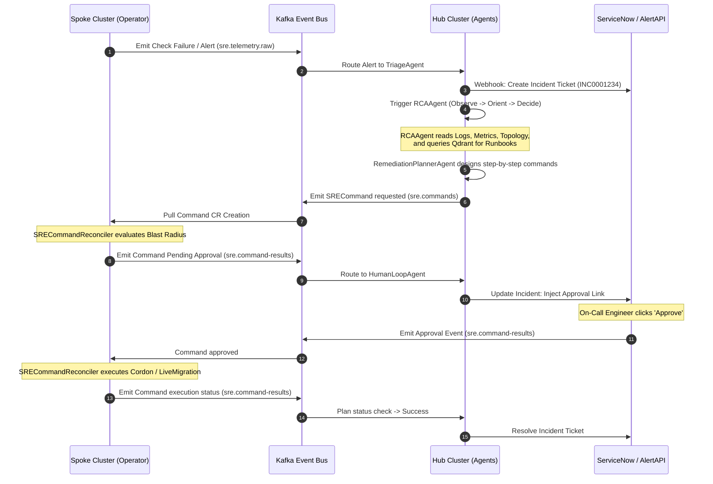

# Unified SRE Platform: Decoupled Agent-Operator Architecture

The **Cortex SRE Platform** is built on a split-plane architectural design: **"Smart Brain, Dumb Hands."** The Spoke Operator is stateless and handles strict cluster execution, while the Central Agent Platform runs on the Hub, managing intelligence, reasoning, and multi-cluster correlation. 

The two planes are decoupled using **Apache Kafka** as the event-driven backbone.

---

## 1. Architectural Philosophy: "Smart Brain, Dumb Hands"

By separating decision-making from execution, we protect Kubernetes control planes and establish strict security boundaries:
- **Stateless Execution (Spoke)**: Spoke clusters do not run resource-heavy LLMs or hold large topology graphs. The Spoke Operator consumes commands, checks local constraints (blast radius, approvals), and runs the execution.
- **Centralized Reasoning (Hub)**: All LLM reasoning, semantic search RAG loops, and Neo4j dependency mapping happen in the Hub, reducing spoke CPU/Memory usage.
- **Asynchronous Communication**: Spoke clusters have **no inbound network connection** from the Hub. All communication is routed asynchronously through a federated Kafka event stream, creating a zero-trust perimeter.

---

## 2. Dynamic OODA Loop Integration

The sequence diagram below shows how an alert moves from detection to diagnosis, approval, and execution across the planes:



---

## 3. Kafka Event Backbone (Topic Registry)

Kafka serves as the central nervous system. The table below outlines how topics route data between the spoke operator and central agents:

| Topic Name | Key Format | Producer | Consumer | Payload Context |
| :--- | :--- | :--- | :--- | :--- |
| `sre.telemetry.raw` | `{cluster-id}` | Spoke Operator | TriageAgent, Splunk Connect | Diagnostic check failures, heartbeat metrics. |
| `sre.signals.buffer`| `{cluster-id}:{ns}:{name}` | Spoke Operator | Spoke Operator (Replay) | Startup signal replay cache (20-min window). |
| `sre.incidents.lifecycle` | `{incident-fingerprint}` | Spoke Operator | Hub Mirror Reconciler | Incident state shifts (Detecting -> Active -> Resolved). |
| `sre.commands` | `{cluster-id}:{cmd-name}` | Central Planner | Hub registration mirroring | Action requests (LiveMigrate, CordonNode). |
| `sre.command-results`| `{command-name}` | Spoke Operator | RemediationPlannerAgent | Phase transitions (Executing, Approved, Succeeded). |
| `sre.errata.cache` | `{cve-id}` | Hub Reconciler | Spoke Errata Consumer | OS advisories and kernel bug databases. |
| `sre.crosscluster.reads` | `{cluster-id}:{kind}:{name}` | Hub Scraper | Central Agent Platform | Sanitized K8s configurations for RAG. |
| `sre.audit` | `{cluster-id}` | Spoke / Hub | Splunk Connect | Immutable compliance log of all mutations. |

---

## 4. Heartbeat & Dead Man's Switch Protocol

To proactively detect network partitions or cluster failures, the platform implements a **Dead Man's Switch** heartbeat protocol:

```
┌────────────────────────┐                   ┌────────────────────────┐
│     Spoke Cluster      │                   │      Hub Cluster       │
│  (SREPolicyReconciler) │                   │  (ClusterRegReconciler)│
└───────────┬────────────┘                   └───────────┬────────────┘
            │                                            │
            │   Emit Heartbeat Event                     │
            │───(Every 30s via sre.telemetry.raw)───────>│
            │                                            │  Updates status.lastSeen
            │                                            │  (Resets offline timer)
            │                                            │
            │   *Heartbeat Missed (90s)*                 │
            │                                            │  Fires synthetic
            │                                            │  ClusterUnreachable incident
            │                                            │──(sre.incidents.lifecycle)──┐
            │                                            │                             │
            │                                            │<────────────────────────────┘
            │                                            │
            │                                            ▼
                                             ┌────────────────────────┐
                                             │      TriageAgent       │
                                             │  - Creates SNOW P2     │
                                             │  - Routes to RCA       │
                                             └────────────────────────┘
```

1. **Heartbeat Emission**: The `SREPolicyReconciler` on the spoke emits a `io.sre.kubevirt.telemetry.heartbeat` event to `sre.telemetry.raw` every **30 seconds**.
2. **Central Tracking**: The `SREClusterRegistrationReconciler` on the Hub processes this heartbeat and updates `status.lastSeen` on the corresponding `SREClusterRegistration` CR.
3. **Dead Man's Trigger**: If a cluster has not emitted a heartbeat for **90 seconds** (3 consecutive intervals):
   - The Hub controller marks the cluster `status.connected = false`.
   - The Hub operator generates a synthetic `ClusterUnreachable` incident and writes it to `sre.incidents.lifecycle`.
   - The `TriageAgent` consumes this event, creates a ServiceNow P2 incident, and routes it to the `RCAAgent` to determine if a WAN partition or cluster control plane failure has occurred.

---

## 5. Command Execution & GitOps-Awareness Protocol

To prevent configuration drift on resources managed by GitOps controllers (like ArgoCD), the platform divides actions into two categories:

### 5.1 Direct Kubernetes API Mutations (Volatile Resources)
Actions targeting cluster resources that are **not** managed by GitOps (e.g., live-migrating a VM, cordoning a node, deleting a stuck pod) are executed directly on the spoke cluster API server by the `SRECommandReconciler`.

### 5.2 GitOps-Aware PR Generation (Desired State Resources)
Actions targeting resources defined in Git repositories (e.g., expanding a PVC, updating replica counts, modifying environment variables) use the GitOps-Awareness flow:
1. The `SRECommandReconciler` detects if the target resource namespace is managed by an ArgoCD application (using the Neo4j topology mapping).
2. Instead of executing `client.Update()` on the cluster, the operator marks the command `Executing` and delegates PR creation to the Central Agent.
3. The central `gitlab_tool` creates a branch, pushes the YAML change to the Git repository, and opens a Pull Request.
4. The `SRECommand` status is updated with `gitops_pr_url`.
5. Once the PR is merged by an engineer or auto-merged, ArgoCD syncs the change to the spoke cluster.
6. The `SRECommandReconciler` detects the resource sync and transitions the command phase to `Succeeded`.

---

## 6. Multi-Region Kafka Federation

To support global deployments (e.g., US, EU, APAC) without experiencing WAN latency bottlenecks:
- Regional Kafka clusters are deployed in each geographic region.
- High-frequency, latency-sensitive traffic (like heartbeats and raw telemetry logs) stays entirely local to the region's Kafka cluster.
- Low-frequency orchestration traffic (`sre.commands`, `sre.command-results`, and `sre.incidents.lifecycle`) is federated globally to the central primary Kafka cluster via **Confluent MirrorMaker 2 (MM2)**.
- Hub agents connect directly to the global primary Kafka cluster, allowing centralized control without regional latency overhead.
