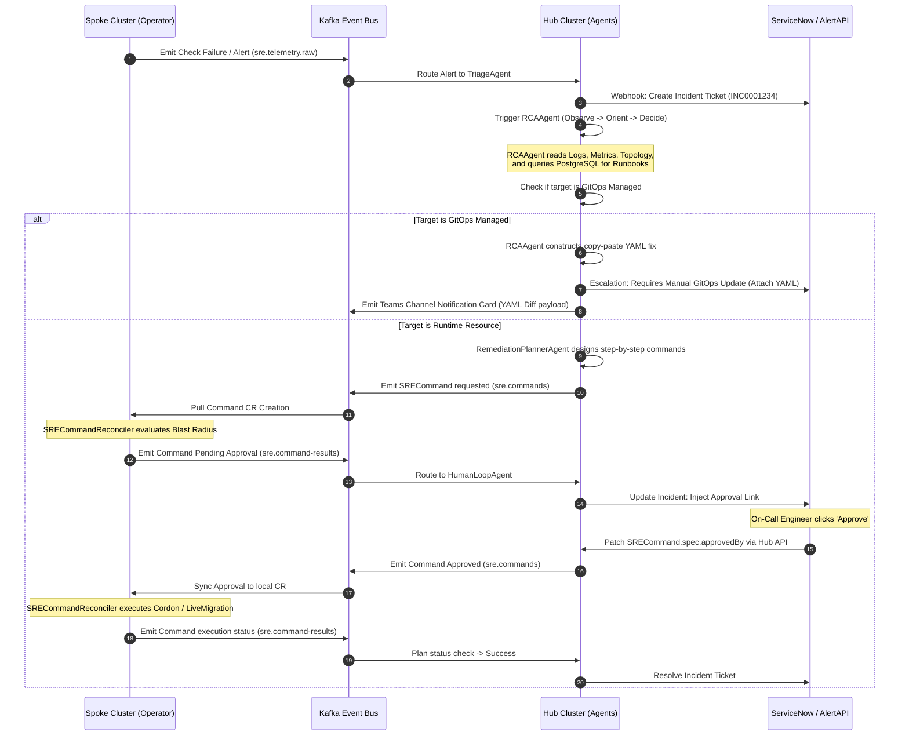
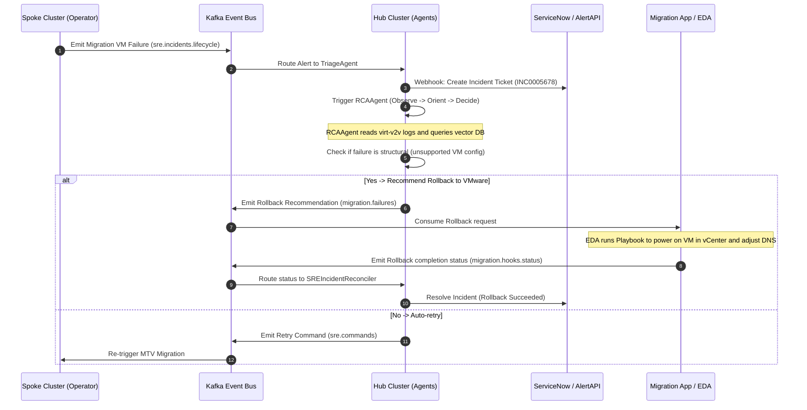

# Unified SRE Platform: Decoupled Agent-Operator Architecture

The **Cortex SRE Platform** is built on a split-plane architectural design: **"Smart Brain, Dumb Hands."** The Spoke Operator is stateless and handles strict cluster execution, while the Central Agent Platform runs on the Hub, managing intelligence, reasoning, and multi-cluster correlation. 

The two planes are decoupled using **Apache Kafka** as the event-driven backbone.

---

## 1. Architectural Philosophy: "Smart Brain, Dumb Hands"

By separating decision-making from execution, we protect Kubernetes control planes and establish strict security boundaries:
- **Stateless Execution (Spoke)**: Spoke clusters do not run resource-heavy LLMs or hold large topology graphs. The Spoke Operator consumes commands, checks local constraints (blast radius, approvals), and runs the execution.
- **Centralized Reasoning (Hub)**: All LLM reasoning, semantic search RAG loops, and Neo4j dependency mapping happen in the Hub, reducing spoke CPU/Memory usage.
- **Asynchronous Communication**: Spoke clusters have **no inbound network connection** from the Hub. All communication is routed asynchronously through a federated Kafka event stream, creating a zero-trust perimeter.

---

## 2. Dynamic OODA Loop Integration

The sequence diagram below shows how an alert moves from detection to diagnosis, approval, and execution across the planes:



### 2.1 VMware Migration Rollback OODA Loop Sequence

The sequence diagram below shows how a migration failure is handled across the VMware boundary under the VMware Boundary Exclusion Protocol:




---

## 3. Kafka Event Backbone (Topic Registry)

Kafka serves as the central nervous system. The table below outlines how topics route data between the spoke operator and central agents:

| Topic Name | Key Format | Producer(s) | Consumer(s) | Payload Context & Usage |
| :--- | :--- | :--- | :--- | :--- |
| **`sre.telemetry.raw`** | `{cluster-id}` | `SREPolicyReconciler` (spoke) | `TriageAgent` (agent), Splunk Kafka Connect | Raw diagnostic check metrics, CNI/NTP offsets, heartbeat logs, and `status.capabilities` matrix. |
| **`sre.signals.buffer`** | `{cluster-id}:{ns}:{name}` | Spoke Operator | Spoke Operator (Replay Cache) | Local BoltDB alert buffer for rule playback (20-min window). |
| **`sre.incidents.lifecycle`** | `{incident-fingerprint}` | `SREIncidentReconciler` (spoke) | `TriageAgent` (agent), `RCAAgent` (agent), `SREClusterRegistrationReconciler` (hub), `PolicyLearnerAgent` (agent), Splunk Kafka Connect | Broadcasts incident phase transitions (Detecting -> Active -> Resolved). |
| **`sre.commands`** | `{cluster-id}:{cmd-name}` | `RemediationPlannerAgent` (agent), `PolicyLearnerAgent` (agent for rules), `ClusterHealthScorerAgent` (agent), `ErrataCorrelatorAgent` (agent) | `SREClusterRegistrationReconciler` (hub) | Triggers creation of the local `SRECommand` CR on the target spoke cluster. |
| **`sre.command-results`** | `{command-name}` | `SRECommandReconciler` (spoke) | `RemediationPlannerAgent`, `HumanLoopAgent`, Splunk Kafka Connect | Execution feedback (Success, Failure, Execution logs). |
| **`sre.errata.cache`** | `{cve-id}` | `SREErrataCacheReconciler` (hub) | `SREPolicyReconciler` (spoke) consumer, `ErrataCorrelatorAgent` (agent), Splunk Kafka Connect | OS packages advisories and kernel vuln patches mirror. |
| **`sre.crosscluster.reads`** | `{cluster-id}:{kind}:{name}` | `SRECrossClusterReadReconciler` (hub) | Central Agent tools layer, Splunk Kafka Connect | Sanitized spoke Kubernetes resource state queries for RAG prompts. |
| **`sre.audit`** | `{cluster-id}` | `SRECommandReconciler` (spoke), `SREIncidentReconciler` (spoke), Hub operator (ManifestWork events) | `PolicyLearnerAgent` (agent), Splunk Kafka Connect | 90-day compliance logs auditing all mutations, bypasses, and approvals. |
| **`sre.dead-letter`** | `{partition}:{offset}` | Any producer on retry exhaustion | Manual SRE review, Dead-letter monitor alert | DLQ for broker unreachable failures or parsing crashes. |
| **`migration.prechecks.results`** | `{plan_id}:{vm_id}` | FastAPI / Airflow | React UI, EDA | Results of the pre-migration checks. |
| **`migration.prechecks.failed`** | `{plan_id}:{check_type}` | FastAPI | EDA → ServiceNow, SRE notification | Alerting for critical precheck failures. |
| **`migration.plans.created`** | `{plan_id}` | FastAPI | EDA, GBGF notification service | Trigger for pre-migration notifications. |
| **`migration.jobs.trigger`** | `{plan_id}:{vm_id}` | FastAPI scheduler | EDA → Ansible → MTV | Triggers the execution of the forklift plan. |
| **`migration.hooks.status`** | `{plan_id}:{vm_id}:{hook_type}` | Migration watcher | FastAPI → Postgres | Feedback channel for prehook/posthook execution. |
| **`migration.progress`** | `{plan_id}:{vm_id}` | Migration watcher | FastAPI → WebSocket → React UI | Live VM migration bandwidth/progress data. |
| **`migration.failures`** | `{plan_id}:{vm_id}` | Migration watcher | FastAPI → Postgres, SRE alert | Error telemetry and conversion logs path. |
| **`migration.rollback.requested`** | `{plan_id}:{vm_id}` | FastAPI (SRE action) | EDA → Ansible rollback playbook | Escalation request for VMware-side rollback. |
| **`migration.vcenter.add`** | `{vcenter_id}` | FastAPI | EDA → Ansible → Airflow DAG | Requests automated discovery of new VMware scope. |
| **`cluster.builds.requested`** | `{cluster_id}` | FastAPI | EDA → Ansible → ACM | Demands target cluster creation for scaling. |

---

## 4. Heartbeat & Dead Man's Switch Protocol

To proactively detect network partitions or cluster failures, the platform implements a **Dead Man's Switch** heartbeat protocol:

```
┌────────────────────────┐                   ┌────────────────────────┐
│     Spoke Cluster      │                   │      Hub Cluster       │
│  (SREPolicyReconciler) │                   │  (ClusterRegReconciler)│
└───────────┬────────────┘                   └───────────┬────────────┘
            │                                            │
            │   Emit Heartbeat Event                     │
            │───(Every 30s via sre.telemetry.raw)───────>│
            │                                            │  Updates status.lastSeen
            │                                            │  (Resets offline timer)
            │                                            │
            │   *Heartbeat Missed (90s)*                 │
            │                                            │  Fires synthetic
            │                                            │  ClusterUnreachable incident
            │                                            │──(sre.incidents.lifecycle)──┐
            │                                            │                             │
            │                                            │<────────────────────────────┘
            │                                            │
            │                                            ▼
                                             ┌────────────────────────┐
                                             │      TriageAgent       │
                                             │  - Creates SNOW P2     │
                                             │  - Routes to RCA       │
                                             └────────────────────────┘
```

1. **Heartbeat Emission**: The `SREPolicyReconciler` on the spoke emits a `io.sre.kubevirt.telemetry.heartbeat` event to `sre.telemetry.raw` every **30 seconds**.
2. **Central Tracking**: The `SREClusterRegistrationReconciler` on the Hub processes this heartbeat and updates `status.lastSeen` and `status.capabilities` on the corresponding `SREClusterRegistration` CR. This capability matrix is used to gate `SRECommand` actions correctly.
3. **Dead Man's Trigger**: If a cluster has not emitted a heartbeat for **90 seconds** (3 consecutive intervals):
   - The Hub controller marks the cluster `status.connected = false`.
   - The Hub operator generates a synthetic `ClusterUnreachable` incident and writes it to `sre.incidents.lifecycle`.
   - The `TriageAgent` consumes this event, creates a ServiceNow P2 incident, and routes it to the `RCAAgent` to determine if a WAN partition or cluster control plane failure has occurred.

---

## 5. Command Execution & GitOps-Exclusion Protocol

To ensure automated remediations never conflict with declarative configurations managed by GitOps controllers, the platform partitions operations:

### 5.1 Direct Kubernetes API Mutations (Volatile / Runtime Resources)
Remediations are focused **exclusively** on runtime cluster state that GitOps does not manage:
* **Node Operations**: CordonNode, UncordonNode, DrainNode.
* **VM Operations**: LiveMigrateVM (moving a VM's runtime launcher pod between physical nodes).
* **Storage Operations**: Dynamic PVC expansion (if storage classes support online expansion without modifying the deployment manifests).
* **Pod Operations**: Restarting transient system pods or clearing temporary local volume directories.
These commands are executed directly on the spoke cluster API by the `SRECommandReconciler`.

### 5.2 GitOps Declarative Block (Escalation & Microsoft Teams Notification)
If the `RCAAgent` or `SRECommandReconciler` detects that the target resource (e.g., a Deployment's replica count or a ConfigMap) is tagged with GitOps tracking labels:
1. The operator **instantly blocks** the command and updates its status to `Failed` with the reason `GitOpsManagedExclusion`.
2. The Central Agent intercepts this status shift via `sre.command-results`.
3. The agent halts automated execution of the remediation plan.
4. **YAML Generation**: The agent leverages the Vector DB runbooks to generate the **suggested YAML patch/diff block** needed to fix the drift or resource parameters.
5. **Incident Escalation**: It updates the ServiceNow incident with the copy-pasteable YAML code block.
6. **Microsoft Teams Card**: The agent calls the `AlertAPI` to post an **Adaptive Card to the SRE Teams Channel**, structured as follows:
   ```json
   {
     "type": "AdaptiveCard",
     "body": [
       { "type": "TextBlock", "text": "GitOps Exclusion Triggered", "weight": "bolder", "color": "attention" },
       { "type": "TextBlock", "text": "Incident: vm-stuck-image-pull | Cluster: prod-east-01" },
       { "type": "TextBlock", "text": "Manual Action Required: Copy-paste the block below into your GitOps repo:" },
       { "type": "CodeBlock", "language": "yaml", "code": "spec:\n  template:\n    spec:\n      containers:\n      - name: main\n        env:\n        - name: HTTPS_PROXY\n          value: squid-proxy-dmz.corp.internal:3128" }
     ]
   }
   ```
7. SRE team members copy this payload directly, merge it to Git, and wait for ArgoCD auto-sync to resolve the incident.

---

## 6. Multi-Region Kafka Federation

To support global deployments (e.g., US, EU, APAC) without experiencing WAN latency bottlenecks:
- Regional Kafka clusters are deployed in each geographic region.
- High-frequency, latency-sensitive traffic (like heartbeats and raw telemetry logs) stays entirely local to the region's Kafka cluster.
- Low-frequency orchestration traffic (`sre.commands`, `sre.command-results`, and `sre.incidents.lifecycle`) is federated globally to the central primary Kafka cluster via **Strimzi / Apache Kafka MirrorMaker 2 (MM2)**.
- Hub agents connect directly to the global primary Kafka cluster, allowing centralized control without regional latency overhead.
